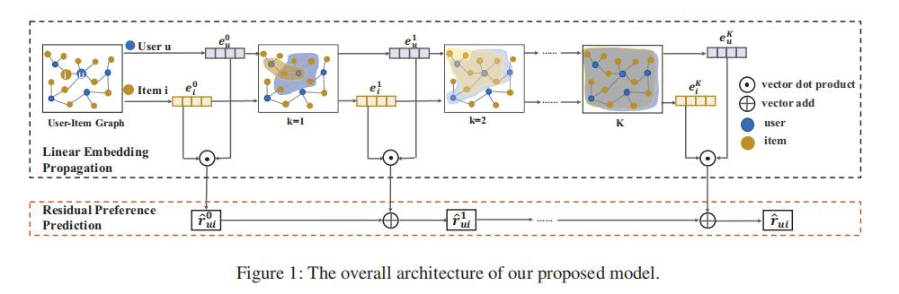

## AAAI 2020 papers

### GNN RS

1、Learning to Hash with Graph Neural Networks for Recommender Systems
* [论文](https://www.aaai.org/ojs/index.php/AAAI/article/view/5330) 
* [已下载地址](../paper/LR_GCCF.pdf)
* [代码](https://github.com/newlei/LR-GCCF.)

**摘要**
图卷积网络（GCN）是通过迭代堆叠卷积聚合操作和非线性激活操作的多个层而基于最新图形的表示学习模型。 最近，在基于协作过滤（CF）的推荐系统（RS）
中，通过将用户项目交互行为视为二分图，一些研究人员使用GCN对高层协作信号进行建模。 与传统作品相比，这些基于GCN的推荐器模型显示出卓越的性能。
然而，这些模型遭受针对大型用户项目图的非线性激活的训练困难。 此外，由于基于图卷积操作的过度平滑效果，大多数基于GCN的模型无法对更深的层进行
建模。 在本文中，我们将从两个方面重新审视基于GCN的CF模型。 首先，我们从经验上证明消除非线性会增强推荐性能，这与简单图卷积网络中的理论是一致
的。 其次，我们提出一种残差网络结构，该残差网络结构是专门为CF设计的，具有用户项交互建模功能，可缓解具有稀疏用户项交互数据的图卷积聚合操作中
的过度平滑问题。 所提出的模型是线性模型，易于训练，扩展到大型数据集，并在两个真实数据集上产生更好的效率和有效性。

主要想法就是通过残差思想，将个卷积层结果通过LR模型进行预测。

 
 

### Social RS
 

