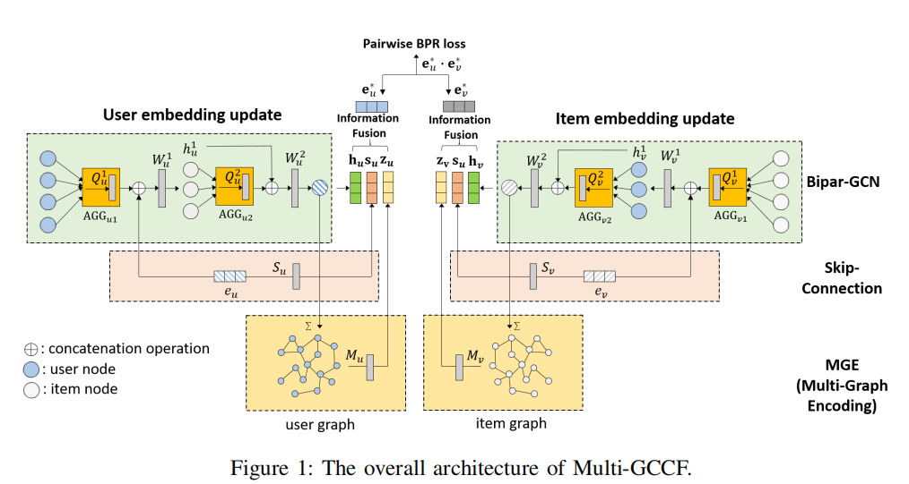
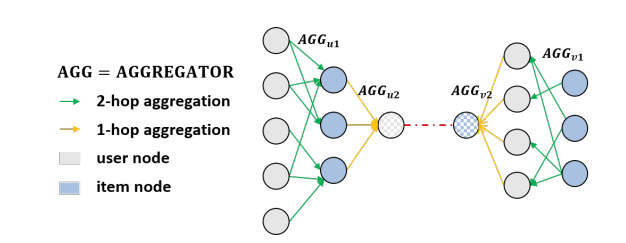
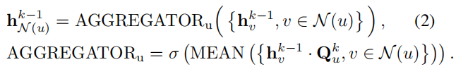
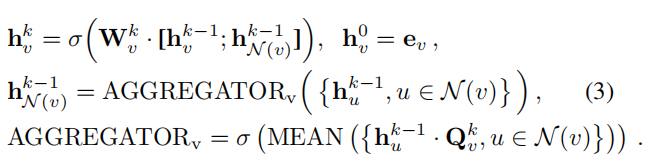
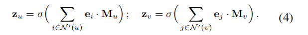
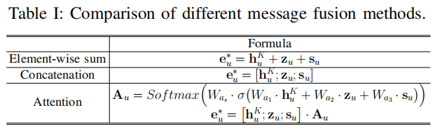
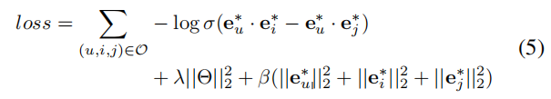
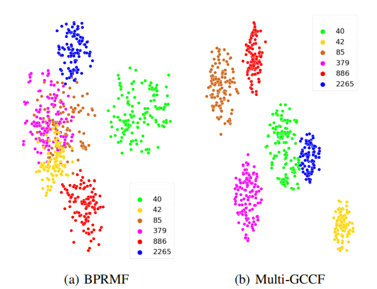

# Multi-Graph Convolution Collaborative Filtering
---

### 摘要

 大量研究致力于学习用户和项目的矢量表示，目的是根据表示的相似性预测用户对项目的偏好。 技术的范围从经典的矩阵分解到最近的基于深度学习的方法。 
 但是，我们认为现有方法没有充分利用可从用户与项目交互数据获得的信息以及用户对和项目对之间的相似性。 
 
 在这项工作中，我们开发了一个基于图卷积的推荐框架，称为多图卷积协同过滤（Multi-GCCF），该框架在嵌入学习过程中明确地包含了多个图。  
 Multi-GCCF不仅可以通过两方用户-项目交互图对高阶信息进行建模，还可以通过构建和处理用户-用户和项目-图来整合近端信息。 
 此外，在二部图上进行图卷积时，我们考虑了用户节点和项目节点之间的内在差异。
 
 ### 介绍

 支持协同过滤的基本假设是，相似的用户倾向于喜欢相同的项目，而相似的项目对于用户会打相似的评分。
 
 进行协同过滤的最成功方法之一是矩阵分解（MF）。
 MF模型通过在相同空间中的矢量来表征商品和用户，从观察到的用户-商品历史交互条目推论得出。 
 
 最近，引入了深度学习模型以提高传统MF模型的性能。 
 
- 基于深度学习的推荐模型不足以产生最佳嵌入：
	因为它们仅考虑用户和商品特征。 开发嵌入内容时，没有明确纳入用户与项目的互动； 交互仅用于定义模型训练的学习目标。 
		
- 深度学习模型的第二个局限性是依赖用户的明确反馈，而反馈通常相对稀疏。
 
 开发一种机制，以直接将用户与项目的交互作用纳入嵌入结构中。
 已经证明了处理二部图的有效性，报告了对最新模型的改进。
 
 尽管它们有效，但我们认为有两个重要限制。 

- 首先，这些模型忽略了二部图中的两种类型的节点（用户和项）之间的固有差异。 当在嵌入构造过程中从图中的相邻节点聚合信息时，
	中的体系结构使用不依赖于节点性质的函数，以相同的方式组合信息。 但是，在实际环境中，用户和项目之间存在重要的内在差异。 
	这表明聚合和转换功能应取决于实体的类型。
	
- 其次，用户与用户之间以及项目与项目之间的关系也是非常重要的信号。 尽管二部图中的两跳邻域在一定程度上捕获了这些信息，
	但可以合理地假设我们可以通过构建和学习直接建模用户-用户和项目-项目关系的图来提高推荐质量。

我们提出了一种基于图卷积神经网络（GCNN）的新型推荐系统Multi-GCCF，它具有两项关键创新：
	
- 捕获用户和项目之间的内在差异：我们将单独的聚合和转换函数应用于 使用图神经网络学习时，处理用户节点和项目节点。
	我们发现可以更精确地学习用户和项目嵌入，并且可以提高推荐性能。

- 明确建模用户-用户和项目-项目关系：我们构造了单独的用户-用户和项目-项目图。
	Multi-GCCF在所有三个图上同时进行学习，并采用多图编码层来集成用户项图，用户用户图和项图图所提供的信息。
		

### 相关模型

#### A.基于模型的协同过滤方法
基于模型的CF方法通过将模型拟合到用户-项目交互数据来学习项目和用户之间的相似性。 
	潜在因素模型很常见，例如概率潜在语义分析（pLAS）和使用最广泛的方法，矩阵分解（MF ）。  
	SVD ++，该软件结合了有关用户“邻居”（即她以前与之互动过的项目）的信息以及矩阵分解进行预测的功能。 
	分解机提供了一种合并诸如用户人口统计和项目属性之类的辅助信息的机制。
	基于MF的方法是有限的，因为它们仅限于作为测量用户嵌入和项目嵌入之间相似性的机制的内部产品。 
	最近，神经网络已被纳入协作过滤架构。 这些使用完全连接的层，卷积，内积和子网的组合来捕获复杂的相似关系。
	
#### B.基于图结构的推荐
图是表示推荐系统中丰富的成对关系信息的自然工具。 早期的工作使用标签传播和用户-项目交互图上的随机游走来得出用户-项目对的相似性得分。
	随着图神经网络（GNN）的兴起，最近的工作开始应用图神经网络。 图卷积矩阵完成（GCMC）将推荐问题视为矩阵完成任务，并采用图卷积自动编码器。  
	PinSAGE在通过对项目之间的相似性建模而形成的项目图上应用了图神经网络。 神经图协同过滤（NGCF）处理两部分用户-项目交互图以学习用户和项目嵌入。

### Multi-GCCF

在本节中，我们将解释方法的三个关键组件。
	
- 我们开发一个 Bipartite Graph Convolutional Neural Network (Bipar-GCN) 充当 encoder 来生成 user 和 item embeddings, 
	处理 user-item 二部图交互。
	
- Multi Graph Encoding 层 (MGE) 编码 潜在 信息 通过 构造 和 处理 多个 graphs: 除了 user-item 二部图, 另两个图形代表 
	user-user respectively. 相似性 和 项目 相似 之 处 
	
- 在初始节点特性和最终嵌入之间的跳过连接结构允许我们利用未被图形处理捕获的原始特性中的任何剩余信息。
	 
Multi GCCF模型如下所示：

##### Bipar-GCN

在推荐场景中，用户-项交互可以很容易地表示为两类节点的二部图。我们应用了一个二部图卷积神经网络(Bipar-GCN)，一边表示用户节点，
另一边表示项目节点。

Bipar-GCN层由前向采样和后向聚集两个阶段组成。
	
- 向前抽样阶段 旨在 处理度分布的长尾性 例如，受欢迎的项目可能会吸引许多用户的互动，其他的项目会吸引的很少
	
- 后向聚合阶段  在从1到k层聚合邻居节后 BiparGCN通过GCN聚合k-hop邻居节点信息来编码user和item节点。
		
	初始化eu和ev表示用户u和项目v。则用户u的k层嵌入表示为：$$h_u^k = \sigma(W_u^k \dot [h_u^{k-1};h_{N(u)}^{k-1}]),h_u^0 = eu$$
	其中eu是用户u的初始化嵌入，；号表示连接，激活函数tanh。Wuk表示的是第k层中所有用户的转换权重矩阵，所有用户共享。
	$h_{N(u)}^{k-1}$表示的是邻居节点的聚合嵌入。

	为了实现邻域的排列不变性，我们采用了元素加权平均聚合:

	其中$Q_u^k$表示user的第k层聚合权重矩阵，所有user 节点共享参数。
	MEAN表示所有向量的平均值。
		
	同样的目标item节点v通过使用聚合过item的集合以及聚合权重矩阵来聚合。
		
		
##### Multi-Graph Encoding Layer

为了解决CF中的数据稀疏问题，提出Multi-Graph Encoding Layer
该层通过构建两个附加图，通过GCN卷积为user或item节点生成一个
附加的嵌入向量。

事实上，除了user-item二部图以外，我们还构建了用户-用户图和项目-项目图
同来捕获在user和item中的距离信息。
  这种邻近信息可以弥补非常稀疏的用户-项目交互二部图。这些图是通过计算评级/点击矩阵的行或列上的两两余弦相似性来构建的
  
在MGE层，对目标节点我们使用one-hop卷积层和加总聚合邻居节点特征来生成嵌入向量：

其中	N'(u)表示在user-user图中user u的一跳邻居节点，N'(v)表示在item-item图中 item v的一跳邻居节点。
Mu和Mv分别表示user和item的聚合权重矩阵。

对比Bipar-GCN，MCE层没有附加的邻居采样，我们根据余弦相似度选择阈值，使每个图的平均度为10。

通过将Bipar-GCN，MCE层结果拼接，我们可以通过三个图将不同的进行编码
而这三个图都可以通过历史交互数据进行构建，并不需要附加很多的计算量。

##### Skip-connection with original Node Features

我们进一步用直接从原始节点特性传递的信息来细化嵌入。这背后的直觉是，Bipar-GCN和MGE都专注于基于关系提取潜在信息。因此，初始节点特性的影响变得不那么明显。
跳过连接允许架构重新强调这些特性。
  
  
##### Information Fusion

bipartite-GCN, MGE layer and skip connections 从三个不同的方面捕获信息，对于怎么拼接他们就十分的重要。

这里建议三种方法将其拼接： element-wise sum, concatenate,  attention mechanism.
 

 
### 模型训练

采用小批量训练({u,i,j}),更具体地说,我们选择独特的用户和项目节点u和v = {i, j}从mini-batch对,
然后获得低维嵌入{eu、ei、ej}信息融合后,与随机梯度下降法广泛使用贝叶斯个性化推荐(BPR)[26]损失模型优化建议。
目标函数如下:

其中O = {(u, i, j)|(u, i)∈R+，(u, j)∈RR)}表示训练批量。R+表示观察到的正相互作用。R表示取样未观察到的负相互作用。
Θ模型参数集和e∗u e∗i, e∗j是嵌入的学习。我们进行正则化模型参数和生成嵌入,以防止过度拟合(正则化系数λ和β)。

 
### 实验部分
1. 数据集：Gowalla, Amazon-Books, Amazon-CDs and Yelp2018 

2. 评价指标：Recall@k and NDCG@k (we report Recall@20 and NDCG@20).K代表k-hop
  
3. baseline：
	经典方法: BPRMF 、NeuMF 
	
	GNN方法: GC-MC PinSage NGCF 
	本文采用 2-hop GCN，同时用1-hop进行Mutil—Graph Encoder学习。

4. 参数设置：
	嵌入层维度 64 ，batch 1024 ， 采用l2正则，λ = 0.01 and β = 0.02.
	
	two BiparGCN layers with neighborhood sampling sizes S1 = 15 and
	S2 = 10. The output dimension of the first layer is fixed to
	128; the final output dimension is selected from {64, 128}
	for different experiments. 

可以看出 mutil—GCCF得到的嵌入向量的聚类效果会更好一些。
	
### 总结

本文提出了一种新的协同过滤方法，该方法利用多个图形来明确表示用户-项目、用户-用户和项目-项目之间的关系。提出的模型Multi-GCCF构建了三个从不同角度了解到的对可用数据的嵌入。在四个真实数据集上的大量实验证明了我们的方法的有效性，一个消融研究定量地验证了每个组件都做出了重要的贡献。
我们提出的多gccf方法在MindSpore开发的易用、高效的GNN库下得到了很好的支持，MindSpore是一个统一的华为AI训练和推理框架。