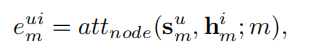
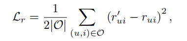

# Multi-Component Graph Convolutional Collaborative Filtering

---

## 摘要

 用户-物品交互的形成通常来自高度复杂的潜在购买动机，如高性价比或引人注目的外观，
 这些都很难用边缘来表示。现有的方法仍然没有探索各种购买动机之间的差异，
 导致无法捕获细粒度的用户偏好。
 
 本文提出了一种新的多成分图卷积协同过滤(MCCF)方法来区分用户-商品交互下的潜在购买动机。
 具体来说，
 
 在MCCF中有两个精心设计的模块，分解器和组合器。
 前者首先对用户-物品图中的边进行分解，识别可能引起购买关系的潜在成分;
 后者自动重新组合这些潜在组件，以获得用于预测的统一嵌入。
 利用稀疏正则化和加权随机样本策略来缓解过拟合问题，加速优化过程。
 
## 介绍

对于许多现代的推荐系统来说，一个事实上的解决方案是协同过滤(CF)技术，它的基本假设是那些在过去分享类似购买的人在未来有相似的选择

本质上，用户-项目交互可以自然地建模为一个图，以基于异构图的推荐为例。
因此，graph convolutional networks 在图表示学习方面表现出了卓越的能力，并被引入到推荐系统中，取得了良好的性能。

通常，在用户-项图上使用堆叠图卷积层来聚合用户和项特性。这样，这些卷积运算可以传播
信息，充分利用高阶关系，从而有效缓解协同过滤中的数据稀疏性问题。

尽管他们取得了巨大的成功，但他们都假定用户购买物品的动机是一致的，而忽略了一个事实，
即一个真正的推荐系统的形成通常遵循一个复杂和异构的过程，由多个潜在组件的交互驱动。
也就是说，虽然用户-项目交互都是由用户-项目二部图的边统一表示的，但是用户购买项目的动机可能是多种多样的。
> 例如，不同的用户可能会有不同的购买动机，例如，一些人喜欢高性价比，而一些人喜欢吸引眼球的外观。

基本上，用户-项目交互系统并不是由一个潜在组件(动机)控制的，因此，不处理所有这些
潜在组件将丢失一些细粒度的有价值的信息。
**考虑购买动机之间的差异，可以捕捉更复杂的交互特征，全面反映用户偏好**
，提供更准确的推荐线索。

图1显示了一个玩具示例。用户U1、U3、U4的购买动机是性价比高，而用户U2的购买动机是吸引眼球
的外观。如果忽略潜在的组件，不清楚用户U1是否会购买I3或I4。但是，如果我们考虑潜在的组件，
我们可能会发现项目I4对于用户U1来说是一个更好的推荐，因为项目I4已经被价值导向的用户购买了，
这更符合用户U1的购买动机。(例子的意思是，item4被在乎性价比的用户购买了，而user1也是在乎
性价比的，因此item4更适合)

因此，未能识别交互之下的潜在组件可能会限制推荐性能。因此，迫切需要设计一种能够描述细粒度
用户偏好的新型多组件学习器。

尽管综合利用多种潜在成分的前景广阔，但仍面临以下两方面的挑战。

(1)如何识别useritem图中的多个组件?
用户-项目交互系统是一个非常复杂的系统，多个组件通常不能被直接观察到。
**我们需要有效地发现相应的潜在成分，从而形成一种特定的购买关系。**
此外，所提取的潜在组件应反映不同的细粒度用户偏好，并体现丰富的语义。

(2)如何重新组织多个潜在组件来学习用户(项)嵌入?然而，即使我们可以提取多个组件，
不同的用户在选择组件时也可能是不同的。因此，有效地融合这些组件仍然是一个严峻的挑战。

##### 本文提出了一种新的多分量图卷积协同过滤方法：
MCCF的关键组成部分包括两个模块:分解器和组合器。

- 对于给定的用户-项目交互(边缘)，分解者通过将边缘分解为多个潜在空间并在节点级进行关注来识别潜在组件。

- 组合器将自动确定这些潜在组件的重要性，并将它们组合起来以获得统一的用户(项)嵌入。

针对过参数化和过拟合问题，采用稀疏正则化方法;

本文的贡献：

 - 我们首先研究了在只给出明确的用户-物品交互图的情况下，挖掘推荐系统中多个潜在的购买组件
	以获取更细粒度的用户偏好的问题。
 
 - 我们提出了一种新的基于图神经网络的协同过滤方法MCCF，用于分解和重组用户-项目图边缘下
	的潜在组件。利用稀疏正则化和加权随机样本策略分别进行参数化和加速优化。

## 相关工作

1. 协同过滤：
	目前最流行的协同过滤算法都是基于矩阵分解的。基本上，他们假设评价矩阵可以用两个低秩矩阵来近似。
	
	- PMF通过最小化观测条目与重建评分之间的均方误差来优化最大似然。
	- BiasedMF通过合并用户和项目特定偏差以及全局偏差来改进PMF。局部低秩矩阵近似利用低秩近似的不同组合重建了评价矩阵条目。
	- AutoRec神经MF模型，将用户(物品)部分观察到的评价向量通过编码器层投射到潜在空间，利用解码器层进行重构;
	- CF-NADE 在每次迭代中都会随机删除部分输入空间，可以将其视为去噪的自动编码器。另一行是将用户-项目交互视为图来推断用户偏好。
	- GC-MC使用两个多链路图卷积层来聚合用户特征和项目特征。提出了一种光谱卷积操作，以发现用户和项目之间所有可能的连接。所有这些方法都只将边缘作为连接用户和项目的桥梁，而没有区分多个潜在组件。

2. Graph Neural Networks

DisenGCN提出了一种学习解纠缠节点表示的方法，该方法采用一种新的邻域路由机制来找出
可能导致某一给定节点的边缘向其相邻节点之一移动的因素。
而DisenGCN是一种同构图表示学习方法，它并没有区分潜在成分的重要性。

## 模型方法
**从模型的全局来看**
如下图所示是模型的整体结构：

图中展示了多组件图卷积协同过滤(convolutional Collaborative Filtering, MCCF)
的整体框架。可以看出，该模型以用户-项二部图为输入，预测用户-项交互评分。

具体来说，用户部分将聚合购买的物品的特性来学习用户嵌入。在项目特征聚合过程中，
我们通过以下两个模块考虑用户-项目交互下的多个潜在组件:

(1) 具有节点级注意力的分解者，从项目特征中识别潜在组件;

(2)组件级注意的组合器，将上述潜在组件重新组合，得到统一的用户嵌入。

在聚合用户特性以学习项嵌入时，我们使用与上面类似的过程。
最后，将MLP层应用到学习的用户和项嵌入中以输出评级。

**分解器**：
定义user-item图，其次是用户部分对整个模型的描述，因为用户部分和项目部分是双重的。

- user-item的二部图：
	将用户历史的user-item的评分矩阵构建成二部图G={U,I,R,E}
	其中U为用户Nu集合，I为项目Iu集合，评分集合R包含一些连续的级别{1,...,R}
	对于每一条边 e= (u, i, r) ∈ E, 代表用户u对项目i的打分是r。
	
	正常用户含有一些自身的特征矩阵 $U=[u1,...,u_{N_u}] ∈ R^{L_u×N_u}$，Lu是用户特征的维度，
	
	项目自身的特征矩阵 $P = [p1, p2, · · · , p_{N_i} ] ∈ R^{L_i×N_i}$  Li是项目特征的维度

- 多成分提取：
	假设将二部图G划分为M个潜在组建。第m个组件捕获二部图中的第m个购买动机。
	因此，我们首先为用户和项目分别设计M个组件特有的转换矩阵，以提取对应于特定组件的不同特征，即
	W = {W1,W2, · · · ,WM} and Q = {Q1, Q2, · · · , QM}.
	
	对于项目i 他的第m个h item-specific组件 $h_m^i$定义成： 
	$$h_m^i = Q_m P_i$$	
	
	对于用户u 他的第m个h item-specific组件 $h_m^u$定义成： 
	$$h_m^u = W_m U_u$$
	
- 节点级注意力：
	我们关注用户u和他购买的物品集Pu。对于用户u，有M个用户特定的组件${s^u_m}^M_{m=1}$。
	对于item i∈Pu，也有M个项目特定 组件 ${h^i_m}^M_{m=1}$。
	这里的关键观点是用户u不需要将所有购买的项目聚合起来来描述第m个组件。
	因此，我们提出了节点级注意机制，通过第m个分量来推断用户u实际购买的物品。
	
	具体而言，用户u基于第m个分量购买第i项的可能性可以表示为:
	
	其中 attnode是一个DNN用来学习节点机注意力。公式表明基于第m个组件 用户u购买
	项目i的可能性取决于自身的特征和这个组件。在获取$e^{ui}_m$之后通过softmax得到
	权重系数$\alpha^{ui}_m$:
	
	其中||是连接操作，am是第m个分量的节点级注意向量。
	
	最后，对于Pu中的所有项目，通过对所有第m个项目的特定组件进行聚合，
	可以得到用户u的第m个项目的聚合组件zum，具体如下:
	
	
	每个用户u将有M个项目聚合组件{z^u_m}=1。请注意，用户u的每一个商品聚合
	组件都是通过该组件下用户购买的商品的特性聚合的，因此它是特定于语义的，
	能够捕获该组件所表示的相应购买动机。
	接下来，我们将介绍如何组合{z^u_m}=1来学习最终的用户嵌入。

- 结合器
	众所周知，用户的购买行为通常是由一个或多个动机驱动的，这些动机可以通
	过学习的项目聚合组件反映出来。因此，不同的组件应该对学习用户嵌入有不
	同的贡献，这促使我们提出了一个具有组件级注意机制的组合器，自动学习不
	同项目聚合组件的重要性。
	
	- 组件级注意力：以M item-aggregated组件的用户u作为输入,我们的目标是
	- 学习每个item-aggregated组件的重量(βu1βu2,···,βuM)如下:
		
	其中attcom是用DNN来学习组件级注意力。
	
	考虑到第m项目聚合组件的重要性βum还应该取决于用户u,我们第一次连接zum总和,并学习他们的统一嵌入如下:
	
	其中Cm是权重矩阵，bm是偏置。然后，以构件级注意向量q表示第m个项目聚合构件的重要性，记为wm，表示如下:
	
	其中b是偏差。注意，所有用户和项目聚合组件都共享参数q和b，这是因为在购买
	项目时，人性中存在一些类似的决策模式。
	我们然后通过softmax规范化wm函数获得的重量聚合组件βum m项目如下:
	
	采购关系,βum越高,更容易造成第m采购组件。
	利用这些学习到的权值，我们可以将这些item聚合的分量进行融合，得到用户u的最终嵌入组，如下图所示: 
	
		
**评级预测**	:
一旦分别从用户和项目部分获得用户u和项目i的最终嵌入(即，我们将它们串联起来，
通过MLP来预测从u到i的评级r'ui为:

l是隐藏层数

**优化器**：
由于任务是评级预测，主要目标是最小化预测评级与地面真实值的差异:

其中O为观测评级集，rui为用户u对项目i的地面真值评级。
那么值得注意的是，为了缓解过度参数化和过度拟合，需要对多个组件进行适当的
正则化。因此，我们将L0正则化应用到我们的目标函数中。通过稀疏化多分量提取
矩阵W和Q，我们可以避免不必要的资源，减轻过度拟合，因为不相关的自由度被修
剪掉了。最终目标函数如下:	
	
Θ表示模型参数设置,θ= {W, Q}和λ是评级hyper-parameter平衡损失和稀疏正则化。

**采用策略**：
众所周知，高评分的商品更能反映用户的偏好，我们在实际操作中可能不需要汇总用户购买的所有商品。因此，我们采用加权随机抽样。
同时，该抽样方法可以提高对高评价用户-项目对的重视程度，加速模型的优化。
具体计算了二部图中用户(项)节点的平均度Nu (Ni)，作为用户(项)阈值。
当邻居的数量超过阈值时，将应用样本策略，否则将保留所有邻居。
抽样过程如下:

其中U为均匀分布，r为等级，k为生成的加权随机数。我们为每个邻居生成一个对应的k，然后按降序排序。
最后，选择上(Ni)邻域进行卷积运算。

### 总结
提出了一种新的推荐系统模型——多分量图卷积协同过滤(MCCF)。其思想是在useritem二部图的简单边下探索购买动机之间的差异，
在此边被分解，然后与层次注意重新组合，根据特定的用户-商品对对潜在语义进行编码。与标准的整体方法相比，
多个组件极大地丰富了表示能力，并反映了细粒度的用户偏好。大量的实验表明，MCCF不仅在推荐精度方面优于现有的方法，
而且在数据集中捕获了潜在的语义。
在今后的工作中，我们将进一步提高优化效率。此外，我们感兴趣的是集成辅助信息以提高性能，而不限于用户-项图的结构信息。

### 思考点
假定了购买动机是一致的，事实上用户的购买动机是多种多样的。