##  An Efficient Neighborhood-based Interaction Model for Recommendation on Heterogeneous Graph

### abstract
1、提出的问题：
一方面，大多数现有的基于HIN的方法依赖于显式路径可达性来利用用户和项目之间基于路径的语义相关性，例如基于元路径的相似性。
这些方法很难使用和集成，因为路径连接稀疏或有噪声，并且通常具有不同的长度。

另一方面，其他基于图的方法旨在通过在预测前将节点及其邻域信息压缩成单个嵌入来学习有效的异构网络表示。
这种弱耦合的建模方式忽略了节点之间丰富的交互，这带来了早期的总结问题。

主要是说基于元路径的相似性存在着路径连接的稀疏性以及噪音，其次通过将邻域压缩成单个嵌入表示导致忽略节点间的丰富交互

**于是提出了**：
通过元路径引导的邻域来捕捉每对节点之间的交互模式。然后，为了探索元路径之间的复杂交互和处理大规模网络上的学习复杂性，
我们用卷积的方式表示交互，并使用快速傅立叶变换进行高效的学习。

### NIRec
NIRec的基本思想是设计一种基于邻域的交互模型来增强对象的表示能力。通过构建在推荐系统上的HINS，NIRec利用元路径来指导不同步骤、
不同类型邻居的选择，并设计了异构交互模块来捕获丰富的交互消息，以及异构聚合模块来获取对象的丰富嵌入。此外，我们用统一的学习过程
表示不同类型的元路径，并进行快速傅立叶变换(FFT)作为一种有效的学习算法。

主要结构
首先，我们使用包含⟨User、Item、Attribute、Relationship⟩的多对象HIN作为输入。
其次，我们通过邻居采样为源节点和目标节点选择元路径引导的邻居(图2(A))。
第三，我们引入交互式卷积运算来生成它们邻域之间的潜在交互信息(图2(B))。
之后，我们通过节点和路径级别的注意力机制捕获关键交互并聚合信息(图2(C))。
最后，NIRec提供了最终预测。

#### Neighborhood Sampling
给出HIN G={V，E}和元路径ρ：A0，···，Ai，···，AII1，其中Ai∈Ai表示元路径ρ引导的第i个节点。
请注意，为方便起见，我们将用户集合U和项目集合I包括在属性集合A中。漫游路径是根据以下分布生成的：
 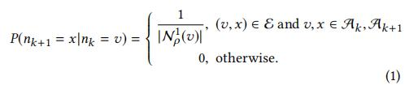
其中，nk是遍历中的第k个节点，n1ρ(V)表示用于节点v引导的元路径ρ的一阶邻居集,并且是可重复采样。
这里采用的就是常规的元路径随即游走

#### Interaction Module
1、这里采用了一个类型转化矩阵，由于不同类型节点具有不同类型的特征空间，通过转换矩阵  转化到统一的特征空间。
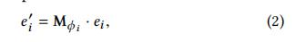

2、考虑到到源节点/目标节点不同距离的邻居对最终预测的贡献通常不同，我们将采样的元路径引导邻域划分为若干个**内距离邻居组**和**外距离邻居组**。
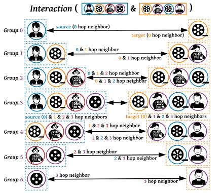
如图所示：当我们将距离设置为1时，我们可以得到内部距离组1和外部距离组5。同样，我们可以获得2i I 1组，其中i表示元路径长度。

我们认为互动应该只在相应的小组中使用。为了在每个邻居组中进行交互，我们需要面对两种情况。(也就是说不同的邻居组中使用不同的互动方式)
1）如果组中只有一个节点，我们采用基于元素的乘积(“与”)运算来度量它们的相似度或共同评级，例如，在组0的情况下，r(UA，MB)。
2）当有多个节点时，我们先按production进行交互，然后按汇总进行聚合，例如在组1的情况下，r(UA，DC)+r(MB，MB)。

对于不同的邻居组，可以是不同卷积运算来对邻居进行信息聚合，常见的卷积有  shift、product 和 sum。
然后模型对于某一条元路径进行建模，针对于某条元路径，再反向找回一条对应的路径，这样对于某条元路径存在着一下的嵌入矩阵表示：
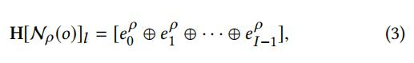
其中l是表示第l条元路径，$e_i^ρ$表示元路径中第i个节点的嵌入表示，I表示元路径的长度。这样对于H的shape是 (LXIXE)矩阵。
对于H[Nρ (o)]表示的是由节点0为起点的元路径嵌入矩阵。

于是，继续定义初始节点到目标节点的邻居交互为：
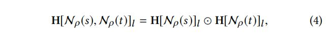
其中⊙表示卷积运算，其定义如下：
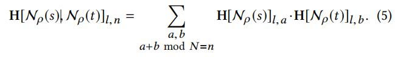

众所周知的卷积定理指出，空间域中的卷积运算等价于傅立叶域中的逐点乘积。设F表示快速傅立叶变换，F∀1表示它的逆，我们可以计算卷积如下：
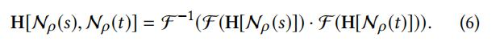

其中&H[N_ρ (s), N_ρ (t)] ∈ R^{L×N ×E} &

####  Aggregation Module
HIN上的每个对象o包含多种类型的语义信息，用不同的元路径ρ0、ρ1、···、ρpp1来表示。这进一步导致各种相互作用矩阵H[Nρ0]、H[Nρ1]、···、H[Nρpp1]。
为了捕捉复杂图中的关键信息，我们需要融合不同元路径所揭示的多种语义，即在路径/矩阵级别。

即这里的聚合指的是同一对象的不同元路径的聚合。
从原点与目标节点中提取元路径i，j的交互嵌入表示，可以计算两者之间的自注意力，

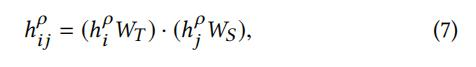
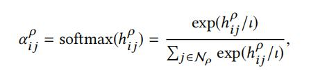

其中hρi , hρj 就是不同元路径的表示，通过计算得到的自注意力，为了共同关注来自不同表示子空间的邻域并稳定地学习，我们利用前人工作中的多头注意[31]将观察扩展为：
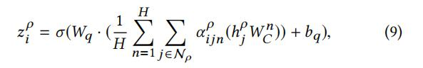
其中H是注意头数，wq、wc、bq是可训练参数。因此，基于元路径的嵌入zρi是基于具有单个元路径和语义特定信息的元路径引导邻域聚合的，即H[Nρ]。
给定元路径集{ρ0，ρ1，···，ρpp1}，反馈到节点级注意后，可以得到P组语义特定的交互嵌入，记为{Z[Nρ0]，Z[Nρ1]，···，Z[Nρpp1]}。

一样的为了获取每条元路径的不同重要性，通过自注意力机制再次聚合不同元路径嵌入，不同的是这里他对每一个元路径进行了一个全连接操作。
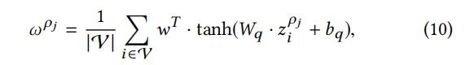
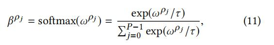
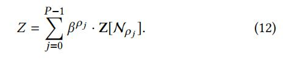

总的来说这个想法很新颖，这应该是算是异质图学习用于推荐系统的进一步创新。

