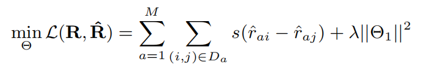

## SocialGCN: An Efficient Graph Convolutional Network based Model for Social Recommendation

### ABSTRACT

背景：这些社交推荐模型中的大多数都利用了每个用户的本地邻居的偏好来减轻CF中的数据稀疏性问题。

问题： 但是，他们只考虑了每个用户的本地邻居，而忽略了随着信息在社交网络中传播而影响用户偏好的过程。

论文创新点：在经典CF模型的基础上，我们提出的模型的关键思想是，我们借鉴GCN的优势来捕捉社交网络中社会传播过程如何影响用户的偏好。 用户偏好的扩散是以分层扩散的方式构建的，
初始用户的嵌入取决于当前用户的功能以及该用户功能中未包含的自由用户潜在向量。同样，每个项目的潜在向量也是该项目的自由潜在向量及其特征表示的组合。

### Introduction

传统的CF模型，通过user-item交互矩阵学习用户项目潜在空间的嵌入向量。目前越来越多的人喜欢在这些社交平台上表达对项目的看法。
许多模型利用用户之间的社交网络来缓解数据稀疏性问题并提高推荐性能。

Question：在社交网络中，信息会从每个用户传播到她的社交邻居，然后是社交邻居的邻居，从而导致信息扩散过程。 替代单跳本地社交网络结构，如何捕获用户之间的影响力扩散过程，以获得更好的社交推荐效果？
同时在大多数社交平台中，用户和项目都与丰富的属性相关联，设计模型是否可以灵活地利用用户和项目的丰富属性？

 GCN的关键思想是学习图中的迭代卷积运算，其中每个卷积运算都意味着从上一层本地邻居的聚合中生成当前节点表示。
 
 >GCN从节点表示的底层作为其节点功能开始，它堆叠了多个卷积运算以模拟图的消息传递。 因此，GCN中充分利用了具有图结构和节点属性的信息传播过程。

SocialGCN:我们借用GCN的优势来了解用户的偏好如何受到社交网络中社交传播过程的影响。 用户偏好的扩散是以分层扩散的方式构建的，初始用户的嵌入取决于当前用户的功能以及该用户功能中未包含的自由用户潜在向量,同样，每个项目的潜在向量也是该项目的自由潜在向量及其特征表示的组合。

### Related Work

######  通常CF是通过打分矩阵学习低维的潜在向量， 实际上，与明确的评分相比，用户通过点击或添加到购物车或消费等行动或不作为隐式表达反馈的情况更为普遍

1. 贝叶斯个性化排名:（BPR）是一种基于最新潜在因子的技术，用于处理隐式反馈。 
 
> BPR并没有直接预测每个用户的点式显式评分，而是在假设用户偏好观察到的隐式反馈与未观察到的隐式反馈之间进行建模。 

问题: 尽管性能相对较高，但冷启动问题仍然是这些协作过滤模型性能的障碍。

######  社交推荐可以利用用户之间的社交网络来提高推荐效果.实际上，社会科学家长期以来一直认为，随着信息在社会网络中的传播，用户会受到其与社会影响理论的社会联系的影响，从而导致在社会邻居之间出现类似的偏好现象

1. SBPR模型:被提议为成对的BPR模型，并假设用户倾向于给他们的朋友偏爱的物品分配更高的评分 

2. TrustSVD:通过将社交邻居的偏好视为活动用户的辅助隐式反馈，以SVD ++为基础来获得社交邻居的信任影响（Koren 2008）。

所有这些基于社会建议的模型都显示出社交网络建模的卓越性能。 然而，当前的模型是基于浅层模型，以利用社交网络结构（例如，社会正规化或将社会邻居的偏好结合起来作为辅助反馈）。
但是SocialGCN没有考虑社交邻居信息，而是通过社交网络中的信息传播过程显式地建模用户的潜在偏好。

######  图卷积网络关键思想是在图的消息传递或信息传播方式中生成节点嵌入。 具体而言，每个节点通过聚集来自邻居的信息来获取其嵌入，然后，来自邻居的消息基于其各自邻居的邻居，依此类推。

1. Graph SAGE:通过学习一个函数来扩展GCN到归纳设置，该函数通过对节点本地邻居的特征进行采样和聚合来生成嵌入

2. PinSage:该算法结合了有效的随机游动和图卷积来生成包含图结构以及节点特征信息的节点嵌入

3. SocialGCN:专注于利用GCN来对社会传播过程进行建模，以获得更好的社会推荐效果。

### The Proposed Model

在基于社交的推荐系统中，有两组实体：用户组U（| U | = M）和项目组V（| V | = N）。

令评分矩阵R∈RM×N表示用户对项目的隐式反馈，如果用户a对项目i感兴趣，则rai = 1，否则等于0。社交链接矩阵S∈RM×M表示社交连接 社交网络中的用户之间。 如果用户a跟随用户b，则sba = 1，否则等于0。

每个用户a的自我社交网络（即a跟随的社交邻居）是S的第i列（Sa）。

每个用户 a与实值属性相关联，在属性矩阵X∈Rd1×M处，实值属性在用户中表示为xa。
每个项目i在项目属性矩阵Y∈Rd2×N中具有属性向量yi。

社交推荐任务要求给定一个评分矩阵R和一个社交网络S，以及用户和商品的关联特征矩阵X和Y，我们的目标是预测每个用户对未知商品的偏好。

##### 模型结构：

1. 简介：该模型描述了传播对社交网络进行社交推荐的影响。 与许多基于潜在因子的模型相似，我们的目标是在低潜在嵌入空间中对用户和商品进行编码，以使潜在空间中的相似度近似用户对商品的偏好。

	令$U∈R^{D×M}$和$V∈R^{D×N}$表示用户和项在潜在空间中的嵌入。将用户a对商品i的预测偏好（表示为$\hat r_{ai}$）计算为：
		
		$$\hat r_{ai} = U_a * V_i$$
	  
	其中ua表示用户嵌入矩阵U中的第a列查找，vi表示项目i潜在嵌入项目嵌入矩阵V中。
	
2. 传统的基于潜在因子的方法是浅层模型，其中每个用户（项目）潜在嵌入都是直接根据嵌入矩阵的参数进行嵌入查找,但是，基于浅层潜在因子的模型存在一些局限性。
	
	- 由于用户的反馈通常很少，仅依靠浅层嵌入就无法对可能确定每个用户（项目）潜在向量ui（vi）的复杂方面进行建模。

	- 用户和项目都具有丰富的属性。 常用的FM学习用户和商品的表示，但是FM会忽略了属性和潜在嵌入之间的相关性
	
	- 在社交推荐系统中，用户彼此连接，并且用户之间的影响传播可能在很大程度上影响用户嵌入矩阵U的公式。

我们使用a，b，c表示用户，使用i，j，k表示项目。

3. Item Embedding.
	
	对于每个item i，假设Vi的嵌入向量包含两部分：yi是item i属性的嵌入，qi是初始嵌入矩阵Q中得来。因为qi无法捕获
	物品i的属性，因此用vi来表示物品的属性，其表示为：
	
	$$v_i = \sigma \left( F ×  [ q_i, y_i ] \right)$$
	
	其中[qi，yi]表示item i的特征向量及其对应的自由嵌入的串联 F是转换矩阵，加上非线性函数得到Vi，其中省去了偏值。
	
4. User Embedding.
	
	对于user a 其潜在嵌入向量ui的组成比较复杂。user的潜在向量表示受社交邻居的影响，所以我们采用GCN的方式，通过多层结构学习社交网络S中
	每个节点的嵌入表示。其中$h_a^k$表示第k次卷积之后的嵌入表示。在通过其邻居的第k层表示，卷积得到user a的K+1层嵌入表示。
	
	$$h^{k+1}_{Sa} = AGG_k(h^k_b , b ∈ S_a), $$
	$$h^{k+1}_a = CONV OLV E^{(k)} ( [h^{k+1}_{Sa} , h^k_a ]),$$
	
	其中AGGk表示的是user a 聚合从邻居的第k层嵌入表示$h^k_b$中的影响。这
	里的聚合有（average aggregation or max aggregation）。
	然后将k+1层的嵌入向量表示和a的嵌入向量拼接，送去到深度全连接网络，深度网络中使用ReLU函数，以及参数矩阵W。CONVOLVE就是这个深度全连接网络，其公式表示:
		
	$$h^{k+1}_a = ReLU(W^k \* [ h^{k+1}_{Sa} , h^k_a  ])$$
	
	然后，我们将其嵌入到第k + 1层。
	
	在原始GCN模型中，使用每个用户的特征向量xa，将每个用户的第0层嵌入定义为她的输入特征： $h_a^0 = x_a$
	
	由于作者认为矩阵X无法捕获每个user的潜在兴趣，于是类似于项目嵌入，我们还将每个用户属性的嵌入Xa与来自用户自由基础潜在矩阵P∈RL×M的自由基础潜在向量pa关联
	再通过深度神经网络得到$h_a^0$的嵌入向量表示：
	
	$$h^{0}_a = ReLU(W^0 \* [ x_{a} , p_a  ])$$
	
	通过上面知道了$h_a^K$和 $h_a^0$ 后，我们可以得到最后的潜在向量表示：
	
	$$u_a = h^K_a + \sum_{i \in R_a} \frac{v_i}{|R_a|}$$
	
	其中Ra = [i | i：rai = 1]是喜欢的项目集,
	每个用户的最终潜在表示ua是两个部分的组合: 1.来自社会扩散过程的嵌入为：$h_a^K$
	2.以及来自她的历史行为的偏好为：$ \sum_{i \in R_a} \frac{v_i}{|R_a|}$
	
	实际上，利用用户的历史反馈进行用户嵌入部分类似于SVD ++模型. 我们提出的用户潜伏嵌入部分通过精心设计的扩散兴趣向量$h^K_a$来利用社交扩散过程中的用户特征来改进SVD ++。
	
	
##### Model Training
	
由于本文探讨的是负反馈，类似于BPR中广泛使用的基于排名的损失函数，我们还设计了基于对排名的损失函数以进行优化：
	

	
其中s（x）是sigmoid函数。  Θ= [Θ1，Θ2]，Θ1= [P，Q]，Θ2= [F，[Wk] Kk = 1]。  λ是控制用户和无项目嵌入矩阵的复杂度的正则化参数。  Da = {（i，j）| i∈Ra∧j∈V V Ra}表示a的成对训练数据，其中Ra表示肯定表示反馈的项目集。

##### Model Analysis

1. Space complexity：
	模型参数由两部分组成：用户和项目自由嵌入Θ1= [P，Q]，参数集Θ2=[F, [Wk]Kk=1]
	Θ1的空间复杂度与基于经典潜在因子的模型(BPR)相同, 对于Θ2中的参数，因为它们在所有用户和项目之间共享，所以此额外的存储成本是恒定的。因此SocialGCN的空间复杂度与基于经典潜在因子的模型相同。	
	
2. Time complexity：
	由于我们提出的损失函数将BPR与成对损失相似，因此我们比较了SocialGCN和BPR的时间复杂度。 扩散过程的成本为O（MKL），其中M为用户数，K表示扩散深度，L表示每个用户的平均社会邻居。 同样，更新参数（第12行）的额外时间复杂度为O（MKL）。 因此，额外的时间复杂度为O（MKL）。同时实验显示，k=2或k=3时达到最佳。
	 
	 
3. Model generalization.
	模型对于user和item是否有自身属性都是可用的，当没有自身属性时每个项的潜在嵌入vi都退化为qi。 同样，每个用户的潜在嵌入ua随第0层嵌入h0 = pa而变化。
	
	
### Experiments  

在本节中，我们进行实验以评估SocialGCN在两个数据集上的表现。

##### Experimental Settings

1. 数据集：
	- Yelp是一个基于位置的在线社交网络。用户与他人成为朋友，并通过评论和评分的形式表达他们的经验。 与许多作品类似，由于每个用户给的评分在[0，5]范围内，因此我们将大于3的评分转换为该用户喜欢的项目。
		由于丰富的评论与用户和项目相关联，因此我们使用流行的gensim tool2来学习每个单词在Word2vec模型中的嵌入。 然后，我们通过平均所有学习到的用户（项目）的词向量来获得每个用户（项目）的特征向量。
		
	- Flickr是一个基于who-trust-whom的在线图像社交共享平台。 用户关注其他用户，并向其社交关注者分享他们对图像的偏好。 用户通过投票行为来表达自己的偏好。 为了进行搜索，我们从该平台爬取了一个大型数据集。
		给定每个图像，我们在数据集上对该图像进行了真实分类。 我们将图像发送到VGG16卷积神经网络，并将VGG16中最后一个连接层中的4096维表示作为图像的特征表示。 对于每个用户，她的特征表示是训练数据中她喜欢的图像特征表示的平均值。
	 

### Conclusions

SocialGCN模型结合了GCN的优势（用于对社交网络中的扩散过程进行建模）和经典的基于潜在因子的模型来捕获用户项目偏好。 具体来说，用户嵌入是按分层扩散方式构建的，初始用户嵌入取决于当前用户的特征以及用户特征向量中未包含的自由用户潜在向量。 
同样，每个项目的潜在矢量也是该项目的潜在矢量及其特征表示的组合。 我们表明，当用户和项目属性不可用时，建议的SocialGCN模型是灵活的。 实验结果清楚地表明了我们提出的模型的灵活性和有效性。 例如，在Flickr上，SocialGCN比NDCG的最佳基准提高了13.73％。 将来，我们希望探索GCN，以用于更多的社会推荐应用，例如社会影响力建模，时间社会推荐等。

	 
	 

