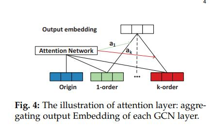

## Modelling High-Order Social Relations for Item Recommendation
* [论文](https://arxiv.org/pdf/2003.10149.pdf)

### 摘要
在线社交网络的普及使得必须研究社交关系如何影响用户的选择。 但是，大多数现有方法仅利用一阶社会关系，即连接到目标用户的直接邻居。 
高层社交关系，例如，朋友的朋友，其非常有益于揭示用户的喜好，而在很大程度上被忽略了。 在这项工作中，我们专注于建模社交网络中高阶邻居的间接影响，
以提高商品推荐的效果。 与主流社交推荐者不同，后者通过社交关系对模型学习进行规范化，相反，我们建议在预测模型中直接考虑社交关系，
旨在学习更好的用户嵌入来改进推荐。 为了解决高阶邻居随订单数量急剧增加的挑战，我们建议沿社交网络递归“传播”嵌入，
以将高阶邻居的影响有效地注入用户表示中。 我们对Yelp和Douban的两个真实数据集进行了实验，以验证我们的高阶社会推荐（HOSR）模型。
 实证结果表明，我们的HOSR明显优于最近基于图正则化的推荐器NSCR和IF-BPR +，以及基于图卷积网络的社会影响力预测模型DeepInf，实现了该任务的最新技术水平。

### 介绍
在现实世界中，当用户考虑要消费哪些商品时，其朋友可能会影响决策选择。 例如，她可能会向朋友提出建议或被一个朋友购买的产品所吸引。 
此外，在线社交网络的普及为用户之间的交流提供了便利，这进一步放大了社交因素的“口碑”影响（请参见图1作为说明性示例）。 
因此，为了提供令人满意的推荐服务，重要的是要在可用的社会关系中考虑证据。

为了利用社交关系建立推荐系统并验证其效用，也就是社交推荐任务[2]，人们已经做出了一些先前的努力。 
最常见的解决方案是设计其他损失项以对社会影响的假设进行编码，并与推荐目标[3]，[4]，[5]，[6]，[7]，[8]，[  9]。 
例如，[3]，[4]，[5]假设连接的用户应具有相似的偏好，并在用户嵌入中定义L 2平滑度项以强制执行约束；  [7]，[8]假设，
朋友消费的物品比未观察到的物品更可取，并定义了成对损失条款以实施假设； 最近的方法IF-BPR [9]融合了平滑度和成对约束这两种策略，
以形成统一的目标函数。 我们将这些方法归类为基于正则化的方法，因为利用社会关系来正则化带有额外损失条件的项目推荐训练，因此比直接丰富预测模型要好。
   
   尽管它们有效，但我们认为这些方法在利用社会关系方面太“隐式”了，需要仔细调整社会正规化系数以使其良好运行[3]。 由于关注的任务是项目推荐，
因此，一种更明确和直接的方法是在直接针对推荐进行优化的预测模型中考虑社会关系。 来自TrustSVD的工作[10]的经验证据表明，在许多情况下，
基于正则化的社交推荐器2甚至可能不仅仅基于用户-项目交互（例如SVD ++ [11]）而表现不佳。  TrustSVD的强大性能（在评级预测中优于SVD ++）证明了实用程序，
更重要的是，它在预测模型中体现了将社会关系分解的潜力。 但是，TrustSVD的局限性在于它在构建用户嵌入功能时仅考虑了一阶邻居，从而不足以捕获社交网络中
可能的“口口相传”影响传播。

但是，由于在对高阶邻居建模方面存在以下两个挑战，因此这种直观的解决方案不可行并且可能无法很好地工作：
1、计算量大。 
   现实世界中的社交网络通常会在节点度上呈现出长尾分布，从而使少数用户（集线器）具有大量邻居（请参见图5）。 
   这使得高阶邻居的数量随着订单大小而急剧增加。 在表1中可以找到速度提高的证据。当我们考虑豆瓣上的三阶邻居时，每个用户的平均数量为7，
   是一阶邻居数的413倍-500倍。 因此，直接合并所有高阶邻居会导致较大的计算成本，并且难以扩大规模。 
   尽管像随机游走[9]这样的采样策略可以缓解这个问题，但是它有可能降低高阶关系建模的保真度。
   
2、重要性不同。 
   虽然高级社会关系很有用，但它们也可能包含噪音。 更重要的是，它们对于不同的用户并不是同等有用。
   直观地，对于具有许多邻居的用户而言，对一阶关系进行建模可能已经足够了（例如，U2）； 而对于邻居很少的用户而言，
   建模更多订单的关系可能是有益的（例如，U5）。 为了有效利用高阶关系，该方法需要能够了解用户的不同重要性。 不同的订单大小。 
   对于现有的基于正则化的方法和TrustSVD，这很难实现。
 
体来说，我们对一个GCN层进行了一步式传播-通过汇总来自其所连接邻居的消息来更新每个用户的嵌入-其复杂度与边数| A |呈线性关系。 
通过堆叠k个这样的GCN层，我们进行k步传播，并使用户的嵌入与其k阶邻居相关，其线性复杂度为k | A |。 为了解决重要性不断变化的第二个挑战，
我们设计了一种神经注意机制来自适应地汇总不同层学习到的用户嵌入。 通过在Yelp和Douban数据集上进行的广泛实验，我们证明了HOSR的有效性，
并提供了针对高阶社会关系建模的其他见解以供推荐。
总而言之，本文做出了以下贡献
	* 我们强调建模高阶社会关系以捕获社会推荐中可能的远程影响传播的重要性。
    * 我们提出了一种基于GCN的新预测模型，该模型通过多步消息传播将高阶社会关系显式编码到用户嵌入学习中。
    * 我们进行实验以证明我们的方法在社交推荐方面取得了最先进的结果，证明了高阶社交关系的高度实用性，特别是对于稀疏用户而言

### 方法论
一般而言，提出的HOSR模型由两个部分组成：1）使用GCN进行用户表示学习，以及2）注意层，该注意层聚合了每个GCN层的输出嵌入。 
我们首先提出要解决的问题，然后介绍HOSR的两个组成部分。 最后，讨论了模型优化和时间复杂度。

**问题描述**

   输入：用户集U，项目集​​V，用户-项目交互矩阵Y和用户-用户邻接矩阵A。
   输出：个性化排名功能，可将项目V映射为每个用户的实际值：fu：V→R。
   
数据稀疏性问题。 传统的矩阵分解经常遭受数据稀疏性的困扰，因为很大比例的用户只有很少的交互数据。 
因此，由于交互数据不足，很难推断出用户的偏好。 在改善通过一阶邻居的用户嵌入方面已经做出了一些努力[3]，[4]，[5]，[15]。 
然而，整合社会关系以解决数据稀疏性问题的关键挑战是用户的社会关系也非常稀疏[10]，从社会角度来看，导致用户偏好建模不准确。
在我们的模型中，用户嵌入与从用户的高阶邻居传播的嵌入结合在一起。 因此，不仅可以从其直接邻居推断出用户偏好，还可以从高阶邻居推断出用户偏好，
这有助于解决社会稀疏性问题。

**用户表示**
1、初始化
我们在表示学习框架下考虑推荐问题，其中每个用户和每个项目都表示为一个嵌入矢量，该矢量对用户和项目的内在特征进行编码。 
矩阵分解（MF）是一种众所周知的表示学习模型，已在推荐系统中证明有效。
   用户i和项j的嵌入分别用ui∈R 1×d和vj∈R 1×d表示，其中d是嵌入大小。
   因此，所有用户和项的嵌入可以用两个嵌入矩阵U和V表示，其中U的第i行和V的第j行是用户i和项j的嵌入。

2、建模一节邻居
用户的偏好会受到其社交关系的间接影响。 如先前的作品[9]，[15]所建议，用户可以与她的社交朋友分享相似的偏好。 
基于此假设，可以通过两个步骤来实现生成用户嵌入以利用其一阶邻居的功能：
1）嵌入传播； 2）嵌入聚合。
嵌入传播显式地模拟了两个连接的用户之间的影响，并且嵌入聚合汇总了从用户邻居传播来的嵌入。
给定一个用户-用户对（i，i'），从i'到i的传播嵌入pii'定义如下：

其中W∈R d×d'是可训练的权重矩阵，该矩阵学习有用的特征并将嵌入大小从d转换为d'。 在本文中，我们设置d'= d。  
Ai和Ai'表示用户i和i'的一阶邻居的集合。1 / p | Ai || Ai'| 代表传播信息的衰减因子，它定义了多少用户i'影响用户i的偏好。 
除了考虑邻居的信息外，我们还添加了用户i的自连接pii来保留她自己的嵌入。 图2显示了两个连接用户的一阶影响传播过程。
可以看出，用户U1的GCN层输出嵌入是通过用户U1和其邻居U2的原始嵌入生成的。
嵌入传播之后，我们将用户i的邻居和用户i自己的嵌入的所有嵌入汇总如下。

其中u（1）i代表输出用户i在第一GCN层中的嵌入。 我们将非线性激活函数设置为双曲线函数（tanh），
根据经验可以显示出良好的性能。 通过这两个步骤，我们明确定义了一阶影响传播。

3、建模高阶邻居
由于用户可能会受到其高阶邻居的影响，因此对高阶影响传播进行建模至关重要。
通过一阶影响力的传播，每个用户的嵌入都包含其一阶邻居的影响力。
因此，通过堆叠更多的图卷积层，我们可以组装高阶邻居的特征。
具体而言，通过堆叠k个GCN层，用户i可以聚合来自其k阶邻居的嵌入。 因此，用户i的嵌入可以递归表示为：

其中嵌入矩阵P定义为

其中W（k）∈R d×d是可训练的加权矩阵，而u k-1 i′是第（k -1）GCN层的用户i′输出嵌入。 如图3所示，用户U1的嵌入一开始仅包含她自己的功能。 
在每个传播步骤中，用户U1汇总高阶邻居的信息。 经过三倍的影响传播后，用户U1的嵌入由整个网络的信息组成。 
因此，我们明确建模高阶邻居的社会影响力，并将信息编码为目标用户的嵌入。   

通过遵循矩阵形式的传播规则，可以有效地计算出k层传播后的用户嵌入。

其中W（k）∈R d×d和W（k-1）∈R d×d是在k和k -1层影响传播之后的嵌入矩阵，并且将U（0）设置为U。每个元素Lij为 等于1 / p | Ai || Ai'| 
表示用户ui和ui'之间的衰减因子。
  A是用户社交关系邻接矩阵，而身份矩阵I则表示用户的自我联系。  D表示对角度矩阵，其中第t个对角元素Dtt = | At |。

### 聚合层
经过k层传播后，我们获得了由k阶邻居信息组成的用户嵌入。
   用户i对目标商品j的偏好可以通过内部产品来估算，其形式为：

但是，直接利用k层输出u（k）会引起问题[16]。 社交网络通常由一个类似于扩展器的核心部分和一个几乎是树的部分组成[16]，[17]，
它们分别代表了联系良好的用户和小型社区。 如图5所示，我们实验数据集中的大多数用户都有几个邻居，只有几个用户有很多邻居。 
当应用太多层时，嵌入传播到连接良好的用户的数量会迅速增加。 这导致过度平滑的问题[18]，这意味着每个节点的特征被太多的邻居混合并失去局部性。 
过度平滑的问题使节点难以区分并损害了模型性能。 另一方面，邻居少的用户需要应用更多的层来聚合足够的信息以进行准确的预测。
   因此，层数很难调整。 这就是为什么当层数为一或两层时，大多数基于GCN的模型[14]，[19]都能获得最佳性能的原因。
   
(这段话就是说每层GCN的结果都包含一定的信息，但是每个结果所表示的信息量是不确定，因此要使用注意力)

为了解决上述问题，先前的工作[16]建议将不同层的输出嵌入进行汇总。
   在这里，我们采用注意力机制[20]来评估每个节点的邻居阶数（例如，第k阶）的权重。 在本文中，我们使用神经注意网络，该网络在一些推荐任务中
被广泛采用[21]，[22]。 具体来说，我们在不同层的输出嵌入上计算加权和，其中sil是可学习的参数，表示在第i层上学习的特征对于用户i的重要性。 
整个神经注意网络的公式为：

其中Pu∈R d×d和Po∈R d×d是可学习的加权矩阵，将原始用户嵌入投影并将第l层嵌入输出到隐藏层。  
ReLU [23]是隐藏层的激活功能。 然后通过向量h∈R 1×d将隐藏层转换为注意力得分ail。
 最后，这些分数由softmax函数标准化。
   然后通过以下公式计算最终用户嵌入 

下图就是直观的表示图

   
   
   
   
   
   