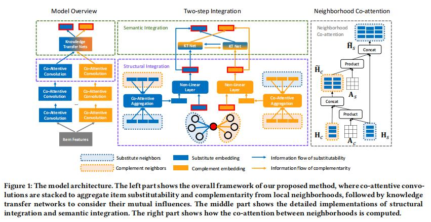
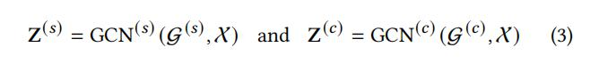
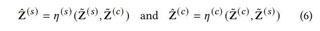

## Decoupled Graph Convolution Network for Inferring Substitutable and Complementary Items

> 论文地址：
> 代码地址：

### 1、背景

本文的场景主要是对项目之间的关系进行讨论，项目之间的关系主要存在两点问题：

- 项目之间是一种异质性的关系，而目前的卷积方法常用于出处理同质关系。
- 不同类型关系之间的相互影响。

在项目的多种关系中最主要的两种关系具有重大的意义：可替代和互补关系。
**因为用户最近点击的物品的可替代或互补物品是推荐列表中的主要内容。**

而先前这方面的研究主要将注意力集中于探究项目的属性，没有充分利用项目之间异质性的关系。本文正是对这样的关系进行处理，主要从两个方面
来处理这种异质关系：

-  解耦多方面的项目语义：由于之前的研究不区分不同类型的边关系，因此使用单一的共享item嵌入来表示边，这样会导致
	不同项目之间的关系是混乱的，嘈杂的。因此需要将多方面的项目语义进行解耦。

-  不同项目语义之间的影响建模：除了将不同的语义进行解耦，同时不同语义之间也会存在的相互影响。
	例如两件物品之间的可替代性的，那么他们之间会有很多相类似的属性，那么他们可能存在很多共同替换的物品。

针对与上面的问题，作者设计了DecGCN模型，下面就仔细看一些作者针对于这两个问题是如何设计模型并解决的。	

### 2、DecGCN模型

先从整体看一下模型的结构：

从模型的整体来看，模型的主干网络有两个分离的GCN部分，分别用于建模项目之间的替代和互补两种关系类型。
这两部分GCN针对于两个不同的子图，并且项目属性X 作为输入，输出两个项目嵌入表示，公式表示如下：

这解决了上述的第一个挑战，对于第二个挑战 因此本文采用将包含两步知识集成范式联合优化这两个子GCN。
具体的说，就是采用了两种整合方式将不同结构以及不同语义下的项目表示进行整合。

如图1中的第2个子图所示，整合分为两个部分：结构整合，语义整合。

**结构整合:**
由于是在两个不同子图上进行学习的，因此

**语义整合:**
定义两个恒河函数分别细化不同的项目语义：

这实现了将提取到的有用信息在不同的项目语义之间相互通信(信息传递)。

#### 2.1、结构整合：多方面的共保持邻域聚合

为了缓解不同图结构的固有影响，对于每个卷积层设计了共同保持邻域聚合策略，具体是个如何进行聚合的呢？

首先，本文定义了$N_i^{(𝑠)}$和$N_i^{(c)}$为节点v的替代邻居项目以及补充邻居项目

#### 2.2、语义整合：解耦节点表示之间的知识转移

### 3、实验
### 思考
### 参考

1、[《Decoupled Graph Convolution Network for Inferring Substitutable and Complementary Items》]()