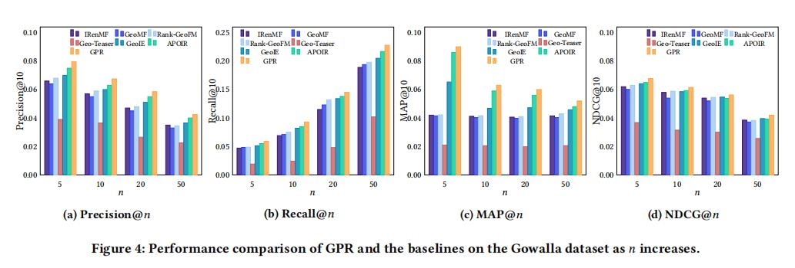

## Learning Graph-Based Geographical Latent Representation for Point-of-Interest Recommendation

>paper链接：https://arxiv.org/abs/1909.00385v1

## 背景

在POI推荐中，用户的行为受到物理约束，因此需要考虑POI之间的地理因素的影响，
以捕获用户行为模式和对POI的偏好

传统的方式分为两种：显式模型和隐式模型。

1、显式模型：使用POI的地理信息来训练得到地理因素潜在表示。其中USG,Rank-GeoFM , GeoSoCa , STGCN
等方法使用地理位置的距离以及各种函数(幂函数等)来考虑地理信息。 GeoMF 和 IRenMF方法使用区域对
POI进行划分，学习区域表示。

2、隐式模型： SG-CWARP和CAPE方法假设连续签到的序列中相邻的两个POI在地理位置相近。通过邻居
训练得到的地理信息潜在表示。

本方法提出的问题是，当前的模型无法捕获POI关系网络中的非线性地理因素影响，
于是提出了本文的模型GGLR模型来学习POI的地理信息潜在表示。

于是提出了两个概念：Ingoing influence和 outgoing influences，
Ingoing influence指的是从其他店到该POI点的影响；
outgoing influences指的是从该POI点到其他点的影响。

这两个定义主要是考虑到序列之间的前后关系问题。例如酒吧一般是一天最后去的一个场所，
因此它的Ingoing influence要大于outgoing influences。因此通过有向的图结构将POI点之间的先后关系因素考虑进去。

本文通过使用GNN的方式聚合POI的地理信息，同时只用指数函数来考虑POI之间的物理距离。

基于GGLR模型学习的地理信息潜在表示进一步进行POI推荐，该模型成为GPR。
该模型首先构造一个用户-POI图用户表示签到信息,通过交互过的POI的潜在表示得到用户的潜在表示；
然后通过用户和POI表示预测用户对未签到POI的偏好。

## 定义

1、user-poi图：
这里的构造方式是通过用户的签到记录进行构造图结构。

2、poi-poi图：
这里的构造方式就是根据用户的签到序列的顺序构造有向图，类似于session的构建方式。
同时为了考虑序列的一个时间问题，对序列点击时间做了一个切片，分为$h \in {3,6,9,12,24，∞}$

## 方法

先从整体看一下模型的整体结构：

可以发现该模型主要有两个部分，一个是从POI-POI图上学习地理位置的潜在表示。
然后借用学习到的潜在表示用于进行POI推荐模型。

### 基于图的地理位置潜在表示模型

**地理位置表示：**

该部分通过在POI-POI的有向图中通过GNN学习POI的高阶非线性表示。由于考虑到签到
序列的先后关系，因此对于节点的出度影响以及入度影响分别用两个向量表示 $p_i$和$q_i$。
从上图中可以看出两个嵌入的更新方式如下：

其中这两个嵌入分别从节点i的出度和入度分别聚合得到，并且对出度和入度进行正则化。
然后利用出入影响和入度影响预测节点i和j之间的的连续频率。

**物理距离特征：**

上面是通过用户的签到序列，通过隐性方式得到地理位置的潜在表示。接下来在通过利用
物理距离以显式的方式获得地理位置的潜在表示。

本文通过指数函数的形式计算两个POI点之间的距离关系。其中指数函数可以将距离较远的
两个POI点得到较高的数值，距离较近的两个点得到较低的数值，其中指数函数如下所示：

通过指数函数得到的距离特征，将其融入到出度影响和入度影响的连续频率中。

作者指出这样做的目的是为了考虑一种情况，即及时两个POI点之间的距离很远
但是由于两个POI节点的特性，其相关性会很强，因此通过上述方式将POI点之间的地理因素和
POI点之间的相关性相结合。

就如上图的红线所示，即使两个节点直接距离很远，但是由于相关性，两者之间存在
一定的POI影响。

损失函数如上述所示。

### 基于图神经网络的POI推荐

首先看一下用户-POI图，其中红色节点是用户u，蓝色节点是POI点，绿色的是
需要评估的未签到的POI点。

**用户的潜在表示：**

POI推荐任务包括根据用户的签入历史记录推荐可能访问的POI。为了考虑不同阶邻居节点的影响，
使用GNN的方式进行聚合：

其中f表示节点v的潜在表示。于是对于用户的嵌入表示，可以得到：

其中W1和W2不同。并且这里的地理位置表示使用的是其出度影响的潜在表示。

这里和普通的GNN不同的在于，这里的聚合只是得到用户表示，地理位置的嵌入
并不是通过二部图的聚合得到，而是通过之前的GGLR模型获得。

**用户偏好预测：**

对于用户偏好的评估，作者使用的是入度表示来作为POI点的表示。
然后使用拼接的操作将不同层的结果进行拼接，得到最终的用户和POI表示。

因此通过考虑到POI的出度和入度影响，进而考虑用户的偏好。

**参数优化：**

这里采用的是成对排名损失，通过未交互的POI和交互过的POI进行监督学习。

最终的损失包含GGLR和GPR的损失，以及两个模型参数的L2正则化。

### 实验

**数据集：**

**对比模型：**

**Gowalla数据上的模型结果：**

### 总结

这篇文章的背景是在基于POI位置信息的一个嵌入学习下，通过学习到的POI嵌入
再通过GNN的方式得到用户的表示。然后基于这两个嵌入得到最终的预测。

比较新颖的地方就是一个入度和一个出度的影响，强调POI之间的一个序列关系。
