# SDM: Sequential Deep Matching Model for Online Large-scale Recommender System

>paper链接：https://arxiv.org/abs/1909.00385v1

>代码和数据地址： https://github. com/alicogintel/SDM.

## 1、背景

大型的推荐系统需要快速和准确的反应用户的需求。通常采用的方式是召回和精排的方式，在召回阶段召回可能的候选集，然后在排序阶段进行精准排序推荐。

目前淘宝在召回阶段采用的模型基础是基于物品的协同过滤模型。但由于协同过滤模型只考虑用户的静态行为，并没有将用户动态兴趣考虑其中。

在淘宝这样的场景中，用户的序列行为采用session的方式进行存储，用户行为的主要特点有两种，一、用户在一个session中需求往往是很明显的，将这部分作为
短期兴趣；二、用户之前的session行为，虽说和最新的session的需求不同，但是也会反映用户的一个整体的兴趣，因此将这部分作为长期兴趣。

下面通过介绍具体模型来了解SDM是如何刻画用户的这两种兴趣，并且如何将这两者进行有效的融合，来帮助做最终的物品召回。

## 2、SDM模型
### 2.1、问题的定义
用户集合U，项目集合I。对于用户长短期兴趣的定义有如下规则：
	
1）日志中标记了同样的session ID
2）虽然session ID不相同，但是相邻的行为间隔小于10min
3）最长的session长度为50，超过50的划分到前一个session（猜测是从后往前划分session）

根据上面的规则，满足这3个要求，用户的短期兴趣表示如下：

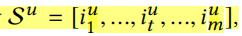

用户的长期行为$L^u$被定义为与$S^u$相隔一周以内的行为

根据上面的定义，则模型的整体流程如下所示：
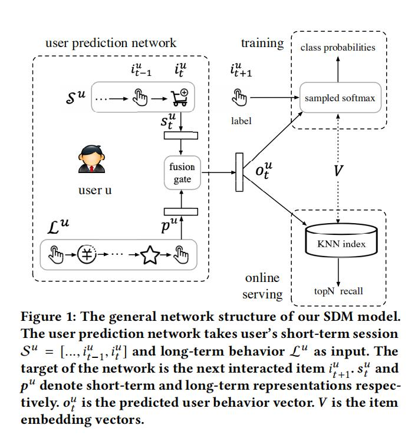

通过给定长短期兴趣，得到用户的长短期兴趣表示，通过融合门机制将不同兴趣表示进行融合，
最终得到用户的行为表示$o^u$。通过$o^u$和每个物品对应的向量$v_i$计算匹配分数，并根据分数高低进行召回：
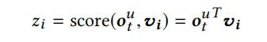
	
### 2.2、模型训练

通过模型的得到用户的兴趣表示$o^u$之后，根据日志可以得到用户的下一个交互物品，将其作为正样本，然后通过采样k-1个负样本，
分解计算着k个物品之间Embedding的內积，作为每个物品的得分。最终通过softmax和交叉熵来计算损失，并进行模型的训练。

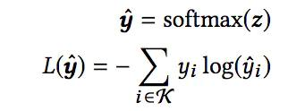
	
### 2.3、物品和用户的Embedding表示
在淘宝的推荐中，用户不仅仅关注物品本身，一些属性如品牌、店铺、价格等都是用户关注的属性。
因此，我们使用不同的属性来刻画物品，如物品ID、叶子结点分类、一级分类、品牌、店铺等等，
并将不同属性对应的embedding进行拼接得到物品的embedding表示：

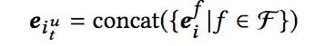

这里物品embedding通过一个全连接进行转化得到一个稠密向量，最终和侧信息进行拼接最终得到项目嵌入$e_i_t^u$

同样的，用户也有对应的属性，如年龄区间、性别、蜂窝(学生／白领等等）。用户的embedding如下：

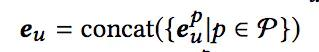

### 2.4、用户短期兴趣建模

用户短期兴趣建模的整体过程如下：

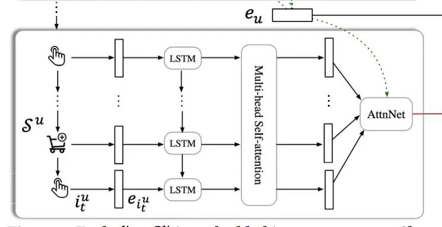

对于短期兴趣，先将用户最近的一个session里的物品转化成embedding，然后通过LSTM来进行建模：

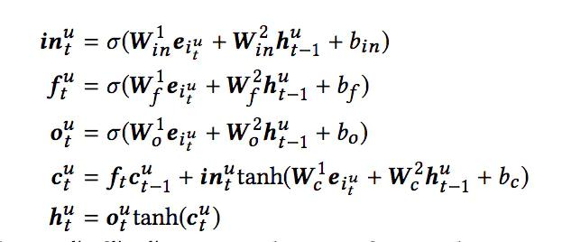

这样得的物品的hidden state的输出h，然后通过multi-head attention。这里我们将LSTM中得到的所用物品的hidden state的输出h组合成
用户u的表示 $X^U$,也就是multi-head attention的输入$X^U= [h^u_1, ...,h^u_t ].$

multi-head attention部分类似于Transformer部分的内容，不详细说。具体的公式表达如下：
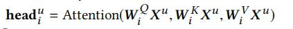

Attention的具体过程如下：
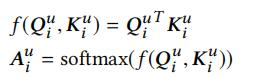
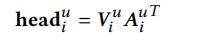

知道一个Attention的过程后，那么multi-head的表示如下：
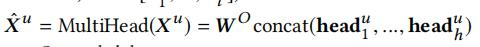

这样通过multi-head attention部分得到对应的序列输出$\hat X^U$

最后通过个attetion过程，这个过程主要是针对用户对不同物品的偏好程度的不同。
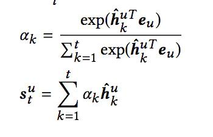

这样就得到了最终的用户短期兴趣表示。

**注：这里使用multi-head attention的原因有两点：**

- 用户的行为中存在一些误点击行为，通过self-attention来降低这种影响；
- 用户可能对不同物品的关注点不同。

这里参考了[文哥](https://www.jianshu.com/p/95acafac035c)的想法，说这里的LSTM过程
加入的没有必要，主要是因为这里可以采用类似于transformer的思想，在后面的multi-head attention部分
加入psoitiong Embedding来捕获时间序列信息特征，不用单独在使用LSTM去捕获，这样在
一定程度上可以提高时间效率。

### 2.5、用户长期兴趣建模

对于长期兴趣建模，不同于短期兴趣建模，主要是因为长期兴趣建模如果和短期兴趣一样，那么性能就不能满足。
因此对于长期建模，其出发点是从不同角度刻画用户的兴趣。即用户可能对不同的店铺有不同的喜好，对于不同的分类喜好不同。
因此把长期序列$L^u$根据不同的属性划分成不同的集合，如物品IDset、物品店铺set、物品品类set等等。对于
每个集合采用基于注意力机制的方式将不同物品聚合成一个整体的Embedding。于是对于$L^u = {L^u_f |f ∈ F }$每个子集合都有一个整体的
Embedding 被表示为 $f^u_k$,然后通过一个全连接层转化层$g^u_k$。于是利用用户的属性embedding($e_u$)作为查询向量与不同的$g^u_k$计算注意力分数，
具体的表示如下：

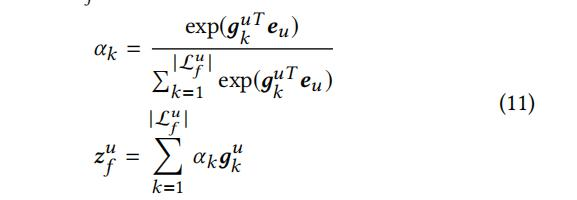

然后将不同集合的嵌入拼接上在通过一个全连接得到最终用户的长期兴趣表示：

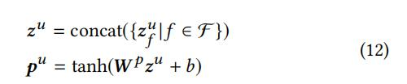

下面就是长期兴趣建模的整体过程：
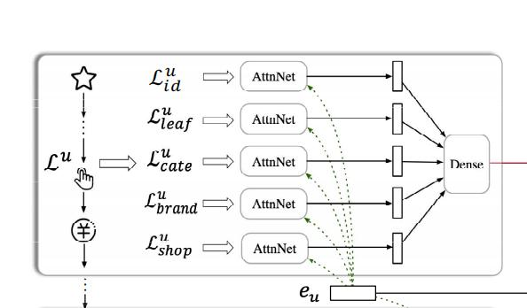

对于每个AttnNet结构就是算不同类别嵌入权重的过程，具体如下：

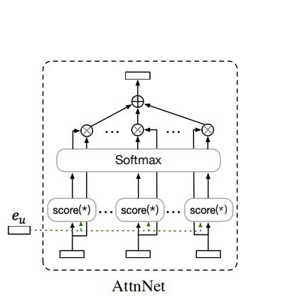

### 2.6、兴趣融合建模

通过上面的过程，可以得到用户的长期和短期兴趣表示，可是如何融合，作者特此作出了设计，具体的思路类似于LSTM中门的思路，过程如下所示：

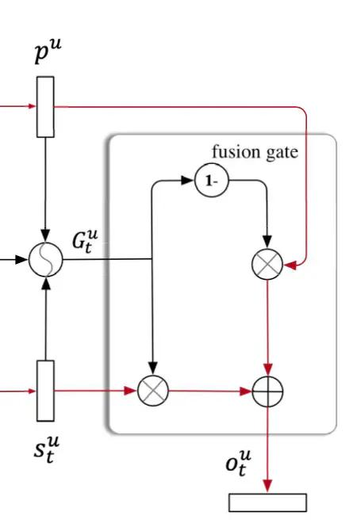

具体计算过程如下：

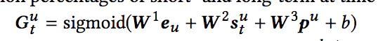

这样我们就得到了用户的兴趣表示$o^u$。

### 2.7 模型的整体结构

看一下整个模型的结构：

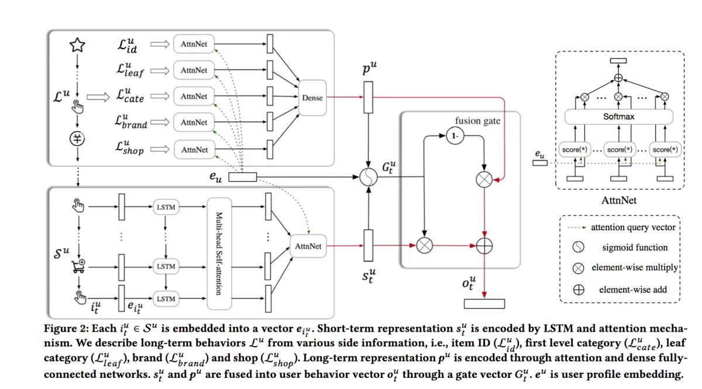

## 3、实验

该论文的代码和数据集已在gethub上给出。

### 3.1、数据集
本文使用了两个数据集
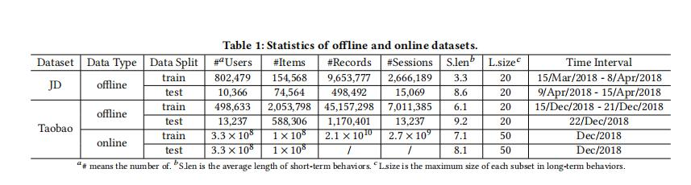

### 3.2、评价指标

评价指标分别采用了离线和线上两种形式。

离线指标：准确率、精确率、召回率和F1。

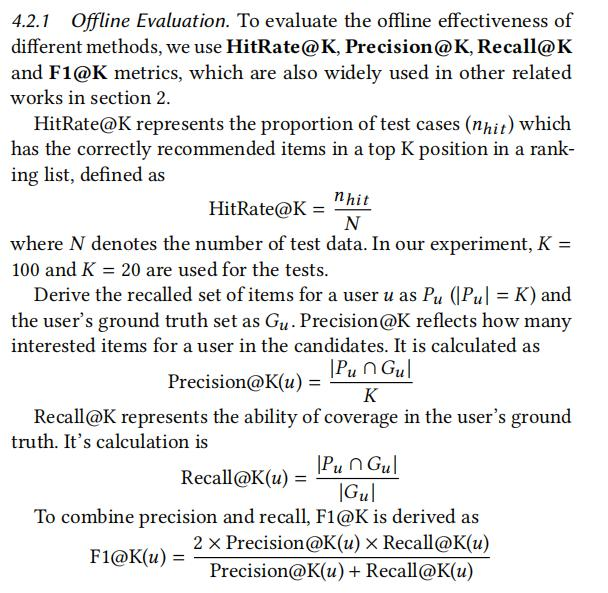

线上指标:pCTR, pGMV 和 discovery。

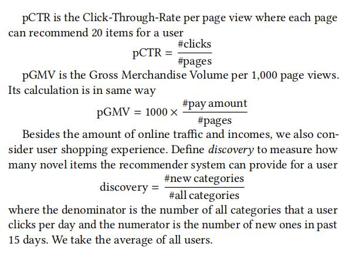

### 3.3、实验结果：

离线的实验结果：

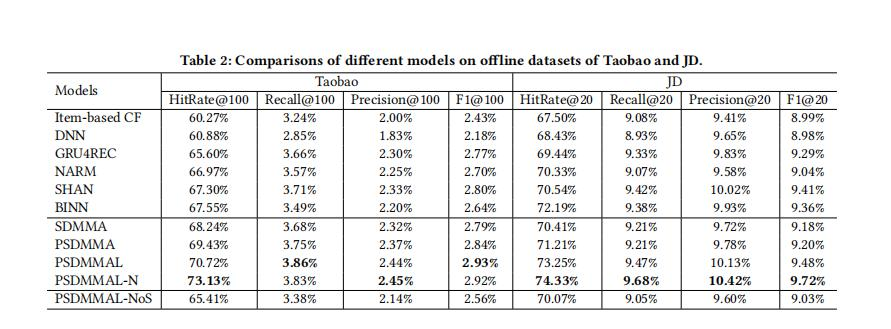

以及SDM也有很多的变种，可以简单看一眼
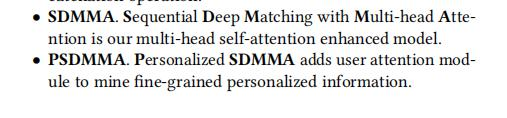
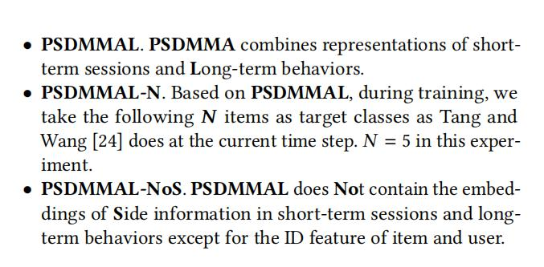

线上的实验结果：

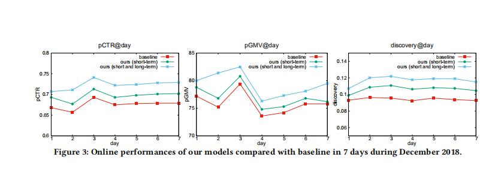

## 总结

这篇论文呢主要的点子就是将召回模型加入了用户动态兴趣的一个因素，不单纯考虑用户的一个静态兴趣。并且在淘宝这样的场景中，效果还不错。
主要的学习点还是对于用户兴趣建模的方式。

对于用户的建模可以考虑长期和短期兴趣相结合的方式，

- 对于短期兴趣可以使用一些时间序列模型对数据进行处理，同时使用注意力机制来聚合，得到一个整体的短期兴趣表示

- 对于长期兴趣可以使用进行分类，不同角度反映用户的兴趣，同时使用注意力机制来聚合，得到一个整体的长期兴趣表示

- 同时对于不同兴趣可以参考这种融合门的方式进行融合。

还有对于长期兴趣建模，我觉得其实他还是和之前看的DHAN这篇论文的思想有一些相似，在DHAN中将item进行聚合得到不同类别，类似于本文
中根据用户的属性将物品的类别进行分类。

## 参考

1、[《SDM: Sequential Deep Matching Model for Online Large-scale Recommender System》](https://arxiv.org/abs/1909.00385v1)

2、[文哥](https://www.jianshu.com/p/95acafac035c)