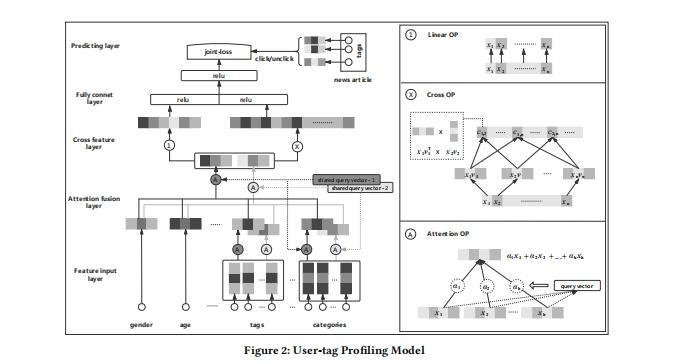
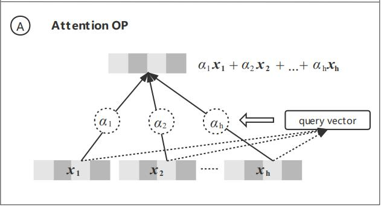
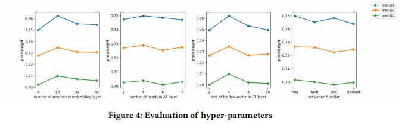

## Learning to Build User-tag Profile in Recommendation System

>paper链接：https://dl.acm.org/doi/pdf/10.1145/3340531.3412719

### 1、背景

本片论文的出发点是基于用户标签来捕获用户精确的画像。主要的特点是利用 多头注意力机制来处理多标签分类任务  以及基于矩阵分解的交叉特征层来处理
不同不同领域的稀疏特征。

本文是基于微信的看一看(Top Stories)这一场景进行介绍。首先了解一下看看的场景，如下图所示：

可以看到，这个场景中主要分为4个部分：新闻画像层(news profile layer)、用户画像层(user profile layer)、召回层(recall layer)和排序层(rank layer)。

在新闻画像层中包含新闻的基础属性，如标签，分类，子标题等；
在用户画像层中包含用户的基本属性(画像特征)，如性别、年龄，此外还包含了用户的行为特征，这里主要分为用户阅读过的信息，以及用户查询过的信息。
通过用户点击过的文章对应的标签作为候选集，在基于模型对于这些标签进行偏好预测(也就是说用户的行为是标签的ID序列，预测用户喜欢的标签种类)；
召回层中存在多种召回方式，包括基于标签的召回、基于协同过滤的召回和基于模型的召回；
排序层可以使用更为复杂的模型对召回层得到的结果进行精确的排序，最后将推荐类别的文章展示给用户。

因此本文关注的重点是用户对标签的一个喜好程度，提出了User Tag Profiling Model (UTPM)模型。

**问题**：

针对于看一看的场景，文中提出两个问题？

- 如何从用户多个特征中自动挑选出对不同领域(标签)有用的特征？
- 如何学习用户对点击过的新闻的不同标签的喜好？

针对于YouTube 提出的DNN模型，指出了两个问题：1）对于多个输入特征的聚合，采用mean pooling方式不能考虑到不同权重的问题；2）将不同领域
的嵌入直接通过拼接送入DNN，不能考虑到不同领域特征的一个交互过程。

针对这两个问题，UTPM的解决方式是，对于问题1）采用注意力机制来代替这个问题，对于问题2）则是采用基于FM分解的方式进行
不同领域(标签)的特征交叉，类似于AFM和NFM的方式。

### 2、UTPM模型

先简单看一下模型的整体结构：

从下而上可以看见，模型整体分为5个部分：特征输入层(Feature-input layer)、注意力融合层(Attention-fusion layer)、交叉特征层(Cross	feature
layer)、全连接层和预测层

### 2.1、特征输入层

对于特征输入层主要包含两个部分：用户画像信息和用户历史阅读信息。
用户画像信息包括用户的年龄、性别等；用户历史阅读信息包括用户历史阅读过的新闻对应的标签集合、类别集合等。

对于所有特征都是离散类型的特征，每个特征有一个单独的field(为了后面的交叉特征特意注意一下)。同时，部分是多值离散特征，如点击过的标签集合和类别集合。
这些离散特征都会通过Embedding层转换成相同维度的embedding向量。由于这里的特征维度非常的大，因此对于embedding的长度设计为128，
主要是为了适应一百万个特征的向量空间。

### 2.2、注意力融合层

这一层的关键是对多离散特征的处理，由于常用的avg／max-pooling处理方式忽略了不同取值的重要性，因此本文采用了multi-head attention的方式，
，通过两个可学习的query向量q1和q2，分别计算域内取值的权重，并进行加权求和，得到两个向量输出。以q1为例，计算过程如下：

以点击的Tags为例，假设在k个field中包含H个tag特征，对于每个tag特征的ti来说，先通过不同field
的Wk进行转化，然后将多值离散特征，得到对应的Embedding，这样通过注意力的方式将不同的embedding
进行整合得到多值离散特征的最终embedding(f1)。值得注意的是，对于不同的field来说，都使用共享的
query向量q1和q2。但是对于不同的field的参数W来说，是独有的。是不是还没有搞清q1和q2的区别，
其实q1和q2主要是针对多头来说，也就是说就是重复两次同样的过程。对于域内和域间采用同样的q。

作者认为对于不同域之间采用相同的query（q）参数可以更好的解决域中数据稀疏的问题，
更好的学习模型参数；同时通过two-head的方式从不同角度来学习特征信息。

这里，attention fusion layer的最终输出计作x

### 2.3、交叉特征层

cross feature layer主要进行特征交互。这里对x的不同维度之间进行特征交叉。对于x的每一个维度xi，
，都会对应一个隐向量vi，那么xi和xj的交叉结果就是cij，计算方式如下：

这样所有维度都进行两两交叉，得到的$c_{i,j}$一共会有E(E-1)/2，将这些cij最终拼接成c，也就是交叉特征层
的输出。

### 2.4、全连接和预测层

**全连接层**
这部分主要是将attention fusion layer的输出x和cross feature layer的输出c进行拼接，
然后经过两层全连接得到用户的最终embedding  

**预测层**

这里的关键是，label如何定义？一种做法是把所有用户点击过的新闻中的标签集合作为正样本，
把曝光未点击的标签集合作为负样本。但用户点击某个新闻，并不一定是对这篇新闻所有对应的
标签都感兴趣，有可能仅仅对其中部分的标签感兴趣。因此论文没有采用上述的方式。
而是将新闻是否点击作为label，预测值的计算过程如下：
首先，对于某篇新闻，其对应的所有标签都会转换成与用户向量u相同长度的向量，
随后用户向量u与所有的标签向量进行内积计算并求和，再通过sigmoid得到预测值：

最终的损失为logloss：

实验结果上也证明这种学习方式，能够取得更好的实验效果。

### 3、实验

数据方面采用的是看一看30天的数据集。

评价指标是：

模型对比结果：

重要参数的消融实验：

### 总结

本文比较有新意的点主要是两个地方：

- 对于多值离散特征，采用注意力的方式来得到一个整体的嵌入。对于不同域的特征，也通过注意力的方式聚合得到。
- 预测层中，采用用户和标签內积在求和的方式，并通过是否点击文章来做标签，来训练网络，这个很
	符合从标签任务转化成点击文章任务的过程。

### 参考

1、[《Learning to Build User-tag Profile in Recommendation System》](https://dl.acm.org/doi/pdf/10.1145/3340531.3412719)

2、[推荐系统遇上深度学习(九十八)-[微信]推荐系统中更好地学习用户-标签偏好](https://mp.weixin.qq.com/s/bKI5Z0xhyl-Da6m4NrneRA)

