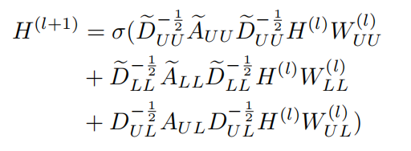
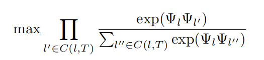

## Graph Convolutional Networks on User Mobility Heterogeneous Graphs for Social Relationship Inference

### 摘要
从用户轨迹数据中推断社会关系在现实世界的应用中有很大的价值，
比如朋友推荐和拼车。

**现在的方法**：
现有的大多数方法都是使用一些手工制作的特性，基于两两配对的方法来预测关系，
或者依赖一个简单的基于跳跃图的模型来学习图上的嵌入。

**存在的问题**：
使用手工制作的特征往往不能捕捉到人类社会关系中的复杂动态，
而基于图嵌入的方法仅使用随机游动来传播信息，不能合并提供的外部语义数据。

提出了一种利用图卷积网络(GCNs)在无监督的情况下学习用户迁移异构图上用户嵌入
的新模型。

该模型能够智能地传播关系层，并将异构图中丰富的结构信息和预测节点特征结合起来。

### 介绍

基于位置的社交网络(LBSNs)如Foursquare的广泛流行，基于位置的在线服务如Uber为我们带来了大量的人类轨迹数据。

了解潜在的人类移动模式被证明对各种应用程序(如POI推荐、下一次访问位置预测)有很大的价值。此外，社会关系可以从轨迹数据中推断出来，因为两者之间存在一定的相关性。

一个直观的想法是，两个经常见面的用户很可能成为朋友。
从人类移动数据中挖掘社会联系是至关重要的，因为它为我们提供了一个新的
视角来解决许多现实世界的问题，比如朋友推荐、链接预测和交通调度(共乘)。

**当前问题**：
利用人类移动数据对社会关系推理进行了广泛的研究。
然而，现有的大多数作品依赖简单的手工特征，单独预测成对关系，
没有考虑关系传播。它们无法解决不活跃用户的数据稀疏性挑战，
因为几乎所有基于成对的方法都要求两个用户共享公共位置以进行预测。

**基于Graph Embedding方法**：
一些基于图嵌入的方法(DeepWalk)已经被提出。它们不需要手工制作的特征，
这些特征可能不能准确地描述人际关系中的各种因素。

然而，这些方法并没有使用更强大的嵌入方法，而是主要使用一个简单的基于
跳跃图的模型来学习节点嵌入，该模型只计算从随机游动中提取的上下文的
概率，外部语义信息不能很好地集成。

此外，它们基于用户相遇图或用户位置二部图，可以将这两种图结合起来构建
包含更丰富信息的异构图，以获得更好的性能。

**基于GCNs**：
GCNs允许在任意结构图上进行卷积，
GCNs传播信息层的能力允许它们学习不同尺度的局部模式，
GCNs可以结合图结构和外部节点特性来学习预测性嵌入。

我们的方法是使用GCNs来学习用户迁移异构图上的用户嵌入，
该异构图融合了用户-用户、用户-位置、位置-位置关系。
我们使用一个基于skip-gram模型训练位置嵌入作为位置节点的功能,
为用户节点和轨道嵌入的特性被培训一个RNN模型来提取用户轨迹所属分类。
另外，如果我们提前知道了相应社交网络的一部分，我们的模型也可以包含它，
从而获得更好的性能。

**主要贡献**:
1. 据我们所知，这是第一个通过挖掘用户-用户相遇图、社会图、用户-位置二部图
	和位置-位置共现图的异构图，从人类移动数据中推断社会关系的模型。
2. 提出了异构图上的GCNs来集成外部语义信息(节点特征)和图结构，
	以实现用户在无监督和半监督两种情况下的嵌入学习。

### 相关工作
**GCNs**：

**流动性的关系推理**：

### 模型Heter-GCN
我们提出了在异构图上运行的GCN框架，以无监督地学习节点表示以及我们提供给
GCN的节点特性。最后，我们证明了我们的方法也可以通过合并部分社交网络以半
监督的方式使用。我们提出的方法的工作流程如图所示。

#### 构建用户迁移异构图
为了刻画用户的移动特征和模型间的关系传播，我们提出了用户移动异构图，
其中包含了表示用户-用户、用户-位置和位置-位置关系的各种信息。
用户移动异构图可分为:用户层、位置层和用户位置交互层。
下图中给出了一个示例。

用户层中的边连接用户节点。每条边ei,j代表用户i和用户j之间的移动关系，
其权重由两个用户之间的相遇频率来定义。

在半监督设置中，我们还为给定的部分社交网络中的每个社交对连接一个未加权
的边(作为用户层中的第二种关系)。

在用户-位置交互层，我们连接一个边缘eu,l从一个用户u到他的每个签到位置l。
边缘的权重是这个特定位置的签到数量(访问频率)。

对于定位层中的每一个边缘ep,q，我们将两个在原始用户轨迹中最频繁重合的
位置p和q连接起来，权重由共出现的频率给出(即， p和q在所有用户的轨迹中
连续出现的次数)。
直观地说，位置层中沿边缘的路径表示流行的旅行序列。

#### 非监督节点表示学习

我们将R-GCN框架扩展到异构图上的无监督节点表示学习，
该框架旨在进行半监督实体分类，并将其用作现有知识图上链接预测模型的
实体编码器。

R-GCNs使用以下在消息传递体系结构中表达的传播规则，
该规则聚合来自节点的本地邻居的信息，并将聚合的信息转发到下一层。

其中Nri表示关系r∈R下节点i的邻居，ci则为归一化常数。σ表示激活函数。
h(l) i是第i个节点在第l层的隐藏状态。对于每个不同的关系r∈R，
赋予不同的权值W(l)r，并添加一个自连接。
该分层传播模型可以实现稀疏矩阵乘法，计算复杂度与边数成线性关系。

在我们的用户移动异构图中有三种类型的关系:用户-用户会议、用户-位置访问和
位置-位置共现(在非监督设置中没有ground truth社交对)。
所有这些关系都必须明确地建模，并具有单独的权重。
我们可以将传播规则表示为矩阵形式:

其中AUU = AUU +I为异构图的邻接矩阵,其中只包含添加了自连接的用户-用户边(在用户节点中)
DeUU为对应度矩阵，W(l) UU为第l层用户-用户关系的权值矩阵。
AeLL, DeLL, W(l) LL的定义方法与位置-位置关系相同。

对于涉及到用户位置关系的AUL、DUL、W(l) UL，由于邻接矩阵是两种不同节点之
间的二部关系，所以我们没有在邻接矩阵中添加自连接。

所有这些邻接矩阵都有相同的维数,H(l)是第l层的激活，
H(0)是输入节点特征。σ象征着一个激活函数(在这里我们使用ReLu激活)。

受异质跳跃图模型的启发，我们引入了一个损失函数，
该函数旨在以完全无监督的方式学习节点嵌入。我们鼓励相邻节点具有相似的
表示，而遥远的节点具有不同的表示。单个节点u的损失为:

Φ(u)来表示节点的输出嵌入u,σ是sigmoid函数
v表示一个齐次节点(即，如果u是一个用户节点，那么v也是一个用户节点)在节
点u的本地上下文中，而w是这个本地上下文中的一个异构节点。
v和w可以从u附近的节点中随机选择。

NEG(u) 是负采样组，其中的节点不在u的节点的本地上下文中。
λheter和λneg分别控制异构环境的重量损失和负采样损失，
整个图的损失在所有节点上取平均值。

由于GCNs利用节点特性来学习节点表示，我们将提供有用的、可预测的用户和位置
嵌入作为输入。我们采用了中的方法来学习用户和位置的嵌入。

首先，我们将每个用户的轨迹分成一系列子轨迹。分裂后,嵌入的位置是学会了使
用一个基于skip-gram模型:对于一个给定的位置,我们要学习它嵌入Ψl通过最大化
的概率预测它的上下文C (l、T)与l(节点共存轨迹T l所在):

在学习了每个位置的嵌入后，将位置嵌入后的子轨迹输入到带有GRU单元的RNN中。
为了以监督的方式训练网络，最后的隐藏状态通过带有softmax的FC层将子轨迹链
接到用户。最后将RNN的隐藏状态作为子轨迹嵌入。一个用户的嵌入是通过对该用
户的所有采样子轨迹的嵌入求平均得到的。

#### 半监督节点表示学习
如果已知社交网络中朋友对的一部分，我们可以进一步改进我们的方法的性能。
在这个场景中，我们使用两种方法来扩展我们的模型。
首先，我们将节点的邻居信息作为局部上下文合并到损失函数中。

我们计算以下半监督损失项Lsemi = =log(Φ> uΦz) z是一个邻居节点u的社交网
络。半监督环境下的最终损失函数定义如下:

其中λsemi 控制半监督损失在整体损失中的比重。

其次，我们将部分社交网络视为一种新型的用户-用户关系(如3.1节所述)，
并在卷积中对其使用单独的权矩阵。

具体的我们对公式2中加入$D_S^{-0.5} A_S D_S^{-0.5}$ 其中
As Ds分别为用户节点上具有自连接的已知部分社交网络的邻接矩阵和度矩阵。
