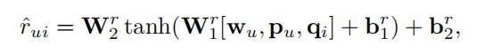
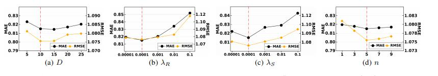

# Feature Evolution Based Multi-Task Learning for Collaborative Filtering with Social Trust

### 摘要
现存的研究都认为信任用户之间存在相似的兴趣偏好，并且通过在同一空间对用户偏好以及用户信任关系进行建模。

本文提出的点在于：设计了一个特殊的特征进化单元，使得两个任务的嵌入向量能够以概率的方式交换它们的特征，
并进一步利用元控制器来全局地探索特征进化单元的合适设置。

### 介绍

以往的研究：
1、基于相似度的方法：在经典的思想流派中，研究人员利用信任传播方法[Massa和Avesani，2007]通过她朋友的特征来估计用户的偏好，
或者在用户-项目二部图和用户社交图上采用随机游走[Jamali和Ester，2009]来预测未来的交互。

2、集成方法：在现代思维流派中，研究人员使用不同的模型将社会信息合并到推荐中。它们采用矩阵分解(MF)[Ma等人，2009；Yang等人，2013；郭等人，2015]，
图正则化(SocialReg)[Ma等人，2011；Wang等人，2017]，概率模型[梁等人，2016；王等人，2018；孟等人，2018]，网络嵌入[文等人，2018；刘等人，2018]，
以及图神经网络[Ying等人，2018；Song等人，2019；Wu等人，2019]来将高维网络信息编码为可访问的特征。

问题：
i)假设用户偏好和社会信任的共同特征空间，直接将友谊等同于偏好相似度；
ii)将社会影响力建模为静态权重或固定约束。
由于这些局限性，社交网络的加入可能会在一定程度上限制推荐模型的准确性。

首先，对于现代社交网络服务来说，朋友之间的关系是复杂和动态的，一些兴趣不同但目标相同或相互依赖的用户也可能以朋友的身份联系起来。
其次，在不同的背景下，来自朋友的影响往往会随着强项的不同而不同，而不是像静态权重一样保持不变。

本文提出的模型：
对于一个用户，我们考虑了两个独立的潜在因素，这两个因素分别编码了一个人对物品的偏好和来自社会网络的信任信息。
然后，这两个因素将经过一系列特征进化单元，这些特征进化单元是专门设计的，以便让两个输入向量按照一定的概率分布共享它们的特征。

特征进化单元：
1)使两个任务实现局部交流，随机建模社会影响；
2)NE特征能融合社会信息，增强推荐，CF特征能引导NE任务捕捉更有效的社会特征；
3)概率特征共享给训练增加了足够的随机噪声，能帮助每个任务走出局部最优。

### 背景

### 模型TrustEV
#### 定义
对于用户评分矩阵定义为  R,将社交矩阵定义为S。其中都是为隐式反馈。

#### 嵌入层
输入的是用户项目的ID 的one-hot 向量，通过嵌入矩阵P和T将用户映射成低维嵌入向量。通过嵌入矩阵Q将项目映射成低维嵌入向量。
其中P用来捕获用户的偏好，T用来捕获用户的社会影响因素。

#### 协同过滤模型和网络嵌入模型(NE)
协同过滤模型部分主要是将  用户偏好嵌入，项目特征嵌入以及社交网络中的用户偏好影响嵌入 三者通过两层全连接进行得到预测分数

NE模型主要是想将社交网络编码成低维向量表示，因此通过学习的社交因素嵌入矩阵S获取用户之间的票号影响。
其主要通过两层的全连接捕获用户之间非线性的关系。

最终的损失将两部分加在一起，并且加上对3部分嵌入矩阵进行正则化。

#### 特征提取层
为了实现CF模型和NE模型之间的充分通信，我们设计了一个特殊的特征演化单元。

输入：将用户偏好嵌入和信任因素嵌入作为输入。
输出: 将用户偏好嵌入和信任因素嵌入输出。

从整体上看：
我们首先以Pu和Tu作为输入，得到p(1)u和t(1)u。然后在p(1)u和t(1)u的基础上进一步得到p(2)u和t(2)u。
新的表示法p(2)u和t(2)u将取代原有的因子Pu和Tu作为CF和NE模型的输入。

从具体细节看：

将x1，x2作为输入向量，将y1，y2作为输出表示。
首先，我们假设两个伯努利分布分别用p1和p2参数化，构造了两个元素为i.i.d.的向量e1∈r1×D，e2∈r1×D。样本取自两个伯努利分布。
我们有e1k∼bernoulli(P1)(分别为。E2k∼bernoulli(P2))，其中e1k(分别为。E2k)是E1的第k个元素(分别为。E2)，并且k=1，···，D。
然后，我们让两个输入向量部分地交换它们的特征，如下所示：

**我对这个设计的立即是将，部分用户的部分兴趣以及部分信任因素进行融合。**
**不合理之处：随机性，其次每个维度当做是某个兴趣或信任影响因素太过于粗粒度**

接下来将融合的嵌入通过一个全连接进行非线性转换得到更浓缩的向量。可以看出维度保持不变。

之后通过一个权重加和，将ml和x进行叠加。之所以这么做为了防止梯度消失的发生。

特征融合单元的好处：
一旦两个矢量通过特征进化单元，新的表示将携带来自两个矢量的部分信息。为了实现更深层次的特征共享，
可以将K个特征进化单元一个接一个地连接起来。新机制具有以下几个优点：
1)NE特征可以将信任信息融入推荐中，CF特征可以引导NE任务选择有效的社会信息；
2)两个任务之间的局部通信使它们能够准确地相互补偿，而不会限制另一个模型的表达能力；
3)概率交叉特征操作增加了训练过程中的随机噪声，帮助每个任务走出局部最优。

有四个超参数需要确定：p1、p2、a1、a2。它们控制双重跨功能操作的影响。一种直接的方法是基于验证数据集的性能手动调整这些参数。
由于可行域是无限的，这样的方法会很麻烦，而且可能会陷入次优设置。
在本文中，我们利用贝叶斯优化[Mockus，1974；Wang等人，2013；Kawaguchi等人，2015]以有效的方式自动搜索参数的最佳设置。

##### 贝叶斯优化器
在特征进化单元中，有四个超参数需要确定：p1、p2、a1、a2。它们控制双重跨功能操作的影响。
一种直接的方法是基于验证数据集的性能手动调整这些参数。由于可行域是无限的，这样的方法会很麻烦，而且可能会陷入次优设置。
在本文中，我们利用贝叶斯优化[Mockus，1974；Wang等人，2013；Kawaguchi等人，2015]以有效的方式自动搜索参数的最佳设置。

### 实验

数据集：
Epinions、Ciao、FilmTrust
对比模型：
PMF, SVD++ ,NCF , TrustPro , SoReg , TrustMF,TrustSVD, NSCR ,SREPS .

实验的提升并不高，

#### 探究性实验
不同信任用户数：

其中TrustEV-FIX是没有进行贝叶斯优化，其中p1 = p2 = a1 = a2 = 0.5.
TrustEV-COMM中设置 p1 = 1 and p2 = a1 = a2 = 0,这样就没有进行特征交叉操作

不同参数对比实验：

总结 ：这篇论文的特征提取部分的设计不错，效果挺好，不过还有缺陷

1、对于用户和项目部分的特征没有充分利用
2、对于用户偏好与信任用户影响之间没有充分融合