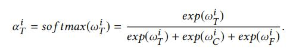
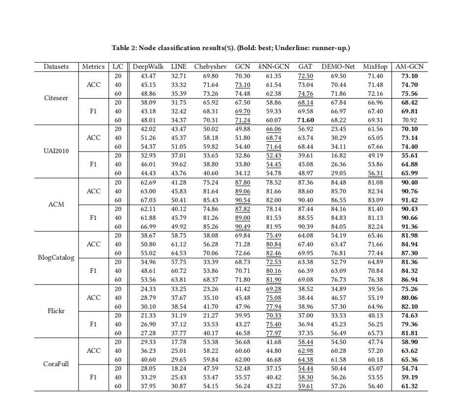

## AM-GCN: Adaptive Multi-channel Graph Convolutional Networks

> 论文链接：https://arxiv.org/pdf/2007.02265.pdf
> 代码地址：https://github.com/zhumeiqiBUPT/AM-GCN

### 1、背景

### 3、 GCNS融合能力的实验研究

在先看模型之前，论文通过两个对比实验证明了GCN在特征融合以及图结构学习方面的能力以及问题所在。

** 随机拓扑和相关节点特征**
作者生成了一个900点的结构随机网络，然后给900个节点随机分配3类标签，并将有相同标签的节点使用同一个高斯分布来生成他们的特征。
在该数据集中，节点标签与节点特征高度相关，而与拓扑结构基本无关。接着我们对比GCN与MLP的节点分类准确率分别为75.2%和100%。

结论：由于节点特征与节点标签高度相关，MLP表现出优异的性能。 GCN从节点特征和拓扑结构中提取信息，
但不能巧妙地融合它们以避免来自拓扑结构的干扰。

** 相关拓扑和随机节点特征**
为了验证这一点，作者通过使用SBM将900个节点分为了3个社区，并且每个节点的标签和所在社区有关，但是特征是随机生成的。
这样节点标签由社区决定，即同一社区的节点具有相同的标签。我们对比GCN和DeepWalk的节点分类准确率为87%和100%。

结论：Deepwalk只对此数据的网络拓扑结构进行了全面的建模。而GCN从节点特征和拓扑结构中同时提取信息，但不能自适应地根据任务进行选择融合。

通过这两方面的对比，验证了GCN可以同时提取相关的拓扑结构以及节点特征，但是并不能适应性的对这方面进行选择性融合

### 2、AM-GCN模型

先看一下模型的整体结构：

总体来看，模型将节点的特征传播到拓扑空间以及特征空间，称之为特征图 (Feature Graph) 和拓扑图 (Topology Graph)。

然后对于特征图和拓扑图分别使用一个特殊的图卷积分别进行嵌入提取。但是考虑到两个空间之间有存在共同特性的可能，
于是设计了一个具有参数共享策略的公共图卷积模块 (Common Convolution) 来提取它们共有的嵌入。

最后通过注意力机制将这些提取的不同特征自适应进行融合。

下面就仔细看看这里的特殊卷积以及公共卷积模块：

#### 2.1、特殊卷积模块

首先为了捕获特征空间中节点的结构特性，于是先采用KNN算法，将与节点相似的K个节点构建为邻居。而这里通过判别前节点之间的相似性。

首先通过节点的特征计算节点之间的相似度，这里采用余弦相似度进行计算，然后选最相似的k个节点构建邻居矩阵，得到邻接矩阵$A_f$,
这样对于l层的卷积过程如下公式所示：

这样得到的输出$Z_F$为学习到的节点信息。

对于拓扑空间，邻接矩阵A以及输入的原始特征都不变，这样得到的输出$Z_T$为学习的结构特征。

#### 2.2、公共卷积模块

公共卷积模块主要是用来提取分类任务与结构空间和特征空间共同相关的信息。看一下卷积公式

从公式可以看出来，其实邻接矩阵以及特征向量Z，和特征图和拓扑图内是一样的，不过就是采用了一个共享的特征转化矩阵$W_c$,
也就是说对于两个图，分别进行聚合，然后分别通过两个矩阵$W_c$和$W_f$($W_t$)进行转化。

这样对于公共卷积部分可以得到3个输出向量 $Z_{CT}$、$Z_{CF}$和$Z_{C}$，而嵌入$Z_{C}$通过下面方式得到：

#### 2.3、注意力融合

这部分主要是将得到3个嵌入向量进行融合：

然后得到了各向量的注意力值，将得到的注意力值通过一个非线性转换以及一个共享的注意力向量 q，这样得到各嵌入的注意力权重：

接下来就是通过softmax来归一化这些权重值，使之和为1，最终得到融合后的节点嵌入：

#### 2.4、优化函数

**一致性约束：**

对于公共图卷积模块两个输出嵌入项$Z_{CT}$和$Z_{CF}$，尽管他们具有共享的权重矩阵，这里仍通过约束两个相似性矩阵

**差异性约束：**

$Z_{C}$和$Z_{CT}$这两个嵌入是通过一幅图学习到的，为让他们捕获不同的信息，本文借用了HSIC来衡量两个嵌入的差异性

其中$K_T$和$K_{CT}$是Gram matrices，其具体的计算如下：

同理，对于$Z_{F}$和$Z_{CF}$也是进行同样的处理。

**目标函数:**
最终的任务是半监督节点分类任务，使用AM-GCN的输出Z,并获得预测值$\hat y$:

计算交叉熵损失作为任务损失$L_t$,最终的优化目标函数为：

### 3、实验

看看实验结果，在6个数据集上与8个模型进行了对比：

分类结果可视化对比：

### 总结

总体看起来其实也比较一般吧，在计算复杂度的时候，其实是一个很消耗时间的过程，这一点并不一定好。

比较新型的地方就是借助Gram matrices来控制从同一个图上学习不同的内容。

### 参考

1、[《AM-GCN: Adaptive Multi-channel Graph Convolutional Networks》](https://arxiv.org/pdf/2007.02265.pdf)

