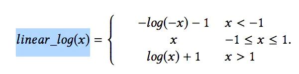

## COLD: Towards the Next Generation of Pre-Ranking System

- 论文 ：  https://arxiv.org/pdf/2007.16122.pdf
- 来源 ：  DLP-KDD 2020

### 背景
首先这篇论文是阿里定向广告团队发表的一篇，关于新一代粗排排序系统 的论文。我们从YoutubeDNN论文中已经了解在很多工业推荐场景中，一般存在Match + Rank的两阶段。

或者以阿里的在线广告系统为例，对于大规模排序的场景按照顺序一般召回、粗排，精排、重排等模块。其中粗排介于召回和精排，主要的目的还是为了从召回中进步减少商品的
数量为精排提供排序的物品集，因此粗排类似于进一步缩减召回的结果，兼顾精排的效率和准确度。

但是在阿里的场景下，基于这两个阶段又增加了Pre-Ranking和ReRanking阶段，如下图所示：

那么Pre-Ranking和ReRanking这两个阶段，Pre-Ranking阶段可以看做是Ranking部分的一个简化版，其评估的候选集数量一般被限制在千级别，耗时被限制在10-20毫秒。
因此该部分的模型应该也要轻量化一些，来满足时间效率问题。

### 预排序系统回顾

第一代预排序系统采用的是静态质量分，一般基于广告的历史平均CTR，只是用广告的信息，表达的信息有限，但是可以做到快速的更新。

第二代预排序系统采用的是逻辑回归模型，是大规模排序系统的一个简化版本。LR模型可以进行并行计算，同时可以做到实时更新。

第三代排序模型使用的则是基于向量內积的方式(也就是双塔模型)，该模型主要包含两部分，即用户侧和广告侧。这两部分在线下进行计算，不对用户和广告进行交叉
然后通过用户和广告得到的向量通过內积计算出分数，在通过分数进行排序，这种方式应用的更为广泛。

基于向量內积的模型通常对模型进行天级别更新，同时离线计算好的用户和广告向量存储在线上存储引擎中，当线上请求时，直接读取对应的用户和广告向量进行內积计算即可。
其离线和线上服务框架如下图所示：

基于向量內积的模型存在以下的缺点：
1）用户和广告向量没有进行交叉特征，导致表达能力受限

2）用户和广告的向量需要离线计算好，这通常需要几个小时，这导致用户／广告向量表示很难适应数据分布的偏移，无法做到实时更新。

论文还给出了几代模型的效果提升。

本文将要介绍的COLD，相较于基于向量内积的模型，不仅在表达能力上有了一定的提升，同时在模型更新频率上，能够达到和LR相同的水平。

### COLD模型
先给出模型的整体结构：

论文中指出，该模型肯定会造成时间上的消耗，因此本文提出了两个方面的方法对耗时方面作出了优化

#### 设计灵活的网络设计
获取轻量级的深度模型常用的办法有  网络剪枝操作、模型蒸馏、特征筛选、神经架构搜索（Neural Architecture Search）等。
论文中采用的是特征筛选的方法，来平衡模型预测精度和预测耗时。

具体来说，我们把SE (Squeeze-and-Excitation) block引入到了特征筛选过程中，它最初被用于计算机视觉领域以便对不同通道间的内部关系进行建模。
这里我们用SE block来得到特征重要性分数。

这里我们用SE block来得到特征重要性分数。假设一共有M个特征，ei表示第i个特征的embedding向量，SE block把ei压缩成一个实数si。
具体来说先将M个特征的embedding拼接在一起，经过全连接层并用sigmoid函数激活以后，得到M维的向量s：

这里s的第i个向量表示第i个特征的重要得到，然后再將si与特征i的向量ei相乘，得到新的加权后的也在向量用于后续计算。

在得到特征的重要性得分之后，我们把所有特征按重要性排序，选择K组不同的候选特征，并基于GAUC，QPS和RT指标等离线指标，对效果和算力进行平衡，
最终在满足QPS和RT要求情况下，选择GAUC最高的一组特征组合，作为COLD最终使用的特征。后续的训练和线上打分都基于选择出来的特征组合。通过这种方式，
可以灵活的进行效果和算力的平衡。

#### 工程优化
1）全层次并行（Parallelism at AllLevel）：并行化对于减少计算耗时是十分重要的，如对于用户的一次请求，会进行分解（拆包），
比如一次请求要预估1000个广告，可以拆解成5个包，每个包包含200个广告，包之间进行并行计算。

**并行计算，这里要说一下，对于粗排问题，对于不同的广告计算相互独立，因此可以将积酸菜分成并行的多个请求同时计算，也就是所，将大量的广告**
**分成多组，这样多组可以进行并行计算，最后只需要汇总每个广告最后的结果，在进行排序即可。**

**对于每个广告的不同特征同时还可以开启多线程进行进一步加速。网络部分使用GPU进行加速。**

 2）基于列的特征计算（Column based Computation）：用户和广告的交叉特征需要实时计算，过去的做法通常是逐条的进行计算，
 即row based method，而论文采用的方法是Column based method，提升了计算效率。下图是二者的对比：

 
 
 3）减小参数低精度（Low precision GPU calculation）：在NVIDIA的T4 GPU上进行矩阵计算，FLOAT16类型的数据计算耗时要比FLOAT32类型的计算耗时小8倍
 以上，但是Float16会损失计算精度，特别是在sum-pooling的情况下，数值有可能超出Floa16的范围。为了解决这个问题，一种方式是使用BN。
 但是BN本身的参数范围也有可能超过Float16.因此只能使用混合精度的方式，对于BN层使用Float32，而后面的层使用Float16。另一种方式是使用参数无关的归一化
 方式，例如log函数。但是log函数不能处理负数，并且输入值接近0的时候会输出绝对值较大的数字。因此我们设计了一种分段平滑函数，
 我们叫做linear-log来解决这个问题：
 
 
 ### 实验

基本以上就是COLD的全部内容，我们在来看看本文和基于向量內积的模型以及DIEN的效果没结果如下：
 
 
 
 从离线精度指标来说的话，COLD模型的效果优于基于向量內积模型，但是比IDEN模型，不过这也正常，毕竟两者的模型复杂度也不再一个层次的。
 从耗时来看，基于向量內积的性能最优，COLD的性能稍差，但是远好于DIEN模型，因此总的来说，这其实就是一个backtrack的问题，就是在
 时间和精准度之间的一个平衡，在通过其他track尽可能的进行优化，在保证高精准度的前提下，减少时间方面的消耗。
 
 ### 总结

这篇论文就模型结构方面来说，不是特别的复杂，毕竟是用于召回，考虑耗时问题，也不能太复杂。这篇论文来源于工业界，因此更多的是一些优化方法，
可能来的更加重要，其中我觉得比较重要的点在于工程优化的三点，确实都是宝贵的经验，在如今越来越复杂的模型中，模型轻量化的经验显得越来越重要。

