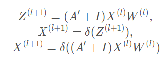

##: Cluster-GCN An Efficient Algorithm for Training Deep and Large Graph Convolutional Networks

- 论文 ：  https://arxiv.org/pdf/1905.07953.pdf
- 代码 ：  https://github.com/benedekrozemberczki/ClusterGCN
- 来源 ：  KDD 2019

### Abstract
目前基于SGD的gcn算法，1）面临随着gcn层数增长，计算复杂度呈指数增长；2）需要保存整个Graph和每个node的embedding，存储量巨大。

这篇论文提出的 Cluster-GCN 模型可以在大型的图结构类型上进行训练更深的图卷积。

Cluster-GCN 的主要做法是先通过图聚类算法找出联系紧密的子图(sub-graph),然后在子图中的一组node进行采样，并且限制子图中的邻居搜索。

### Introduction

由于GCN运算需要利用graph中节点之间地交互来学习更新embedding，这使得GCN的训练非常有挑战性。与cnn等网络不同，
训练loss可以完美地分解为每个样本单独影响（decomposed into individual terms），**GCN的损失函数必须依赖大量的其他节点。特别是GCN变深时，
由于这种节点依赖，GCN的训练变得非常慢–反向传播时需要计算Graph上的所有embedding。**

#### GCN 现有的训练方法

1. GCN采用的是全批次梯度下降法(full-batch Gradient Desent),需要计算全部的梯度，因此需要寻出所有节点的Embedding 需要的内存O(NFL)。由于每个epoch只进行一次参数更新，因此收敛速度很慢。
2. Graph-SAGE：Inductive Representation Learning on Large Graphs 提出了 mini-batch SGD计算方式。每次的参数根性只需要一个batch的梯度，降低了内存的需求，这样一个epoch可以进行多次的
参数更新，加速收敛的速度。Graph-SAGE存在节点邻居扩展问题，需要计算节点的邻居节点在L-1层的embeddings，而这些邻居节点又需要求在L-2层的embeddings，周而复始，这导致大量的计算复杂度。
Graph-SAGE同过在各层的反向传播过程中固定大小的邻居节点，降低了复杂度。
3. VR-GCN 通过减少房产的技术来减少邻居节点采样的大小。尽管较少了采样的大小，但是仍然需要存储所有节点的embedding，因此当节点数量急速增大时，内存的限制仍然是无法解决的问题。

本文的方式是利用图聚类算法将图进行节点的区域划分，对于子图进行图卷积。 **一个mini-batch算法的效率，由embedding utilization（嵌入利用率）来描述：与一个batch或者within-batch的节点之间的链接数量成正比**

**Cluster-GCN可以达到与VR-GCN类似的训练速度。但当网络加深时（4层），可以比VR-GCN更快。这是因为Cluster-GCN的复杂度与网络层数L成线性关系，而VR-GCN时指数关系。**

### Bachground
GCN的定义不重复了

利用GCN做节点分了的任务中，我们将损失函数定义为：

在Cluster-GCN将损失函数改成

其中batch_size = |B| 表示每个batch的节点，使用基于mini-batch的SGD。虽然mini-batch训的SGD在每个epoch收敛得更快，
但由于引入了另一个计算开销，所以比Full Gradient Descent要慢。

#### Why does vanilla mini-batch SGD have slow per-epoch time?
计算一个节点i相关的梯度需要存储该节点的embedding 而节点i的embedding计算需要L-1层节点i的邻居节点的embedding。**假设一个LL层的GCN网络，每个节点的平均度数为dd，
为了获得节点ii的相关梯度，需要对Graph中的一个节点聚合O(dL)个节点的特征。**

#### Embedding utilization can reflect computational efficiency
这也就基于上面的问题得来的。因为节点的更新依赖于上一层节点的embedding，**如果上层节点的embedding的利用率增加，那么是不是就更高效一些的，因为图结构联系的更紧密(边数更多)效率也就
会更好。**

如果节点i在第l层得embedding：$z^{(l)}_i$，在计算第l+1层得embeddings时被重复使用了u次，那么$z^{(l)}_i$的嵌入利用率就是u。

为了使mini-batch SGD工作，以前的方法试图限制邻域扩展的数量，但是这并没有提高嵌入使用率。

* GraphSAGE 是通过限制其邻居节点的集合来限制这里节点的利用率，但是缺点在于没有利用到所有的邻居节点。
* FastGCN提出了一种改进梯度估计的重要采样策略；
* VR-GCN提出了一种策略来存储所有N个节点和L层在先前计算的embedding，并对未采样的邻居节点重复利用。

### Vanilla Cluster-GCN
主要的思路是设计一个batch和相应的计算sub-graph来最大限度的提高embedding利用率。

对于一个图G，把节点分为C个组：V=[V1,V2....Vc]，这样得到的c个sub-graph：

每个Et只包含在Vt中的节点之间的边；

......

Cluster-GCN使用了Graph聚类算法来划分Graph。Graph聚类的方法，如metis和graclus等，旨在在Graph中的顶点上构建分区，使得簇内连接远大于簇间连接，从而更好的捕捉聚类和区分结构。

* embedding utilization相当于每个batch的簇内的连接。每个节点及其相邻节点通常位于同一个簇中，因此经过几次跳跃后，高概率的邻域节点仍然位于同一个簇中；
* 由于使用A的对角近似A¯ 取代A，并且误差和簇间的连接成正比，所以要找到一种分区方法最小化簇间连接的数量。

在上图中，全图G和聚类分区图G¯ 来进行邻域展开，如右边所示，Cluster-GCN可以避免大量的邻域搜索，而集中在每个簇中的邻居上。也就是增加了embedding的利用率。

### 时间和复杂性分析
由于在分区Vt中的节点，只连接Vt中的节点，所以每个节点不需要再Att外部执行邻居搜索。对每个batch的计算将很纯粹的只是A¯′ttX(l)W(l) 的矩阵乘积和一些element-wise的操作，
时间复杂度低。并且每个batch只需要计算O(bL)的embeddings，是线性的，存储要求也低。

### 存在的问题
* Graph被分割，因此会删除一些连接，可能会造成一定信息缺失。
* 图聚类算法往往将相似的节点聚集在一起，因此聚类的分布可能不同于原始数据集，从而导致在执行SGD更新时对full gradient的估计有偏差。

随即多聚类方法，在簇与簇之间进行合并，减少batch间的差异（variance）。首先用一个较大的p值把图分割为V1,…,Vp，然后对于SGD更新重新构建一个batch B，而不是只考虑一个簇。
随机的选择q个簇：t1,…,tq，并把它们的节点Vt1∪⋯∪Vtq包含在这个batch B中。此外，在选择的簇之间的连接：A ij∣i,j∈t1,…,tq被添加回去。这样，簇间的连接会被重新合并，使得batch之间的差异更小。

**也就是说针对这两个问题的解决方式是通过 选择q个簇将其根据原图在还原回去一个大一些的子图，来减缓上述两个问题。**
​

### Issues of training deeper GCN
采用残差网络的思想，每层的X 不仅是聚合后的结果，还加上前一层的x

本文通过放大每个GCN层中使用的邻接矩阵A的对角部分，实现在每个GCN层的聚合中对上一层的表示施加更多的权重，如将单位矩阵添加到A¯中：

也就是加入的子连接，保存更多节点自身的信息。

### Experiment
多层GCNs，对比了Cluster-GCN和VRGCN，对比发现，VRGCN由于其邻域查找的代价呈指数增长，而Cluster-GCN线性增长。

通过对Cluster-GCN的归一化方法，可以进行更深的训练，对于PPI数据集，Cluster-GCN可以通过训练一个包含2048个隐藏单元的5层GCN来达到最先进的效果。
对于Reddit数据集，使用了一个包含128个隐藏单元的4层GCN。

### 总结

该论文提出了一个思路就是对于图卷积神经网络的最大问题就是需要存储所有节点的嵌入向量，使得对于大型的图来说不可训练。但是图上的节点训练
不一定需要所有节点的参与，因此可以借助其他方式将图划分成子图结构，对与不同子图，分别学习各节点的嵌入向量，对于大型图就变得可训练了。

我的想法是不仅通过图聚类算法，我们还可以通过图嵌入算法，根据图的结构学习节点的嵌入表示，在因此划分不同的子图进行分别训练。

对于邻接矩阵分成c^2还不是很理解，可能得看代码仔细研究。