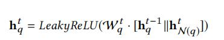
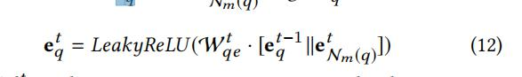
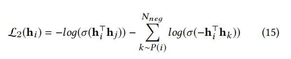

## A Dual Heterogeneous Graph Attention Network to Improve Long-Tail Performance for Shop Search in E-Commerce

> 论文连接：https://dl.acm.org/doi/10.1145/3394486.3403393

### 1、背景

本文提出的问题是在淘宝的场景中，店铺搜索功能存在长尾现象。很多店铺名不能很好体现本店所售商品，为了更好解决
这个问题提出了DHGAT网络。

由于店铺和商品数量的迅增导致店铺搜索存在一些问题：1）用户的查询词以及店铺名字很短，导致两种存在着语义差异；
2） 用户的商店搜索行为和反馈信号（点击或购买）相当稀疏；3）由于曝光的店铺大多数流行店铺，导致很多长尾
查询和店铺没有足够的反馈数据得到训练，因此当长尾数据发生的时候很难得到好的排序结果。

下面就看看针对上述问题，DHGAT是如何解决的。

### 2、DHGAT模型

#### 2.1、问题定义

本文将用户集合，查询集合以及店铺集合分别用 $U,Q,S$来表示。当用户u发出查询q时，商店搜索引擎需要检索最相关的商店作为排名列表。

由于存在多种实体(users, items, shops and queries)本文将场景构建成异质图作为基本的数据形式。

本文将异质图定义为 G = (V, E)，其中v是节点集合 E是边集合； φ(v)和ψ(e)分别是节点和边的映射。

#### 2.2、DHGAT核心结构

先看一下模型的核心结构图：

这是DHGAT最基础的一个模型结构，从图中可以看出，对于一个target query存在着同质节点 query neighbors
以及异质节点heterogeneous neighbors (其中同质节点就是与target query语义类似的查询；异质节点是
在target query搜索下点击过的店铺)。以于是根据这些邻居，可以分别对两种类型邻居节点进行聚合，公式如下：

其中$N_o(q)$表示query的同质邻居集合，$N_e(q)$表示query的异质邻居集合。COMBINE的操作将聚合
信息与上一层图卷积的信息进行合并，这么做的意义在于尽可能多的保持原节点信息。

但是呢，简单的均值聚合肯定是不行的了(从题目的GAT就能看出来啦)，于是设计了注意力聚合。

注意力聚合主要分为两种，一种是邻居聚合，一种是聚合不同类型的聚合(也就是上图中的两层Attention Net)

其中对同质图邻居聚合的公式如下：

这很简单就是注意力聚合，不多提。然后对于异质邻居的聚合公式如下：

这里有些区别就是$W_{QS}$,它是异质邻居转换矩阵，主要因为query和shop不在同一个向量空间。
然后就是和同质图一样了。

通过上面的两个聚合过程，得到了用户的$h^t_{N_{o}(q)}$和$h^t_{N_{e}(q)}$，这里就用到了第二个
用到注意力的地方了。还是先看公式：

这里也没什么区别，就是这三个注意力聚合所用的参数不是相互共享的。这样就得到query节点的分层注意力表示。
$h^t_{N(q)}$。最后在加上上面提到的COMBINE操作：

对于节点shop执行相同的过程，不赘述。

#### 2.2、TKPS（ 从产品搜索中传递知识）

先简单看一下TKPS的整体结构：

设计这部分主要原因有3个：1）用户查询意图不明确，商品名称简洁，两者存在语义差异，因此不会简单
聚合邻居query文本。2）商店搜索的用户行为相当稀疏，而产品搜索的交易历史包含更丰富的信息；
3）通过合并item的信息(集合shop所销售的item到shop表示中以及query查询下的item信息聚合
到query表示中)来减小query和shop之间的语义差异。

还是以query为例(shop同理)，对于每个query的内容，由n个词组成，对于每个词处理成$t_{q,n}$。
然后使用f()函数得到query的嵌入表示$e_q$,这里采用的是均值函数。具体数学公式如下：

这样可以分别得到了店铺和项目的文本表示 $e_s$和$e_i$。对于每个query(shop)采样N个item邻居，然后
通过聚合操作得到query(shop)的嵌入表示$N_M(q)$,公式如下：

这里的聚合函数采用的是均值聚合。然后我们可以得到$e^t_{N_M(q)}$，将其和$e^{t-1}_q$拼接再通过
一个全连接得到query在TKPS模块得到的最终表示$e^{t}_q$,公式如下：

对于shop也是同理的过程，不赘述。

#### 2.4、用户特征结合

这里主要是通过增强用户的特征来提升模型性能， 用户特征以多字段多热编码形式表示。
每个字段包含多个离散分类特征或词袋特征。

对于多编码的特征，采用mean pooling来得到最终的嵌入表示。

#### 2.5、双塔结构

先整体的看一下双塔结构：

可以发现，其实双塔结构就是在DHGAT和TKPS的基础上分别对query和shop加上了3层全连接。

#### 2.6、目标结果

在两塔的最后一层L中，我们得到了用户查询表示和商店表示$h^L_{UQ}$和$e^L_s$。 
用户u在发出查询q后点击店铺的概率可以通过：

通过全连接层之后，通过简单的內积操作建模用户对项目的交互过程。

损失函数用的是交叉熵损失。此外，使用CTR(即。 单击或不单击)作为唯一的监督信号来训练模型，
可能无法有效地捕获图形拓扑结构中编码的信息。 为了在损失函数中显式地涉及图邻居关系，
于是在主CTR预测损失中添加了一种新的邻居邻近损失，它在高阶中吸引了更接近的邻居 信息空间
和推动更远的随机采样负节点，因此模型的整体损失函数如下所示：

### 实验结果

数据集采用的是Taobao的真实数据集，对比模型有 GAT、HAN等模型。评价指标才欧诺个的是AUC，MRR，以及HR。

对比baseline，效果肯定是好的。

还有一些消融实验就不细说，这篇论文大概就是这样了。

### 总结

总的来说，这篇论文设计的挺巧妙，我觉得总共有3点：

- 通过DHAT结构通过GAT的方式分别聚合来之不同类型邻居节点信息。
- 对于TKPS结构，设计的很巧妙，通过邻居信息对节点信息进行补足。这刚好使用于query表意不明(shop
	name 不能准确表明所销售物品)这样的场景。
- 通过添加 正则化邻居接近损失(NPL)  来加强对图拓扑结构的学习，感觉非常合理。

当然个人觉得下一步工作可以是针对不同的seesion最好也有区别对待，这样基于时间的用户信息
也就可以被考虑进来。当然这还得基于真实的业务场景进行合理的分析和设计了，不过总的来说
这个模型设计的还挺好的，学习了。

### 参考

1、[《A Dual Heterogeneous Graph Attention Network to Improve Long-Tail Performance for Shop Search in E-Commerce》](https://dl.acm.org/doi/10.1145/3394486.3403393)

