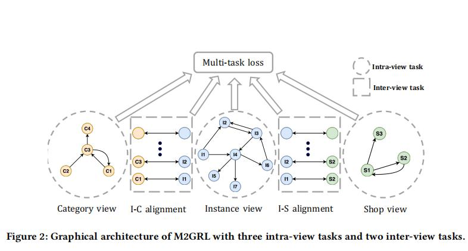
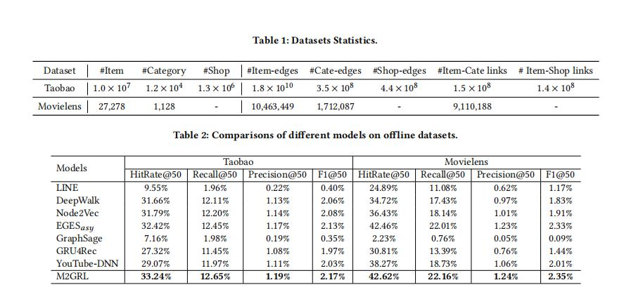

## M2GRL: A Multi-task Multi-view Graph Representation Learning Framework for Web-scale Recommender Systems

> 论文连接：https://arxiv.org/pdf/2005.10110.pdf

### 1、背景

在学术界中基于图的推荐算法得到巨大进步，过学习图结构数据中的结构联系。但是在工业界中这还存在一些问题：
如何将图形表示学习与侧信息结合起来（例如，项目的价格、用户的画像）。这是因为 侧信息（或多视图数据1)描述项目(或用户）的不同方面，
在工业推荐系统中起着重要作用。

主要的解决思路有两种：

- 将多视图数据（评级数据除外）作为项目的属性，然后将其作为基于图形的算法的输入。 
- 构造一个具有多视图数据的异构图，然后应用图表示学习技术(metapath2vec[3])学习项嵌入。(异质图嵌入学习)

而这两种方式都被称之为 multi-view representation fusion(数据来自多个方面，但是最终被整合成单一紧凑的表示)。
但是将这样的想法运用于web-scale的推荐任务可能存在问题：

- 单个嵌入很难表示多个维度数据的信息，很容易丢失信息，导致嵌入表示缺乏准确性。
- 另一个问题就是不同维度的数据的分布是不同的，如何不仅处理，可能会引入更多的噪音。

因此本文的想法是 **首先为每个数据视图学习一个单独的图形表示，然后对不同图形之间的交叉视图关系进行建模。**
具体的做法是模型会为每一个view的数据构造一个图，从多个图中学习不同的表示，然后将模型对其。换句话来说就是
对每个子图内学习节点的嵌入表示，对各个子图间建模多vierw 数据之间的交叉联系。

### 2、M2GRL模型

#### 2.1、问题定义

首先该模型是通过融合不同方面的特征，为每个item学习一个可用于下游任务的高质量的嵌入表示。对于item存在3个主要方面的数据：1、用户-项目评分矩阵；2、项目
 category-view主要包含项目的类别信息；3、 shop-view data主要记录item和店铺的关系，同样的项目可能有多个店铺销售。将这三个方面分别称之为：
 item (instance) graph, category graph, 和 shop graph。
 
**节点序列采样：**

- 考虑到用户误触现象，模型删除持续时间（点击后）小于两秒的项目。 
- 其次对于用户行为，会按照时间戳对行为进行切分，分成不同会话的行为。
	并且如果时间跨度小于30分钟，我们将连续合并两个会话。

#### 2.2、模型结构

先看一下模型的整体结构：

可以看到 M2GRL包含两种类型的任务：视图内任务学习单个视图中项的表示，
视图间任务建模两种不同节点之间的关系。 其中三个任务是视图内任务，其他任务是视图间任务。 
视图内任务和视图间任务生成的所有表示都被称为多个表示。

#### 2.3、 视图内表示学习

对于每个单一的图来说，本文将其作为同质图进行处理。对于这部分模型直接使用了SGCN来学习节点嵌入。
具体的是在给定一个项目序列$i_1,i_2,i_3, . . . ,i_T$,通过skip-gram模型最大化平均对数概率(公式如下)
来得到所有项目的嵌入表示：

其中在skip-gram模型中，$p(i_{t+j} |i_t )$采用的softmax函数。
但是在M2GRL中，对于每个正样例采样K个负样例，因此$p(i_{t+j} |i_t )$变成了如下公式：

这样做的目的是为了学习到的嵌入表示时，正样本和负样本的嵌入表示区分开。这样我们得到了
损失函数(第一个)，其中$p(i_{t+j} |i_t )$是第三个公式。

#### 2.4、 视图间对齐

尽管视图内表示学习可以得到图内节点的嵌入表示，但是不同视图中实体的联系无法捕获，因此
视图间对齐模块就是用来建模这种交叉视图联系（例如图中的i-c alignment代表学习商品和类目的关系。）

由于商品和类目处于不同的特征空间，需要先将它们映射到一个共同的关系特征空间，
然后在这个空间学习它们的关系。具体地，我们利用了一个转移对齐矩阵W来映射。
因此inter-view task的loss变成了如下：

#### 2.5、多任务学习

对于多任务学习，一种常用的思想是将不同任务的损失做一个线性结合：

但是这样的一个缺点就是需要人为的进行调参，这才现实中肯定是不行的。
于是本文使用了同方差不确定性的思想来在模型训练的时候对每个任务的权重进行自动调整。
对每个任务的预测结果赋予一个高斯似然分布，并用它的标准差作为噪音扰动来衡量不确定性，
因此loss function重写为：

由于这两个task都可以看成一个多分类任务，所以可以用一个softmax 函数来表示似然函数
把它代入loss function，可得：

整体得到总体损失为：

做了一下简化，最终得到：

总的来说就是，用方差的倒数作为各个任务的权重(也就是不确定性)，同时这个权重是未标准化的。
当一个任务的不确定性很大的时候，计算的梯度误差大，我们给这个任务一个低的权重。
反之，当不确定性小的时候，任务的权重就会增大。这样就达到来动态调整多任务权重的目的。

### 3、实验

下面是本文的实验数据以及和其他模型的对比，效果肯定是很好的了。

### 参考

[M2GRL: A Multi-task Multi-view Graph Representation Learning Framework for Web-scale Recommender Systems](https://arxiv.org/pdf/2005.10110.pdf)

