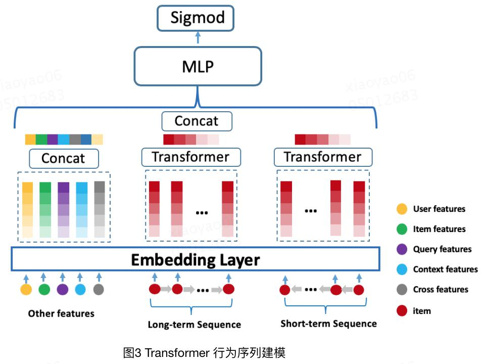

## 将Transformer用于淘宝推荐————BST   【阿里】

题目《Behavior Sequence Transformer for E-commerce Recommendation in Alibaba》

论文下载地址为：https://arxiv.org/pdf/1905.06874.pdf 

### 1、背景

近些年深度学习在推荐系统得到充足的发展，主要在于深度学习的强大处理能力，能够对原始特征如user ID、item ID、behavior sequences等进行进行有效建模。
具体地他们能将这些特征映射到低维空间的向量表示，然后输入到MLP中，如WDL、DeepFM、DCN 等模型都满足这一范式。但是这些模型都忽略了一个事实，
就是他们忽略的用户的行为序列所反映的用户多个兴趣。

在DIN中，尽管使用了注意力机制捕获目标item和历史item的相似度，来刻画用户多样的兴趣分布。但是这仅仅只考虑了行为之间的相似度，没有考虑
用户历史行为序列的先后顺序，比如，用户是否点击连衣裙，受近期连衣裙相关商品的行为影响较大，而半个月用户买过鞋子影响就微弱了。其实
这和DIEN的建模思想是一样的，但是使用的解决办法是不同的，DIEN中使用的是GRU对用户行为进行建模，捕获用户的兴趣演变过程。而本文则是
借用NLP中tansformer的思想来提取用户行为序列背后的隐藏信息。

### 2、BST的模型结构

先看一下模型整体的结构图

整体来看，BST模型的结构采样的和WDL布局构造，最大的不同就是利用了Transformer结构来提取用户的行为序列。对于Embedding部分和其他网络类似，
主要的输入特征有item feature，用户画像特征，上下文特征，交叉特征，通过Embedding层之后进行拼接，作为一个补足信息，就是模型最左边的输入。
对于用户的行为序列主要包括Item ID类特征及对应的position 信息，通过Embedding之后到Transformer中捕获用户历史行为和Target Item之间的相互
关系得到用户的兴趣表达，然后与之前的补足信息一起concat在一起，经过三层MLP计算预测的点击率。

#### 2.1 Embedding Layer

Embedding层主要是将所有输入特征编码成低维空间向量，主要有用户特征、商品特征、上下文特征、交叉特征：

这部分在模型中成为Other feature。对于用户行为序列，对每一个行为序列中的item得到一个嵌入。对于每个item除了一般的Embedding，还包括
一个Positional Features  类似于Transformer，主要包含当前item在行为序列中的一个位置关系。一般的EMbedding包括item_id and category_id.

对于Positional embedding，BST模型没有采用Transformer中的sin，cos的方式，而是设计了一个新的方式。对于第i个位置的位置特征计算方式为
pos(vi)=t(vt)-t(vi) 其中t(vt)表示推荐的时间戳，t(vi)表示用户点击商品i的时间戳。

#### 2.2 Transformer Layer

Transformer结构不细说了，具体的之前写过了 [atteion is all you need](../Transformer/readme.md)

本文主要使用Transformer 的Encoder 部分用来捕获Target Item 与用户行为序列中Item 的相关关系：

经典Transformer Encoder 部分主要由6个相同的层组成，每层包含如下两部分：

- Multi-Head Attention 多头注意力层
- Feed Forward 全连接层

以上两部分都包含Residual Connection残差连接、Add&Norm数据归一化。

**Self-attention layer:**
使用 Multi-Head Attention 是self-attention 的一种实现，对应输入的Q,k,V 均是相同Item ID Embedding + Positional Embedding:

其中，$W^Q$,$W^K$,$W^V$为Q，K，V的参数矩阵，E是行为序列中的每个item的embedding向量。

**Point-wise Feed-Forward Networks:**

这部分的作用就是增强模型的非线性能力。并且在训练集都是大规模的数据时，为了防止过拟合使用Dropout和ReLU作为激活函数。

这里和Transformer中一样，使用了残差连接和normal为数据进行归一化。

**Stacking the self-attention blocks:**

上面是transformer中整个encoder结构，这里为了让模型能够建模行为序列中的复杂关系。因此对模型的self-attention部分进行堆叠：

b 为Transformer 堆叠的层数。在实验数据集上表明，当b=1 时离线评估AUC 效果最优。

### 3、实验部分

本论文作出了两项主要贡献：

第一，BST模型与以往模型不同，前者可通过把Transformer模型并入一个标准多层感知器中，成功捕获用户网上购物行为中的序列信号。

第二，大规模的在生产中部署BST模型不仅是一个可行方法，同时还适合阿里巴巴和淘宝当前的生产模式。

### 思考

1、这篇论文是阿里巴巴将Transformer用来处理推荐系统的问题，关键的思想是利用其来处理推荐系统的时序问题，进而帮助达到更好的推荐效果。
	这样可以想到的是，可以尝试用transformer来处理session-based方面的推荐问题。
	
2、美团在transformer中的应用：也是看到美团自己的技术分享文章中考到的内容，具体的内容在[这里查看。](https://tech.meituan.com/2020/04/16/transformer-in-meituan.html)
	在工业中将 Transformer 结构应用于搜索推荐系统成为业界的一个潮流。1、AutoInt对 CTR 预估模型进行特征组合；2、BST 对行为序列建模；
	3、PRM 重排序模型。因此美团在这三个方向进行了探索。

- 特征组合：
	这方面的探索主要是参考AutoInt模型中的思想，利用Transformer结构来进行特征组合，这正好对于处于搜索场景的美团业务来说，对于数据的稀疏性
	且维度高的特性，得到准确的特征交叉对模型的效果很关键。因此想借助用Transformer结构来获取精准的特征组合。
	
	美团在这方面的探索主要是参考了AutoInt模型,如下图所示：
	
	
	
	但是根据美团自己的场景作出了一些调整，具体有一下几点：
	
	- Embedding部分：由于CTR场景除了一些稀疏特征，还有一些稠密特征也比较重要，所以这部分将所有类型
		特征都转换成Embedding。
	
	- MLP部分：由于MLP的隐形的特征交叉能力很强，因此在MLP部分，保留将稠密特征和
		离散特征的 Embedding 送入到 MLP 网络，以隐式的方式学习其非线性表达。
	
	- Transformer部分：这一部分主要的区别不是将所有的特征都作为输入，而是选择用户行为
		序列，商户、品类、地理位置等特征的Embedding输入Transformer显示学习特征的交叉关系。
		之所以这么做的原因主要有两点：
		
		1、训练方面，考虑到美团的场景是高维度特征，如果全部输入会提高模型的复杂度。
		
		2、所有特征的维度不同，难以统一，不适合一起输入。
		

- 行为序列建模：
	
	由于用户ID在训练数据中的稀疏性，用户ID很容易过拟合，因此需要大量的泛化特征来表达用户。
	泛化特征主要分为两类：一类是静态特征，另一类是动态特征。而动态特征指的是用户实时行为
	特征，所以在模型中优化模型的序列建模能够更好的理解用户行为。
	
	之前也总结过一些对于用户行为序列建模的常用思路：
	1）pooling思路：常用的是mean 或Sum的
	方式，这种方式假设所有行为内的item对于用户兴趣是等价的，但是这种对于高维稀疏的场景会引入
	很多的噪音。于是提出了基于attention的pooling方式。
	
	2)RNN或transformer思路：由于pooling的方式没有考虑到行为序列中的时间因素，因此DIEN引入了
	RNN(GRU)来捕获用户行为序列中的时间因素，考虑用户兴趣随时间变化的不断发展。但是又因为
	RNN对时间的消耗是巨大的，因此阿里又尝试将Transformer架构(BST)引入，实现并行化的效果。
	这里特别注意一点就是为了考虑行为序列中不同item的位置关系，引入了将当前时间戳和用户行为
	发生时间戳的差值离散化后的embedding加入到输入信息中。
	
	3)多用户兴趣建模：考虑用户兴趣的多样性，通过胶囊网络来提取用户的多兴趣表示，提升模型的召回能力。
	
	4)用户长行为序列建模：考虑用户的长行为序列，可以提供丰富的用户兴趣表示。但是存在的问题
	就是如何更好的建模，实现性能以及时效性的平衡？主要的思路有一些1）SDM提出将用户行为
	分为长期行为和短期行为，从长短期兴趣入手刻画用户兴趣表示。2）MIMN模型则是提出通过
	memory的方式建模用户原始行为，并设计UIC来存储固定大小的用户抽象的兴趣表示，进而实现
	线上耗时问题。3）SIM模型的思路类似于召回和精排的思路，就是从用户的长行为序列中
	通过搜索在长用户行为序列中找到与目标item相似的行为，得到一个小的行为序列后，在通过一个
	精确建模（DIEN）来提取用户兴趣表示。因此这个过程其实很类似与recall-rank的思路。
	
	**好了上面在啰嗦一遍以前的内容，现在再回归到原理这个问题上。**
	上面的一些工作主要是针对阿里这种电商环境的一种推荐方式，但是对于美团这样的场景其实还需要重考虑一些不一样的部分。
	美团在这部分的工作主要分为了三个阶段：
	
	一、因为到原来的 Sum-pooling 建模方式没有考虑行为序列内部各行为的关系，而 Transformer 
	又被证明能够很好地建模序列内部之间的关系，于是尝试直接将行为序列输入到 Transformer Layer，
	
	**输入部分：**
	
	- 输入部分考虑到了短期行为序列以及长期行为序列，并且行为序列中的每个item表示有商户ID以及
		一些其他泛化信息的Embedding进行concat组成。
	- 对于所以用户行为固定长度，不足的使用0进行补足。
	
	输出部分对 Transformer Layer 输出的向量做 Sum-pooling 得到行为序列的最终 Embedding 表示。
	
	二、第一个版本存在一个问题，对所有的 item 打分的时候，用户的 Embedding 表示都是一样的，
		所以参考 BST，在第一个版本的基础上引入 Target-item，这样可以学习行为序列内部
		的 item 与 Target-item 的相关性，这样在对不同的 item 打分时，用户的 Embedding 
		表示是不一样的。
		
	
	三、和第二个版本一样，同样针对第一个版本存在的对不同 item 打分，用户 Embedding 
		表示一样的问题，尝试在第一个版本引入 Transformer 的基础上，叠加 DIN模型里面
		的 Attention-pooling 机制来解决该问题。
		
		
		结论：
		1、Transformer 编码层内部的自注意力机制，能够对序列内 item 的相互关系进行有效的建模来实现更好的表达。
		2、Transformer 编码为什么优于 GRU ？忽略 GRU 的性能差于 Transformer；我们做过实验将行为序列长度的上限往下调，Transformer 的效果相比 GRU 的效果提升在缩小，但是整体还是行为序列的长度越大越好，所以Transformer 相比 GRU 在长距离时，特征捕获能力更强。
		3、Transformer 编码层不需要太多，层数过多导致模型过于复杂，模型收敛慢效果不好。
		4、调节多头注意力的“头”数对效果影响不大。
		