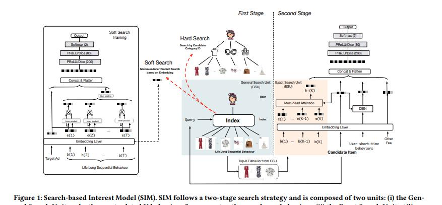
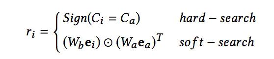
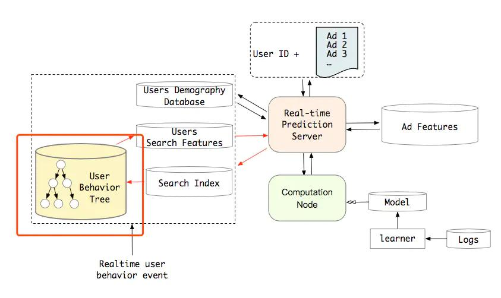
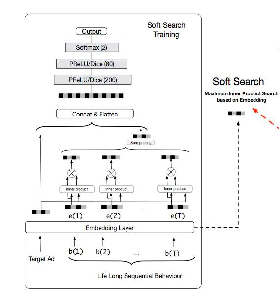
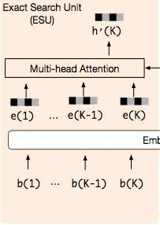
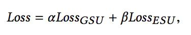
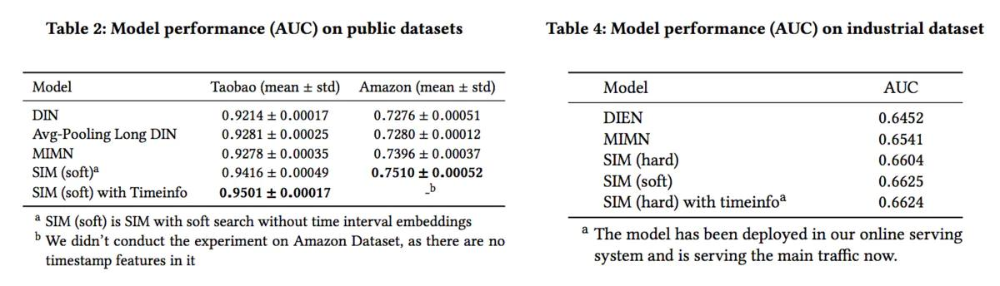
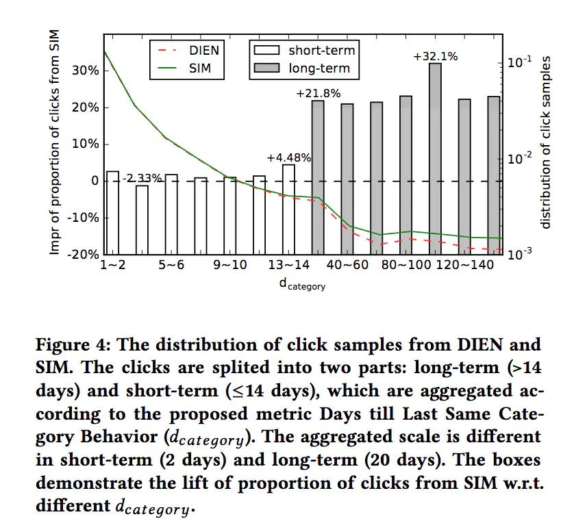

## Search-based User Interest Modeling with Lifelong Sequential Behavior Data for Click-Through Rate Prediction
>链接：https://arxiv.org/abs/2006.0563

### 摘要
目前很多模型通过建模用户行为数据来进行点击率预测，其中阿里巴巴提出的基于记忆网络的模型MIMN，实现了学习算法和服务系统的协同设计。MIMN是第一个对长度高达1000的序列用户行为数据进行建模的工业解决方案。
尽管如此，但是随着用户行为数据的增加，MIMN也无法精准的捕获用户兴趣。

本文提出一个基于搜索的兴趣模型(SIM)，其中包括两个级联搜索单元提取用户兴趣。
（i）通用搜索单元（General Search Unit，GSU）：
	根据候选项的查询信息，从原始的及任意长的序列行为数据中进行搜索，得到与候选项相关的子用户行为序列（Sub User Behavior Sequential，SBS）；

（ii）精确搜索单元（Exact Search Unit，ESU）：
	为候选项与SBS之间的精确关系建模。这种级联搜索范式使SIM能够在可伸缩性和准确性上更好地建模Life-Long序列行为数据。

### 简介

用户兴趣建模对广泛的引入到了点击率预估模型中，主要集中于学习用户的兴趣表达。但是由于现实情况中计算和存储的负担导致不能对数百的序列用户
行为数据进行建模。

一类研究是借助NLP的思想，提出用记忆网络（Memory Network）对长序列用户行为数据进行建模，其中代表是阿里巴巴的MIMN。
具体来说，MIMN增量地将一个用户的不同兴趣嵌入到一个固定大小的记忆矩阵中，该矩阵可以被每一个新行为更新。这样，用户建模的计算就与CTR预估解耦了。
因此，对于在线服务，延迟不会是一个问题，存储成本取决于记忆矩阵的大小，而记忆矩阵的大小远远小于原始行为序列。在 《Lifelong Sequential Modeling
with Personalized Memorization for User Response Prediction.》也体现的类似的思想。但是用户行为的增加，导致记忆矩阵中包含大量的噪音
使得不能精准捕捉用户对特定候选项的兴趣。

另一类则是DIN中所指出的，用户的兴趣是多样的，面对不同的候选广告不同的历史行为带来的影响不同。
但是问题在于当用户行为数据是长序列时，DIN搜索公式的计算和存储开销是巨大的。

因此本文提出的SIM通过采用DIN的思想，只捕获与特定候选项相关的用户兴趣。在SIM中，用户兴趣通过两个级联搜索单元来提取：
（i）通用搜索单元（General Search Unit，GSU），根据候选项的查询信息，从原始的及任意长的序列行为数据中进行搜索，得到与候选项相关的子用户行为序列（Sub User Behavior Sequential，SBS）。
（ii）精确搜索单元（Exact Search Unit，ESU），为候选项与SBS之间的精确关系建模。这里我们可以很容易地应用DIN[20]或DIEN[19]提出的类似方法。

### 基于搜索的兴趣建模（Search-Based Interest Model）
SIM模型通过两个阶段来对用户的终身行为序列进行建模，其中整体框架如下图：

从图中可以看出，模型在第一个阶段利用通用搜索单元(GSU)从原始长期行为序列中寻找top-K个相关的子行为序列。通过这样的方式过滤掉长期用户序列中存在的大量的噪音。

第二个阶段是  精确搜索单元(RSU)，使用前一阶段得到的较短的行为序列，通过Exact Search Unit来精准建模用户的兴趣，可以采用类似DIN或者DIEN等复杂的模型。

注意一点 这两个阶段是同时进行训练的。

#### General Search Unit
这部分主要是通过利用目标ITEM的信息，从长行为序列中寻找出和目标Item关系紧密的用户行为，该部分行为将会对用户最终的决策起到至关重要的影响。

因此，通过General Search Unit去找到这部分的行为序列。这里搜索的方式有两种：Hard-search(硬搜索)和Soft-search(软搜索)。

**Hard-search**：所谓的硬搜索主要是通过物品的类别ID进行搜索的，具体的说就是对用户历史行为序列中的物品类别和目标物品的类别相同的行为作为子序列。
用于用户行为的存储方式采用用户行为树的方式，具体如下图：

用户行为采用Key-Key-Value的树结构进行存储，第一层的Key代表用户id，第二层的Key代表品类Id，第三层的Value则是该品类下的用户行为。

**Soft-search**：对于soft-search来说，利用目标item和行为序列中item的embedding，通过内积的方式计算二者的相似度，线上应用的时候，采用局部敏感HASH的方式进行高效的搜索。

item的embedding通过如下的网络训练得到：

>那么阿里实际应用的是哪种方式呢？通过统计发现，通过soft-search得到结果和hard-search非常接近，品类相同的item拥有更高的相似度，
>尽管soft-search的效果略好于hard-search，但是综合考虑性能和计算耗时，最终还是选择了hard-search的方式。

#### Exact Search Unit
第二个阶段，通过Exact Search Unit并结合子行为序列和目标item，来精确建模用户的兴趣。

论文中的ESU采用的是Multi-head attention的结构，同时为每一个用户行为引入了时间状态属性。对于每一个历史行为，
计算该行为发生时间距当前时间的时间差，离散化之后转换为对应的embedding，作为输入。时间离散化的方式没有指明，
一种可以参考的方式是通过2的幂次进行离散化。
 

Loss是两个阶段的loss的和，每个阶段的Loss都是logloss：

 
 
如果采用hard-soft的方式的话，GSU阶段其实是无参数的，该部分loss的权重为0。

### 实验结果
下面是论文的实验结果：

这里的实验结果看看就好，不过这里有一个对比可以仔细看看。

其中d_category：这里指的是与用户点击的item 品类相同的行为最近发生日期离当前的天数。假设当前用户点击了一双球鞋，上一次点击球鞋是15天前，那么对该用户来说，球鞋这个品类的d_category=15。

上图代表了不同d_category下，SIM和DIEN推荐且被用户点击的item的分布，以及SIM相对于DIEN的点击数量的提升：

图中40-60这个部分，指模型推荐且被用户点击的item，其相同类目的行为最早发生在过去的40-60天内，
可以看到虽然SIM和DIEN的推荐并点击的结果主要集中在近期部分，但是在长期部分SIM的推荐且被点击的数量显著高于DIEN。
这从侧面说明SIM相对更好的建模了长期兴趣。

### 相关工作
用户兴趣模型（User Interest Model）：
- DIN[20]强调用户兴趣的多样性，在DIN中引入了一种注意机制，捕捉用户对不同目标项目（target item）的不同兴趣。
- DIEN[19]指出，历史行为之间的时间关系对于建模用户的漂移兴趣很重要。在DIEN中设计了一个基于GRU的带辅助损失（GRU with Auxiliary Loss）的兴趣提取层。
- MIND[6]认为，使用单个向量来表示一个用户不足以捕捉用户兴趣的变化性质。引入胶囊网络和动态路由方法，学习用户兴趣的多向量表示。
	此外，受在序列到序列学习任务中self-attention架构成功的启发，在《Deep session interest network for click-through rate prediction》
	中引入了Transformer来建模用户cross-session和in-session兴趣。

长期用户兴趣（Long-term User Interest）：
- 《Lifelong Sequential Modelingwith Personalized Memorization for User Response Prediction》提出了一种分层周期记忆网络，
	用于终身序列建模，并对每个用户的序列模式进行个性化记忆。
- 《Adaptive user modeling with long and short-term preferences》 选择一个基于注意力的框架来结合用户的长期和短期偏好。
- 《Practiceon Long Sequential User Behavior Modeling》提出了一种基于记忆结构的MIMN模型，将用户的长期兴趣嵌入到固定大小的记忆网络中，
	以解决用户行为数据存储量大的问题。设计了一个UIC模块，以增量方式记录新的用户行为，以应对延迟限制。

### 用户行为序列建模回顾
1、Pooling方式
	Pooling的防护最简单的方式就是将用户行为序列中每个item做Embedding，对其进行max/mean pooling，在 《Deep Neural Networks for YouTube Recommendations》
	中将用户看过的视频取到embedding后，做一个mean pooling来作为用户的兴趣表示。
	
	但是mean-pooling 的操作将所有的项目看做是同等重要，但是这明显存在问题，用户的不用历史行为对具体的目标行为的贡献是不同的。在DIN中
	将attention的思想加入其中，通过用户历史行为的嵌入和目标行为的嵌入做attention，得到一个两个相关的权重(weight)，然后通过加权
	求和的方式来表征用户兴趣表示。
	
2、RNN／Transformer方式
	由于pooling的方式没有考虑用户的兴趣是随着时间的变化的，但是pooling 的方式不足以提取行为序列中的这种变化。将行为序列通过RNN，LSTM或GRU
	进行提取用户兴趣的演化过程，DIEN则就是这样考虑的。
	
	但是由于RNN是串行计算用户行为序列的，这对时间上的消耗的巨大的。这可以参考阿里的BST，通过transformer替换RNN的方式，实现对行为序列进行
	并行计算。需要注意：
	**使用Transormer时需要结合行为的先后顺序信息，如在BST中，将当前时间戳和用户行为发生时间戳的差值离散化后的embedding加入到输入信息中。**
	
	进一步，通过观察用户行为发现用户在同一个session中的行为相近，而在不同的session中差别很大，考虑这种跟session相结合的用户行为序列，于是
	又有了DSIN。
	
3、多兴趣抽取
	用户兴趣本身就是多种多样的，而大多数的用户兴趣建模都是采用单个embedding表示用户兴趣，容易产生头部效应。在模型MIND中，通过胶囊网络来生成
	多个表征用户兴趣embedding来提升召回阶段的效果。

4、长用户行为建模
	由于上述模型都是直接将用户行为序列的item id作为输入，但是由于线上耗时问题导致序列不能过长，因此他们只能用来刻画短期的兴趣，但是这很
	容易被近期热点和大多数所代表，同时无法建模用户长期以来的兴趣。
	
	SDM提供的主要思路是：将用户的行为分为两种，一种是近期行为，一种是较长时间的行为，对于长期行为会按照店铺，品牌进行聚类，来刻画用户长期的兴趣偏好。
	
	另一种思路时考虑预先对行为序列做一些信息压缩。MIMN利用兴趣 memory 来建模用户的原始行为，将用户原始行为进行归纳和抽象为用户抽象的兴趣表达。
	同时设计了了UIC模块来存储固定大小的用户抽象的兴趣表达 memory，解决了线上耗时的问题。
	
	但MIMN将大量用户行为压缩成为固定大小的兴趣 memory 的过程中，存在信息损失。当用户行为膨胀到数万数十万时，有限的兴趣 memory 向量维度难以完整记录用户原始的行为信息。
	

### 参考

- [Search-based User Interest Modeling with Lifelong Sequential Behavior Data for Click-Through Rate Prediction](https://arxiv.org/pdf/2006.05639.pdf)
- [推荐系统遇上深度学习(八十七)-[阿里]基于搜索的用户终身](https://www.jianshu.com/p/830dc8598f2e)
- [Life-long兴趣建模视角CTR预估模型](https://zhuanlan.zhihu.com/p/148416488)