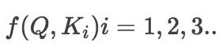
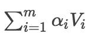

# Attention Is All You Need

这篇论文是谷歌机器学习团队在2017年发表的一篇非常火的论文，很多次听见将transformer运用于推荐系统中，于是就想好好来看看到底是什么妖魔鬼怪！

这篇论文的下载地址：https://arxiv.org/abs/1706.03762，也可以去这个库的paper文件夹下找到论文的pdf。

代码部分：后面完善

本文大多数地方参考了文哥的内容：https://www.jianshu.com/p/b1030350aadb （一个非常厉害的男银）

## 1、背景

传统的基于RNN的Seq2Seq模型难以处理长序列的句子，无法实现并行，并且面临对齐的问题。
在提出Attenion之后，现有的seq2seq模型通常结合RNN和Attention的模型。

所以这类模型的发展大多数从三个方面入手：

- input的方向性：单向 -> 双向
- 深度：单层 -> 多层
- 类型：RNN -> LSTM GRU

但是依旧收到一些潜在问题的制约，神经网络需要能够将源语句的所有必要信息压缩成固定长度的向量。这可能使得神经网络难以应付长时间的句子，
特别是那些比训练语料库中的句子更长的句子；每个时间步的输出需要依赖于前面时间步的输出，这使得模型没有办法并行，效率低；仍然面临对齐问题。

本篇文章创新点在于抛弃了之前传统的encoder-decoder模型必须结合cnn或者rnn的固有模式，
只用**Attention**。文章的主要目的**在于减少计算量和提高并行效率**的同时不损害最终的实验结果。


## 2、模型

先看看模型的整体结构，如下所示：


之前不了解Seq2Seq模型，很多材料上说吧上面图看成下面这种简单的encoder-decoder结构。
左边一个encoder把输入读进去，右边一个decoder得到输出：


这是一个整体的结构，细化来看左边encoder的输出是怎么和右边decoder结合的。因为decoder里面是有N层的。再画张图直观的看就是这样：

也就是说，Encoder的输出会和每一层的Decoder进行结合。取其中一层进行展开，如下所示：


### Encoder 和 Decoder 

我们仔细来来看一下，对于Encoedr结构中存在6个encoder，其中存在两个子结构，第一个是多头自注意力机制，第二个部分是一个全连接部分。
并且两个子结构之间会进行残差连接，那个每个子结构的输出就是LayerNorm(x + Sublayer(x))，并且每个层输出的嵌入维度是统一的 512。


对于Decoedr结构中存在6个decoder,其中存在3个子结构，有两个和encoder中的一样，剩下的子结构的作用是对编码器堆栈的输出执行多头注意


### Attention

Attention用于计算"相关程度"，例如在翻译过程中，不同的英文对中文的依赖程度不同，Attention通常可以进行如下描述，
表示为将query(Q)和key-value pairs映射到输出上，其中query、每个key、每个value都是向量，输出是V中所有values的加权，
其中权重是由Query和每个key计算出来的，计算方法分为三步：

- 第一步：计算比较Q和K的相似度，用f来表示：
 
 
- 第二步：将得到的相似度进行Softmax操作，进行归一化：

- 第三步：针对计算出来的权重 $\alpha_i$，对V中所有的values进行加权求和计算，得到Attention向量：


对于f(Q,Ki)存在四种不同的方式：
> 点乘 dot product：$f(Q,K_i)=Q^T K_i$
> 
> 权重 General：$f(Q,K_i)=Q^TWK_i$
> 
> 拼接权重 Concat：$f(Q,K_i)=W[Q^T;K_i]$
> 
> 感知器 Perceptron：$f(Q,K_i)=V^T tanh(WQ+UK_i)$
> 

下面对于Attention，稳重提出了两种具体的方式。分别叫做 Scaled Dot-Product Attention 和 Multi-Head Attention。

### Scaled Dot-Product Attention
先看一下他的结构：


从图片可以看出，模型的输入是Q，K，V  通过网络的资料理解这三个具体是由一个输入x，经过线性转化
之后得到的。具体的过程如下(论文中没详细介绍，参考第2个材料)：

1、第一步：


>两个单词，Thinking, Machines. 通过嵌入变换会两个向量x1和x2，shape都是1*4。
>分别与Wq,Wk,Wv三个矩阵(shpae=4 * 3)做点乘得到，{q1,q2},{k1,k2},{v1,v2} 6个向量(shpae=1 * 3 )。

2、第二步：


>向量{q1,k1}做点乘得到得分(Score) 112, {q1,k2}做点乘得到得分96。

3、第三步：


>对该得分进行规范，除以8(不知道怎么得到的)。这个在论文中的解释是为了使得梯度更稳定。
>之后对得分[14，12]做softmax得到比例 [0.88，0.12]。

4、第四步：


>用得分比例[0.88，0.12] 乘以[v1,v2]值（Values)得到一个加权后的值。
>将这些值加起来得到z1。这就是这一层的输出。
>仔细感受一下，用Q,K去计算一个thinking对与thinking, machine的权重，
>用权重乘以thinking,machine的V得到加权后的thinking,machine的V,
>最后求和得到针对各单词的输出Z。

当然在代码中不能一个个算，肯定是要批量运算的，也就是运用矩阵的方式，下面就是矩阵计算的过程。

然后计算权重，聚合value


Q对K转制做点乘，除以dk的平方根。做一个softmax得到合为1的比例，对V做点乘得到输出Z。
那么这个Z就是一个考虑过thinking周围单词(machine)的输出。

**注意encoder里面是叫self-attention，decoder里面是叫masked self-attention。**

### Multi-Head Attention
Multi-Head Attention及时将Scaled Dot-Product Attention的过程执行多次的过程
然后将所有的输出合并成Z，具有的结构如下所示：

 

具体的解释如下：


具体步骤：
- 将数据X分别输入到图13所示的8个self-attention中，得到8个加权后的特征矩阵Zi,i in {1,2,...,8} 。
- 将8个Zi按列拼成一个大的特征矩阵；
- 特征矩阵经过一层全连接后得到输出Z。

## 3、Transformer 结构

绝大部分的序列处理模型都采用encoder-decoder结构，其中encoder将输入序列$(x_1,\dot,x_n)$
映射到连续表示$(z_1,\dot,z_n)$,然后decoder生成一个输出序列$(y_1,\dot,y_n)$,每个时刻输出一个结果。
对于Transformer延续了这样的一个形式。

### Position Embedding


其中t就是Position Embedding

之所以这么设计的原因：由于模型中没有类似于Recurrence/Convolution的方法来捕获序列顺序信息
例如将K、V按行进行打乱，那么Attention之后的结果是一样的。因此利用将序列的分词相对或者绝对position信息
通过Position Embedding考虑到模型中。

每个分词的Position Embedding维度为$d_{model}$,将原本的input embedding和position embedding
加起来组成最终的embedding作为encoder/decoder的输入。position embedding计算方式如下：

其中 pos 表示位置index， i 表示dimension index。

Position Embedding本身是一个绝对位置的信息，但在语言中，相对位置也很重要，
Google选择前述的位置向量公式的一个重要原因是，由于我们有：


这表明位置p+k的向量可以表示成位置p的向量的线性变换，这提供了表达相对位置信息的可能性。


Transformer模型中，Position Embedding是位置信息的唯一来源，因此是该模型的核心成分，并非是辅助性质的特征。


### The Final Linear and Softmax Layer


>将Decoder的堆栈输出作为输入，从底部开始，最终进行word预测。

### 为什么使用自注意力机制
1、每层总的计算复杂度

2、可以并行计算；用所需的最小顺序操作数来衡量。

3、由于长距离依赖问题是序列转换任务的一个挑战； 影响学习这种依赖关系能力的一个关键因素
	是前向和后向信号必须在网络中遍历的路径长度。 任何组合之间的这些路径越短  
	在输入和输出序列中的位置，越容易学习远程依赖关系。
	因此，我们还比较了序列中任意两个输入和输出位置之间的最大路径长度  
	由不同的层类型组成的网络。


## 4、实验


可以看出，transformer 用了最少的资源得到了state-of-art的输出回报。


对模型自身的一些参数做了改变自变量的测试，看一下哪些参数对模型的影响比较大。


### 代码部分：

代码部分详细参考了文哥的内容，可以参考这个[一步步解析Attention is All You Need！](https://www.jianshu.com/p/b1030350aadb)

在代码部分的学习

1、Embedding部分
这里因为句子的不定长的输入，为了并行计算，采用了mask的方法。因此对于idex为0的部分将Embedding设置成0向量，为后面计算attention部分也是
做了一个准备。  

对于Embedding进行scale操作，具体形式是将Embedding乘以了一个$\sqrt d_{embedding}$。
**主要的意义是为了将方差控制为1，也就有效地控制了前面提到的梯度消失的问题。** 作者的认为是，点积值将整个softmax推向梯度平缓区，使得收敛困难。
可以[参考](https://www.zhihu.com/question/339723385)。


其次是Position Embedding。主要是根据公式(三角函数计算)得到所有位置的嵌入。然后根据位置的idx得到Position Embedding。


2、Scaled Dot-Product Attention

根据点积的注意力计算是这篇论文的核心部分。

- 先通过nn.Linear进行线性变换。需要注意的是，如果是encoder的self-attention部分，query和key-value输入的embedding是一样的。
- 相似度计算，该部分主要就是利用Q和K进行矩阵乘法，这样就可以得到一个  Max_len * Max_len 的权重矩阵，不过这时候并没有进行softmax。
	* 但是对于self-attention部分来说，由于我们padding进去idx=0的嵌入向量，我们要排除idex=0和其他位置的权重关系。因此需要将这部分进行
	赋值一个很小的值(-2**32+1;为什么是因为softmax的时候，这部分就会变成0，即权重值为0)。
	
	这里具体做法是，因为idx=0的Embedding是全0嵌入，因此对Embedding进行加总，如果是0表示该位置的idx=0的部分。
	这样可以构造一个key_masks，若果存在0，只需要在在对应位置设置一个最小值即可
	
	```
	key_masks = torch.sin(torch.abs(torch.sum(x, -1)))
	key_masks = key_masks.unsqueeze(1).repeat(1,list(x)[1],1)
	# 去除idex=0的embedding对计算注意力带来的影响。
	# 这是对Encoder部分这么计算注意力值
	padding = torch.ones_like(outputs)*(-2**32+1)
	outputs = torch.where(torch.equal(key_masks,0),padding,outputs)
	```
	
	* 但是对于Decoder的self-attention来说，我们是不能看到未来的信息的，所以对于decoder的输入，
		我们只能计算它和它之前输入的信息的相似度。
		
		并且在Decoder的中其实encoder-decoder Attention也是利用这个结构计算的
		但是这里query是 encoder的输入 key-value都是encoder的输出。
		
		具体的做法是首先得到一个下三角矩阵，这个矩阵主对角线以及下方的部分是1，
		其余部分是0，然后根据1或者0来选择使用output还是很小的数进行填充：
		
		```
		diag_vals = torch.ones_like(outputs[0, :, :])
		tril = torch.tril(diag_vals)
		masks = tril.unsqueeze(0).repeat(list(outputs)[0],1,1)
		
		paddings = torch.ones_like(masks) * (-2 ** 32 + 1)
		outputs = torch.where(torch.equal(masks, 0), paddings, outputs)
		```
	接下来利用softmax就可以得到权重矩阵。
	
3、Multi-Head Attention

该部分和Scaled Dot-Product Attention大部分是类似的，只不过这里需要注意的就是
我们需要有多个Q、K、V。这里的一个技巧就是将每个单词的嵌入分割，得到8个 B*Max_len*emb_size
然后在吧8个矩阵按照最外度进行拼接，这样这8个head就可以并行计算，最后只需要
再将它们转换回来

```
q_=torch.cat(torch.split(q,self.emb_size//self.num_heads,2),0)
k_=torch.cat(torch.split(k,self.emb_size//self.num_heads,2),0)
v_=torch.cat(torch.split(v,self.emb_size//self.num_heads,2),0)
....
outputs = torch.cat(torch.split(outputs,list(outputs.shape)[0]//self.num_heads,0),2)
       
```

这里需要注意torch.split 第二个参数是指分割后的维度  
不同于tf.split中参数二，其指的是分割成几份。

以上就是代码中主要记录的点


## 参考
1、[一步步解析Attention is All You Need！](https://www.jianshu.com/p/b1030350aadb)

2、[细讲 | Attention Is All You Need](https://mp.weixin.qq.com/s/RLxWevVWHXgX-UcoxDS70w)