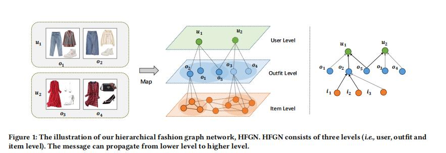
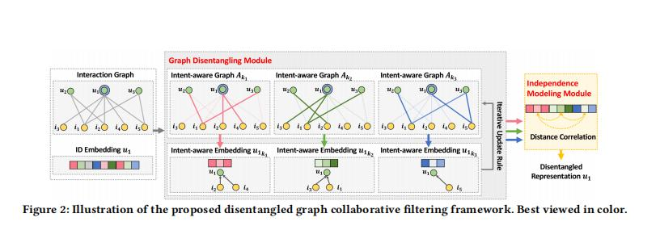

## SIGIR 2020 papers

### Graph-Based
1、Hierarchical Fashion Graph Network for Personalized Outfit Recommendation  
* [论文](../paper/HFGN.pdf)
* [代码](https://github.com/xcppy/hierarchical_fashion_graph_network)

这篇论文主要的将时尚兼容性建模和个性化服装推荐。什么意思呢？就是通过不同单个商品的组合，将组合后的商品推荐给用户。于是，用户提出一种分层时装图神经网络，
主要的做法是，通过将信息从较低级别传播到更高级别来改进节点嵌入，即从项目节点收集信息以更新服装表示，然后通过历史服装来增强用户表示。如图，
他的做法是先通过单个物品的向量通过GCN聚合得到服装组合的向量表示，用户则通过历史购买过的服装组合，通过图卷积得到用户的向量表示，在给用户进行推荐。
不过这里存在很多的问题？1、用户历史记录中如果商品很少或者没有服装组合怎么办？2、如果单个商品数量多，那进行组合的可能行也多，怎么选择商品的组合，如果
全组合肯定也存在巨大的问题？

2、Disentangled Graph Collaborative Filtering
* [论文](../paper/DisenGCN.pdf)
* [代码](https://github.com/xiangwang1223/disentangled_graph_collaborative_filtering.)

该论文主要是对用户的多意图进行建模，通过对每个用户项目交互的意图分布进行建模，我们可以迭代地细化意图感知交互图和表示形式。 论文的出发点是
现如今使用大量的用户历史信息，用户的意图难以区分，用户或项目的表示存在大量的噪音。论文还指出基于图卷积的方法，其实就存在这丰富的语义，
即不同的路径中蕴含大量的用户的意图。

但是尽管如此，作者认为用户-项目关系的统一建模不足以反映用户的潜在意图，也很少有研究对用户的的研究进行分离表述。最近的MacridVAE，在交互数据
上采用了β-VAE，并实现了用户的纠缠表示。 由于β-VAE的局限性，仅使用历史项的分布（即用户和项之间的一阶连通性）将发现的因素与用户意图耦合，
而忽略了复杂的用户项关系（即更高的 反映协作信号的订单连接性）。 因此，我们认为MacridVAE中可能没有充分探讨用户与项目的关系。

这篇模型总的来说，想法上还是比较独特，通过在多子图上学习不同意图的向量表示，然后通过归一化进行合并，并加入到邻接矩阵中。
同时根据一个tanh的非线性转化，加强用于对于不同意图的一个不对表示。最终将合并后的用户项目向量通过图卷积进行聚合，进行模型的预测。

[论文详解](./DisenGCN/paper.md)

