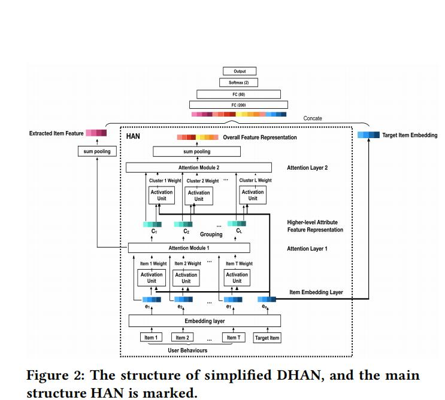
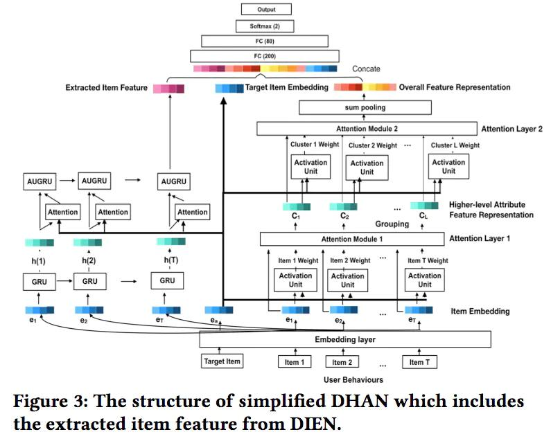
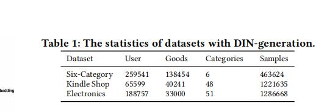
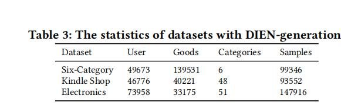
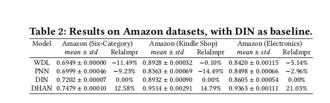
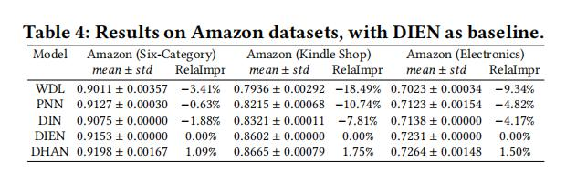

## 【阿里】抽取用户多为兴趣网络  DHAN

题目《Deep Interest with Hierarchical Attention Network for Click-Through Rate Prediction》

论文下载地址为：https://arxiv.org/abs/2005.12981

对应代码地址为：https://github.com/stellaxu/DHAN

### 1、背景介绍

在CTR预测中，用户历史行为信息是很重的一类信息，从中可以提取用户的兴趣可以提高推荐效果。

对比之前的DIN以及DIEN，都对用户的历史行为中提取了用户的多个兴趣，并且通过利用注意力机制来提取历史行为中与目标行为相关的信息。

本文提出了的问题：
用户的兴趣存在一种层级模式，从高层次(high-level)的属性(如品牌，价格区别，商品类别)到具体低层次(low-level)的属性(具体的item)。
这也正是DIN、DIEN所忽略的东西，只是从低层次的角度提取用户兴趣。

针对提出的问题，提出了DHAN模型,具体结构如下所示。并且对于之后在建模兴趣层次进化中，可以从时间和层次方面着手考虑。

### 2、DHAN介绍
先看一下DHAN的整体结构，这个结构图是简化后DHAN的主要结构：

 Hierarchical Attention Network是模型的主要模块，主要是从项目级别(item-level)和属性级别(feature-level)去建模用户的兴趣层次。
 
 - item-level:项目级别建模的方式和DIN以及DIEN的方式类似。以DIEN的方式为例，先通过GRU对历史行为进行建模，获取每个项目兴趣进化后的表示$h(1),\dot,h(T)$,
	然后通过计算$h(1),\dot,h(T)$和目标item嵌入的相关权重，权重通过$W={w_1,\dot,w_T}$来表示，进而得到item级别的特征，用$I_x$表示。
 - feature-level:属性级别建模的方式比较复杂，对于一个具体的属性或不同的属性组合（简单结构中应该是对不同的属性做了一个组合），
	
	- 首先通过聚类算法得到L个类别，这L个类别分别用$I = {I^1, I^2,...,I^l,...,I^L}$表示。
	
	- 其次对于每个类别存在不同个数的item，具体表示为$I^l={i^l_1,i^l_2,...,i^l_X}$, 并且第l个类别中包含的物品权重为wl={wl1,wl2,...,wlX}，权重从W中获取。
		这样就可以得到第L类的embedding，表示如下：
		$$c^l = (w^l_1i^l_1 + · · · + w^l_Xi^l_X)/ \sum_{k=1}^X w^l_k $$
		分母存在的目的是为了让每一个类别中物品的权重之和均变为1。
	
	- 接下来，是计算每一个类别与目标物品的相关性权重，计作$W_c = {w_{c^1},w_{c^2},...,w_{c^L}}$，
		最后通过加权求和的方式，得到属性级别的向量输出：
		$$x = \sum^L_{l=1}w_{c^l}c^l $$
 - 接下来对三部分的向量进行拼接：分别是item级别兴趣建模得到的向量输出ix,属性级别兴趣建模得到的向量输出x，
	和目标物品的embedding向量ea，通过多层全连接神经网络得到点击率的预估值。

上面是模型的简化后的主要部分，下面这个结构是加上item级别的完整结构：

### 3、实验部分：

#### 数据集：

	
#### 实验结果：

1、与DIN进行比较

2、与DIEN进行比较

最后来看下DHAN和DIN的比较，评价指标为AUC，可以看到，DHAN的AUC有着较为明显的提升。

### 总结一下
该模型依旧是根据从历史行为中提取用户的兴趣，并且除了建模物品之间的相关性之外，同时还进一步建模用户对不同的品类，价格区间，品牌
的偏好，更加细粒度的刻画了用户的兴趣。对于一些存在这样高层次属性的场景，可以尝试使用这样的方法。具体有外卖、音乐、电商等场景。

### 参考

1. [《Deep Interest with Hierarchical Attention Network for Click-Through Rate Prediction》](../../paper/[阿里]抽取用户多维度兴趣的DHAN网络介绍.pdf)

2. [推荐系统遇上深度学习(八十四)](https://www.jianshu.com/p/4a9e398286db)
