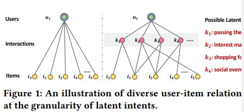
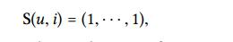
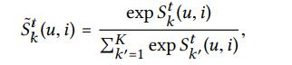
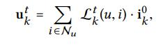
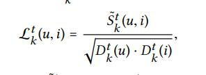
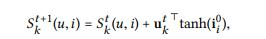
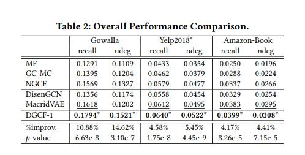

## Disentangled Graph Collaborative Filtering

- 论文 ： https://arxiv.org/pdf/2007.01764.pdf
- 代码 ： https://github.com/xiangwang1223/disentangled_graph_collaborative_filtering
- 来源 ： SIGIR 2020

## 背景
本文从用户购买意图的角度出发，认为现如今直接将用户的负反馈直接作为用户的统一表示，没有对用户的不同意图进行建模，忽略了用户采用这些项目的意图的多样性。

如上图所示，之前用户对一个商品的交互，我们对用户的意图不会进行建模，导致可能存在有图这样的问题，用户对于项目3可能是由于无聊打发时间并非兴趣。
而用户对项目1可能真的感兴趣等等，这样细粒度的建模，更好的对用户多兴趣进行解纠缠，更好的表示用户的兴趣。

本文提出的DGCF模型主要是通过对用户/项目的切片，应用图解缠结模块，具体解释就是邻居由利用节点-邻居亲和力来完善意图感知图，
从而突出了用户与项目之间具有影响力的关系的重要性。

## 任务建模
**1、用户-项目联系：**
直观地，一种用户行为受到多种意图的影响，为了对用户和项目之间的这种细粒度关系进行建模，我们旨在学习每种行为的用户意图分布A（u，i），
如下所示：A（u，i）= A1（u，i），·  ··，AK（u，i）其中，Ak（u，i）反映了第k个意图的置信度，这是用户u采用项目i的原因；  
K是控制潜在用户意图数量的超参数。 联合检查与特定意图k相关的分数，我们可以构造一个意图感知图Gk，其定义为Gk = {（u，i，Ak（u，i））}，
其中每个历史互动（u，i） 代表一个边并分配有Ak（u，i）。 此外，为Gk建立加权邻接矩阵Ak。 因此，我们建立了一组意图感知图G = {G1，...，GK}来
表示不同的用户-项目关系，而不是先前工作中采用的统一图。

**2、生成解缠结的表示：**
模型的目标是设计一个嵌入函数f（·），以便为用户u输出一个解纠缠的表示eu，它由K个独立组件组成：
eu = (e1u, e2u, · · · , eKu )

其中eku是用户u的第k个潜在意图影响； 为简单起见，我们使这些分量具有相同的维eku∈R d K。为此，每个分块的表示形式eku建立在意图感知图Gk上，并合成相关的连通性。 类似地，我们可以为项目i建立表示ei。

## DGCN模型
DGCN由实现解缠结的两个关键组件组成：

1）图解缠结模块，该模块首先将每个用户/项目嵌入的片段切成块，然后将每个块与 一个意图，然后将一种新的邻居路由机制整合到图神经网络中，
以解开交互图并完善意图感知表示；  

2）独立性建模模块，该模块使用距离相关作为正则化器以鼓励意图独立性。  

DGCF最终产生与意图感知的解释图解开的表示。

### 图解缠结模块
该模型在嵌入传播中引入了新的邻居路由机制，以更新这些图的权重。 这使我们能够区分每个用户项连接的不同重要性得分，
以精炼交互图，进而将信号传播到意图感知块。

**Intent-Aware嵌入初始化**
将ID嵌入分成K个块，将每个块与潜在意图相关联。 更正式地说，此类用户嵌入的初始化为：
u = (u1, u2, · · · , uK )
类似地，为项目i建立了i =（i1，i2，...，iK）。 此后，我们分别采用随机初始化来初始化每个块表示，以确保训练开始时意图之间的差异。 
值得强调的是，我们使用主流CF基线设置了相同的嵌入大小（例如d = 64），而不是将模型参数加倍。

**Intent-Aware图初始化**
由于只根据一个用户项目交互图，无法描述行为背后的丰富用户意图。因此，我们为K个潜在意图定义了一组得分矩阵{Sk |∀k∈{1，···，K}}。 
着眼于意图感知矩阵Sk，每个条目Sk（u，i）表示用户u与项目i之间的交互。此外，对于每个交互，我们可以构造K个潜在意图上的
得分向量S（u，i）=（S1（u，i），···，SK（u，i））∈R K。 我们统一初始化每个得分向量，如下所示： 

假设在建模开始时意图的贡献相等。 因此，这种得分矩阵Sk可以被看作是意图感知图的邻接矩阵。

**图解缠结层**
现在，每个意图k都包括一组分块的表示形式{uk，ik | u∈U，i∈I}，它专用于其特征空间，以及由Sk表示的特定交互图。
 在个人意图渠道内，我们旨在从用户和商品之间的高级连接中提取有用的信息，而不仅仅是ID嵌入。 为此，我们设计了一个新的图解缠结层，
 该层具有邻居路由和嵌入传播机制，其目标是在沿其传播信息时区分每个用户项连接的自适应角色。 我们将这样的图层д（·）定义如下：

其中e（1）ku是要从邻居那里收集与意图k有关的信息；  Nu是u的第一跳邻居（即u采用的历史项）； 超索引（1）表示一阶邻居。

1）迭代更新规则
采用了邻居路由机制：
首先，我们使用嵌入传播机制根据意图感知图更新意图感知嵌入； 
然后，我们依次利用更新的嵌入来细化图并输出意图上的分布。
 特别是，我们设置了T个迭代来实现这种迭代更新。 在每个迭代t中，S t k和u t k分别存储邻接矩阵和嵌入的更新值，
 其中t∈{1,2,3，T}，T是最终迭代。
 
2）跨意图嵌入传播
在迭代t处，对于目标交互（u，i），我们得到了得分向量，即{Sk（u，i）|∀k∈{1，···，K}}。 
为了获得其在所有意图上的分布，我们然后通过softmax函数将这些系数归一化：

 然后，我们在各个图上执行嵌入传播[9、18、38]，以便将对用户意图k有影响的信息编码为表示形式。 更正式地说，加权和聚合器定义为：

其中u t k是u的临时表示形式，用于存储经过t次迭代后从其邻居Nu = {i |（u，i）∈G}中提炼的信号；  
i 0 k是历史项i的输入表示； 并且Lt k（u，i）是S〜t k的拉普拉斯矩阵，公式为：

这里的GCN操作，采用了LightGCN中的方式，不进行非线性转化。

3）意向图更新
基于用户（或项目）节点的邻居来迭代地调整边缘强度。 
由相同意图驱动的历史项往往具有相似的分块表示，这进一步鼓励了它们之间的关系更加牢固。
 因此，我们迭代更新S t k（u，i）-更精确地，调整质心u及其相邻i之间的强度，如下所示：

其中u t k⊤tanh（i 0 k）考虑u t k和i 0 k之间的亲和力；  tanh [37]是一个非线性激活函数，用于增加模型的表示能力。
经过T次迭代后，我们最终获得一个图解缠结层的输出，该层由解缠结的表示即e（1）ku = u T k以及其意图感知图组成，
即A（1）k = S〜  T k，∀k∈{1，···，K}。 当向前进行这种传播时，我们的模型会汇总与每个意图有关的信息并生成注意流，
这可以看作是解开纠结的解释 。

4）层组合
使用第一跳邻居后，我们进一步堆叠了更多的图解缠结层，以收集来自高阶邻居的影响信号。 
特别是，此类连接具有丰富的语义。 例如，像u1→i2→u3这样的二阶连通性暗示了在消费i2时u1和u3之间的意图相似性。 
同时，较长的路径u1→i2→u2→i4通过协作信号加深了他们的意图。 为了从这种更高级别的连接中捕获用户意图，
我们在l层之后递归地将表示形式表示为：
e（l）ku =дe（l-1）ku，{e（l-1）ki | i∈Nu}  

其中e（l-1）ku和e（l-1）ki是用户u和以第k个因子为条件的项i的表示，记住从其（l-1）传播的信息 跳邻居。 
此外，每个解缠结的表示还与其说明图相关联以明确地表示意图，即加权邻接矩阵A（l）k。 这样的解释图能够显示出合理的证据来证明哪些信息
构成了纠缠的表示。

在L层之后，我们将不同层的意图感知表示总和起来作为最终表示，
如下所示：

eku = e（0）ku +··+ e（L）ku，ek i = e（0）ki +  ···+ e（L）ki。  
这样，我们不仅可以解开CF表示，而且可以对表示的每个部分进行解释。 
值得强调的是，可训练参数只是第0层的嵌入，即所有用户和项的u和i
   
### 实验

根据实验结果，可以看出相比其他的模型，模型提升的还是比较多的。

这篇模型总的来说，想法上还是比较独特，通过在多子图上学习不同意图的向量表示，然后通过归一化进行合并，并架构到邻接矩阵中。
同时根据一个一个tanh的线性转化，加强用于对于不同意图的一个不对表示。最终将合并后的用户项目向量通过图卷积进行聚合。

