## Neighbor Interaction Aware Graph Convolution Networks for Recommendation

>  论文地址：https://dl.acm.org/doi/abs/10.1145/3397271.3401123

### 1、背景

这篇论文的出发点是GCN通过mean 聚合邻居节点信息忽略了节点与节点之间的关系。同时对于用户交互图来说实际上是一个异质图，那么对于
一个节点的一阶邻居和二阶邻居是不同的节点类型，而之前的模型都忽略了这一点，都是当做统一的节点类型进行聚合。因此对于聚合邻居嵌入时
也要考虑其嵌入所属的不同深度的问题。

NIA-GCN于是提出了3点：

- 建模节点与邻居之间的联系信息，提出了成对邻居集合层
- 对于异质图的特性，提出了Parallel-GCNs来独立的聚合不同实体邻居的信息。
- 为了捕获邻居中的不同联系，以及将不同深度之间的联系帮助预测过程提出了 Cross-Depth Ensemble (CDE)层

以上就是NIA-GCN的所有motivation了，下面就来看看模型是如何建模上面这些问题的？

### 2、NIA-GCN模型

先看一下模型的整体结构：

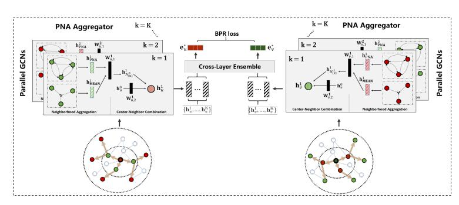

可以看到模型整体有三个部分组成：PNA layer主要是用来捕获节点对之间的关联信息；Parallel-GCNs
主要是聚合邻居节点的不同深度的信息；Cross-Depth Ensemble (CDE)则是使用Parallel-GCNs的不同深度
的嵌入表示。

#### 2.1、成对邻居聚合层

在基于图卷积的推荐模型中，常用的操作就是将卷积分为两个步骤：一个是邻居聚合，即将邻居节点的信息
但是忽略了节点之间的结构信息；另一个是中心节点嵌入组合，即如何将聚合的邻居信息嵌入和中心节点
的嵌入进行组合。

**邻居聚合过程：**

PNA层聚合邻居节点信息的主要思路是对每一个邻居对进行元素乘法。那么对于中心节点的第k层邻居有
$N_k$那么其邻居嵌入矩阵为$Q^𝑘 \in R^{N_K x d}$，并且 $q_i$ 和 $q_j$是其第i和第j个邻居节点。
那么PNA层的计算公式如下：

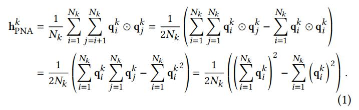

其实可以看到这个过程是不是和FM很相似啊，其实是一样的意思，都是二阶特征交叉，两两之间进行考虑。
这样化简之后整体的时间复杂度就降低了。

除了通过这学习节点之间的联系信息，同时使用了均值聚合，并将两者同时拼接之后融入MLP层，得到
节点u最终的第k层嵌入表示：

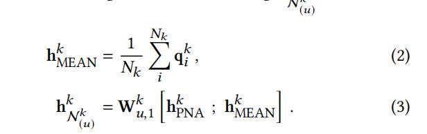

其中对于$W^k$对于所有的用户节点都共享权值。

**中心邻居聚合过程：**

在得到从邻居节点聚合得到的嵌入表示后，将其嵌入和中心节点嵌入表示相结合得到节点u新的嵌入表示：

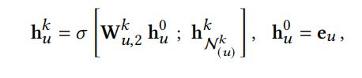

这里$W^𝑘_{𝑢,2}$是用于所有用户在第k层进行节点转化的参数。

总的来说，PNA层的主要不走如下图所示：

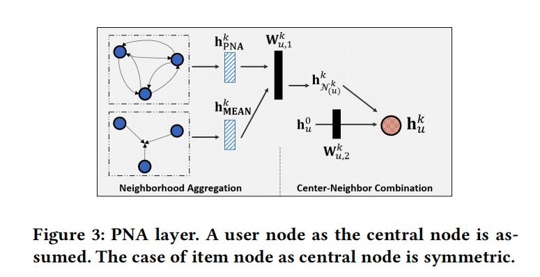

可以看出，其在mean聚合的过程中多考虑了邻居节点之间的关联信息。

#### 2.2、并行卷积层

并行图卷积层的设计主要为了解决用户项目交互图上的异质性。于是并行卷积层不在像常规图卷积的方式
迭代的聚合不同阶邻居的信息，而是直接对不同阶邻居同时进行聚合。下面是两种聚合方式的图解：

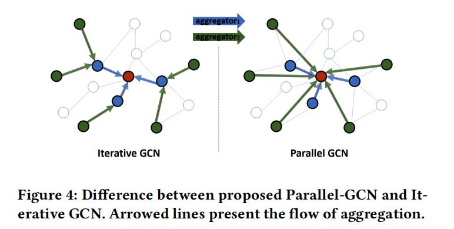

这样对于不同的实体可以做到分别聚合。

#### 2.3、深度交叉集合

该层的作用主要是对不同PNA层的结果进行有效的合并，也就是不同阶邻居的信息如何进行合并。
具体如何进行合并的可以看下面的伪代码：

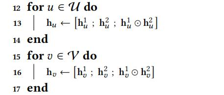

可以看出只是单独的进行了拼接，不过还加入了不同深度嵌入的元素乘积向量。
而Cross-Depth Ensemble的具体过程如下所示：

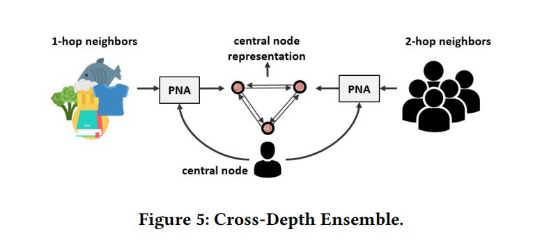

#### 2.4、训练过程

该模型的具体训练过程采用的是基于排名的BPR损失函数：

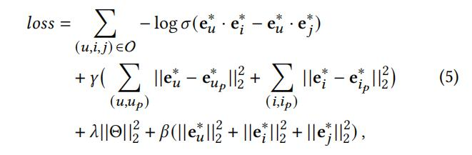

其中值得注意$u_p$是用户u采样的10个邻居，$i_p$同理，这么做是为了 规范用户与项目之间的距离与他们的积极邻居。

### 3、实验

#### 3.1、实验数据集：

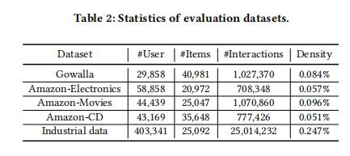

#### 3.2、实验对比

模型效果当然是好的啦，但是我觉得有一点遗憾的是，没有对比GAT，毕竟大家的motivation都有
考虑中心节点与不同邻居节点之间的联系程度不同。

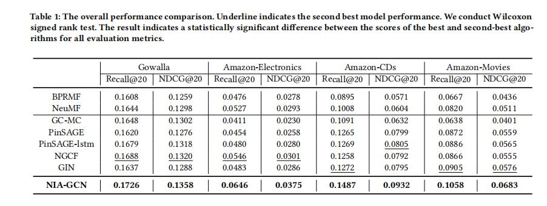

#### 3.3、消融实验

该部分的实验室证明设计的模型的有效性了，当然肯定是有效的啦。

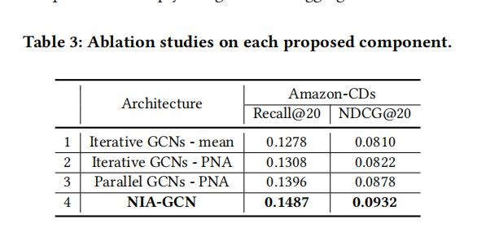

以上就是所有的内容了，如果想了解更多具体细节的，可以去看一下原文。

#### 思考：

这里简单的说一下自己的总结吧，个人觉得将FM的思想运用到邻居对交叉组合上，来捕获GCN在
图结构学习上的缺陷，这一点真的很赞。其次就是对于并行图卷积的方式，虽然说这种方式考虑了
不同类型实体的聚合，但是真的就很合适吗，感觉这也不一定，消融实验里并没有对此作出实验。
总的来说，NIAGCN模型没有采用通俗的注意力机制方法，这是让我觉得眼前一亮的地方。

### 参考

1、[《Neighbor Interaction Aware Graph Convolution Networks for Recommendation》](https://dl.acm.org/doi/abs/10.1145/3397271.340112)

